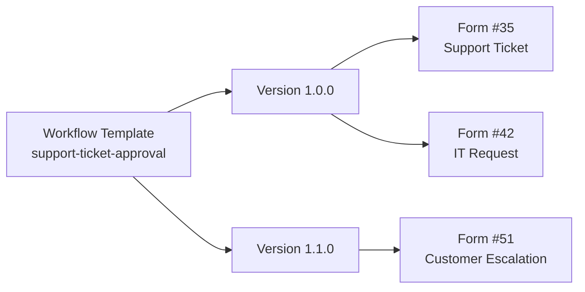

# MegaForm Handout: Reusable Workflow Library, Dynamic Role/Permission Display, and Custom Submission Grids

**Date:** 2026-07-10  
**Audience:** Product owner, implementation team, QA, support/hand-over team  
**Scope:** Oqtane MegaForm, with Core concepts shared by DNN/Web hosts where registered  
**Related implementation commits:**

- `1e14114` — `feat(workflow): add reusable workflow library`
- `c19868a` — `feat(rules): add shared contextual rule engine`
- `f9b375b` — `feat(security): enforce submit permissions server-side`

---

## 0. Executive summary

MegaForm now has the foundation for three enterprise features:

1. **Reusable Workflow Library**
   - Create a workflow once as a template.
   - Version it.
   - Map multiple forms to the same workflow template.
   - Per form, map actual form field keys to canonical workflow field keys.
   - Runtime uses the mapped library workflow first; if a form is not mapped, it falls back to legacy per-form `WorkflowJson`.

2. **Shared Rule Engine for dynamic fields/tabs/sections**
   - `ShowIf` rules can now evaluate not only form field values, but also:
     - user roles,
     - permissions,
     - query string values,
     - current user properties.
   - The same rule concept is available client-side and server-side.
   - Server-side enforcement strips hidden/forbidden values before validation and persistence, so hiding UI is not the only protection.

3. **Custom search/filter for submission grids**
   - Basic submission dashboard/list endpoints support server paging and basic filtering.
   - For custom reporting/search/filter grids, use **DataRepeater**.
   - DataRepeater supports custom SQL/stored procedures, parameterized filters, paging, sort, export, and a privacy gate for MegaForm submission data.

Important hand-over note: the backend/runtime foundation is implemented. Some admin UX screens for workflow-library management may still need to be built on top of the repository APIs/tables.

---

## 1. Reusable Workflow Library

### 1.1. Problem it solves

Before this feature, Workflow V2 was effectively:

```text
1 form = 1 workflow definition
```

That is not ideal when many forms share the same process, for example:

- Support Ticket approval,
- Leave Request approval,
- Purchase Request approval,
- Document Review,
- Multi-step intake routing.

Without a library, every form would need its own workflow copy. That creates drift: one form gets updated, another does not.

The new model is:

```text
1 workflow template = many versions = many form mappings
```

In practice:



### 1.2. Data model

The migration `MegaForm.01.06.00.38` adds three tables:

| Table | Purpose |
|---|---|
| `MF_WorkflowTemplates` | Template header/catalog row: key, name, category, enabled flag, current version. |
| `MF_WorkflowTemplateVersions` | Versioned `WorkflowDefinition` JSON. This stores the actual workflow graph. |
| `MF_FormWorkflows` | Form-to-template mapping plus per-form field mappings. |

Core models:

| Model | File | Purpose |
|---|---|---|
| `WorkflowTemplateInfo` | `MegaForm.Core/Models/WorkflowLibraryModels.cs` | Template header. |
| `WorkflowTemplateVersionInfo` | same file | Immutable-ish version row with `DefinitionJson`. |
| `FormWorkflowMappingInfo` | same file | Links one form to one template/version. |
| `WorkflowFieldMappingInfo` | same file | Maps canonical workflow key to concrete form field key. |
| `WorkflowRuntimeDefinition` | same file | Runtime object resolved for a form. |

Repository contract:

```csharp
public interface IWorkflowLibraryRepository
{
    WorkflowRuntimeDefinition GetActiveDefinitionForForm(int formId);
    WorkflowTemplateInfo GetTemplate(int workflowTemplateId);
    WorkflowTemplateInfo GetTemplateByKey(int portalId, string templateKey);
    List<WorkflowTemplateInfo> ListTemplates(int portalId, bool enabledOnly = true);
    int SaveTemplate(WorkflowTemplateInfo template);
    WorkflowTemplateVersionInfo GetVersion(int workflowVersionId);
    List<WorkflowTemplateVersionInfo> ListVersions(int workflowTemplateId);
    int SaveVersion(WorkflowTemplateVersionInfo version);
    void ApplyVersion(int workflowTemplateId, int workflowVersionId, string appliedBy = "system");
    FormWorkflowMappingInfo GetActiveMapping(int formId);
    List<FormWorkflowMappingInfo> ListMappingsForTemplate(int workflowTemplateId, bool activeOnly = true);
    int ApplyToForm(FormWorkflowMappingInfo mapping);
}
```

Oqtane implementation:

```text
MegaForm.Oqtane.Server/Data/EfWorkflowLibraryRepository.cs
```

### 1.3. Runtime resolution

At submission time, `WorkflowEngineV2` resolves workflow in this order:

1. Look for active row in `MF_FormWorkflows` for the form.
2. If mapping exists:
   - load enabled template,
   - load pinned `WorkflowVersionId` if present,
   - otherwise load template `CurrentVersionId`,
   - otherwise load latest applied version.
3. Apply field mappings.
4. Execute the resolved workflow definition.
5. If no library mapping exists, fall back to legacy per-form `MF_Forms.WorkflowJson`.

This means the feature is additive and should not break existing forms.

### 1.4. How to design a reusable workflow

The most important design rule is:

> Design the workflow using canonical workflow field keys, not one form's physical field keys.

Example canonical keys for a support workflow:

| Canonical workflow key | Meaning |
|---|---|
| `requester_email` | Person who submitted/requested. |
| `request_title` | Short title/subject. |
| `request_description` | Main description. |
| `priority` | Low/Normal/High/Urgent. |
| `department` | Department/team routing. |
| `manager_email` | Approver. |

Then each form maps its own fields to these canonical keys:

| Workflow key | Support Ticket form key | Leave Request form key | Purchase Request form key |
|---|---|---|---|
| `requester_email` | `email` | `employee_email` | `requestor_email` |
| `request_title` | `subject` | `leave_type` | `purchase_title` |
| `request_description` | `description` | `reason` | `business_justification` |
| `priority` | `priority` | `urgency` | `approval_priority` |
| `manager_email` | `assigned_manager` | `manager_email` | `budget_owner_email` |

### 1.5. Recommended workflow design process

1. **Name the process**
   - Example: `support-ticket-approval`.
   - Use a stable `TemplateKey`; do not rename it casually.

2. **Define canonical fields**
   - Write a small data contract before building the graph.
   - Decide required fields.

3. **Build the workflow graph**
   - Use node types supported by `WorkflowEngineV2`, such as:
     - `Condition`,
     - `SendEmail`,
     - `Webhook`,
     - `Database`,
     - `Calculate`,
     - `SetVariable`,
     - `Switch`,
     - `Loop`,
     - `End`.
   - Approval/task concepts exist in the model, but confirm palette/runtime exposure before promising it in a customer flow.

4. **Save as template version**
   - Save the workflow graph JSON into `WorkflowTemplateVersionInfo.DefinitionJson`.
   - Version examples: `1.0.0`, `1.1.0`, `2.0.0`.

5. **Apply version**
   - Call `ApplyVersion(templateId, versionId)`.
   - This marks the version as current/applied for the template.

6. **Map forms**
   - For each form, create a `FormWorkflowMappingInfo`.
   - Include `FieldMappingsJson`.

7. **Test with one pilot form**
   - Submit a test record.
   - Confirm:
     - email/webhook/database nodes use mapped values,
     - condition branches evaluate correctly,
     - workflow metadata shows source `library`.

8. **Roll out to additional forms**
   - Reuse the same version if no process change is needed.
   - Create a new version if process logic changes.

### 1.6. Example field mapping JSON

`MF_FormWorkflows.FieldMappingsJson` stores a list of mappings:

```json
[
  {
    "workflowFieldKey": "requester_email",
    "formFieldKey": "email",
    "required": true
  },
  {
    "workflowFieldKey": "request_title",
    "formFieldKey": "subject",
    "required": true
  },
  {
    "workflowFieldKey": "priority",
    "formFieldKey": "priority",
    "required": false
  }
]
```

Runtime behavior:

- Original submitted data remains available under original form keys.
- Mapped canonical keys are added/overlaid into workflow data.
- Example: if form data has `email = "a@example.com"`, workflow data will also have `requester_email = "a@example.com"`.

### 1.7. Example C# setup/seed flow

This is useful until a full admin UI is added.

```csharp
var templateId = workflowLibrary.SaveTemplate(new WorkflowTemplateInfo
{
    PortalId = portalId,
    TemplateKey = "support-ticket-approval",
    Name = "Support Ticket Approval",
    Category = "Support",
    Description = "Reusable triage/approval workflow for support-like forms.",
    IsEnabled = true,
    CreatedByUserId = actor.UserId
});

var versionId = workflowLibrary.SaveVersion(new WorkflowTemplateVersionInfo
{
    WorkflowTemplateId = templateId,
    Version = "1.0.0",
    DefinitionJson = JsonConvert.SerializeObject(workflowDefinition),
    Notes = "Initial production workflow.",
    CreatedByUserId = actor.UserId
});

workflowLibrary.ApplyVersion(templateId, versionId, actor.UserName);

workflowLibrary.ApplyToForm(new FormWorkflowMappingInfo
{
    FormId = 35,
    WorkflowTemplateId = templateId,
    WorkflowVersionId = versionId, // pin exact version; null means follow template current version
    TriggerType = "on_submit",
    AppliedByUserId = actor.UserId,
    AppliedBy = actor.UserName,
    FieldMappingsJson = JsonConvert.SerializeObject(new []
    {
        new WorkflowFieldMappingInfo
        {
            WorkflowFieldKey = "requester_email",
            FormFieldKey = "email",
            Required = true
        },
        new WorkflowFieldMappingInfo
        {
            WorkflowFieldKey = "priority",
            FormFieldKey = "priority",
            Required = false
        }
    })
});
```

### 1.8. Versioning policy

Recommended policy:

| Change type | Version action |
|---|---|
| Typo in description only | Patch version or notes only. |
| Email copy/template changes | Create `1.0.1` or `1.1.0`, depending on impact. |
| New node/branch, changed approval logic | Create new minor/major version. |
| Breaking field contract | Create major version, e.g. `2.0.0`. |

Do not silently edit a version already used in production unless there is an emergency. Prefer new versions so old submissions remain explainable.

### 1.9. Pinned vs current version

`MF_FormWorkflows.WorkflowVersionId` controls whether a form is pinned:

| Mapping setting | Behavior |
|---|---|
| `WorkflowVersionId = 123` | Form always uses version `123` until mapping is changed. |
| `WorkflowVersionId = null` | Form follows template `CurrentVersionId`; when template current version changes, this form follows it. |

Recommended:

- Use pinned version for production-critical forms.
- Use follow-current for low-risk internal forms or shared demo forms.
- During rollout, pin pilot forms first, then move more forms after QA.

### 1.10. Hand-over checklist for workflow reuse

Before handing a reusable workflow to a customer/team:

- [ ] Template key is stable and documented.
- [ ] Canonical workflow field contract is documented.
- [ ] Required field mappings are listed.
- [ ] Version number and notes are set.
- [ ] At least one pilot form has test submissions.
- [ ] Email/webhook/database side effects are tested or dry-run logged.
- [ ] Rollback plan exists: deactivate mapping or map form back to previous version.
- [ ] Existing unmapped forms still use legacy workflow.

---

## 2. Dynamic fields, tabs, and sections based on roles or permissions

### 2.1. What changed

The `ShowIf` rule model now supports multiple context sources:

```csharp
public enum RuleSourceType
{
    Field,
    Role,
    Permission,
    Query,
    User
}
```

A rule can evaluate:

| Source type | What it checks | Example |
|---|---|---|
| `Field` | Submitted/current form values | `priority == "High"` |
| `Role` | Current user's roles | user has `Manager` |
| `Permission` | Effective MegaForm permissions | user has `approve` or `edit` |
| `Query` | URL query string | `mode=internal` |
| `User` | User properties | `isAuthenticated == true`, `email contains "@company.com"` |

Supported condition operators include:

- `Equals`
- `NotEquals`
- `Contains`
- `NotContains`
- `StartsWith`
- `EndsWith`
- `GreaterThan`
- `LessThan`
- `GreaterOrEqual`
- `LessOrEqual`
- `IsEmpty`
- `IsNotEmpty`
- `In`
- `NotIn`

### 2.2. Why server-side enforcement matters

Hiding a field in the browser is not security. A user can still use DevTools or a script to submit hidden values.

MegaForm now enforces this server-side in `ServerSidePermissionEnforcementService` before validation and persistence:

1. Clone submitted data.
2. Check explicit `submit` permission if configured.
3. Build rule context:
   - fields,
   - query string,
   - user,
   - permissions.
4. Strip unknown keys not present in schema.
5. Strip values for fields whose `ShowIf` evaluates false.
6. Apply `FieldRestrictions` allow/deny policy.
7. Continue validation using the same rule context.
8. Save only the cleaned data.

This means:

```text
Client hide = UX
Server enforcement = security
```

### 2.3. ShowIf JSON format

The rule shape:

```json
{
  "operator": "And",
  "rules": [
    {
      "sourceType": "Role",
      "key": "roles",
      "condition": "Contains",
      "value": "Manager"
    }
  ]
}
```

Notes:

- `operator` can be `And` or `Or`.
- `rules` and `conditions` are both supported for compatibility.
- For `Role` and `Permission`, `key` is optional in practice; the engine evaluates the role/permission set.
- For `Field`, `Query`, and `User`, `key` matters.

### 2.4. Example: show field only to managers

Use case: field `manager_notes` should appear only for users in role `Manager`.

```json
{
  "key": "manager_notes",
  "type": "Textarea",
  "label": "Manager Notes",
  "showIf": {
    "operator": "And",
    "rules": [
      {
        "sourceType": "Role",
        "condition": "Contains",
        "value": "Manager"
      }
    ]
  }
}
```

Behavior:

- Browser hides it for non-managers.
- Server strips `manager_notes` if a non-manager posts it manually.

### 2.5. Example: show tab/section only to users with permission

Use case: an "Approval" tab should appear only to users with `approve` permission.

```json
{
  "key": "approval_section",
  "type": "Section",
  "label": "Approval",
  "properties": {
    "displayMode": "tabs"
  },
  "showIf": {
    "operator": "And",
    "rules": [
      {
        "sourceType": "Permission",
        "condition": "Contains",
        "value": "approve"
      }
    ]
  }
}
```

Recommended for production:

- Put the same `showIf` on sensitive child fields too, especially when sections/tabs are represented as visual separators rather than strict nested containers.
- For fields inside `Row.columns[].fields`, hidden parent containers cascade through server-side recursive stripping.
- For flat section separators, do not rely only on the section's visual hide state. Apply field-level `showIf` or use `FieldRestrictions`.

### 2.6. Example: show internal field from URL query string

Use case: if URL is:

```text
/try-it-live?formid=35&mode=internal
```

then show `internal_reference`.

```json
{
  "key": "internal_reference",
  "type": "Text",
  "label": "Internal Reference",
  "showIf": {
    "operator": "And",
    "rules": [
      {
        "sourceType": "Query",
        "key": "mode",
        "condition": "Equals",
        "value": "internal"
      }
    ]
  }
}
```

Server-side Oqtane submit passes `Request.Query` into the processor, so query-based rules can be enforced during submit.

### 2.7. Example: show only to authenticated users

```json
{
  "key": "member_id",
  "type": "Text",
  "label": "Member ID",
  "showIf": {
    "operator": "And",
    "rules": [
      {
        "sourceType": "User",
        "key": "isAuthenticated",
        "condition": "Equals",
        "value": "true"
      }
    ]
  }
}
```

Supported user keys:

- `id` / `userId`
- `userName` / `username` / `name`
- `displayName` / `fullName`
- `email` / `emailAddress`
- `isAuthenticated` / `authenticated`
- `isAdmin` / `admin`
- `isSuperUser` / `superUser` / `host`
- `ip` / `ipAddress`
- `role` / `roles`

### 2.8. Example: field depends on another field

Use case: show `escalation_reason` only when `priority = Urgent`.

```json
{
  "key": "escalation_reason",
  "type": "Textarea",
  "label": "Escalation Reason",
  "required": true,
  "showIf": {
    "operator": "And",
    "rules": [
      {
        "sourceType": "Field",
        "key": "priority",
        "condition": "Equals",
        "value": "Urgent"
      }
    ]
  }
}
```

If the field is hidden, server-side validation skips the required check and strips the field value if posted.

### 2.9. Permissions and principals

Permission types exposed by the catalog:

| Permission | Meaning |
|---|---|
| `submit` | Can create/submit new records. |
| `view` | Can view submissions. |
| `edit` | Can edit submissions. |
| `delete` | Can delete submissions. |
| `export` | Can export submissions. |
| `approve` | Can approve workflow tasks. |
| `manage` | Full management access. |

Principal types:

| Principal type | Examples |
|---|---|
| `user` | Specific Oqtane/DNN user ID. |
| `role` | `Manager`, `SupportAgent`, `Administrators`. |
| `special` | `all_users`, `authenticated`, `anonymous`. |

Submit behavior:

- If a form has no explicit `submit` rules, submit remains open as before, subject to existing form settings such as `RequireAuth`.
- If explicit `submit` rules exist, user must match a granted `submit` rule or a granted `manage` rule.
- Admin/host/superuser bypasses regular restrictions.

### 2.10. FieldRestrictions examples

`FormPermissionInfo.FieldRestrictions` is optional JSON attached to permission rules.

Deny a few fields:

```json
{
  "deny": ["internal_notes", "salary", "risk_score"]
}
```

Allow only selected fields:

```json
{
  "allow": ["name", "email", "request_title", "priority"]
}
```

Alternative deny mode:

```json
{
  "mode": "deny",
  "fields": ["internal_notes", "manager_notes"]
}
```

Map-style format:

```json
{
  "internal_notes": "hidden",
  "risk_score": "readonly",
  "public_summary": "allow"
}
```

Server-side behavior:

- `deny`, `hidden`, `readonly`, `forbidden` remove posted values.
- `allow` creates an allowlist; fields outside the allowlist are removed.
- If both allow and deny apply, deny wins.

### 2.11. QA checklist for dynamic fields/tabs/sections

For every role/permission-based UI rule:

- [ ] Test as admin/host.
- [ ] Test as matching role.
- [ ] Test as non-matching authenticated user.
- [ ] Test as anonymous user if public form.
- [ ] Confirm UI hides/shows correctly.
- [ ] Attempt manual post of hidden field and confirm server strips it.
- [ ] Confirm required hidden fields do not cause validation failure.
- [ ] Confirm saved `DataJson` does not contain forbidden fields.
- [ ] Confirm submission detail/list/export does not expose fields through a different endpoint.

---

## 3. Custom search and filtering for submission grids

### 3.1. There are three different grid concepts

The word "grid" can mean different things in MegaForm. Use the correct one:

| Grid type | Best for | Custom search/filter support |
|---|---|---|
| Submission Dashboard/List endpoint | Admin submission browsing | Basic server filters: status, search, date, paging. |
| DataRepeater | Reporting, SQL grids, custom dashboards | Strong support: custom SQL/stored proc, filter JSON, paging, sorting, export. |
| DataGrid widget | Editable subform/line-item table | Basic grid editing; not the main reporting/search solution. |

### 3.2. Built-in submission dashboard/list filtering

Oqtane controller endpoint:

```text
GET MegaForm/Submissions
```

Important query parameters:

| Parameter | Meaning |
|---|---|
| `formId` | Required. Which form's submissions to list. |
| `status` | Optional status filter. |
| `search` | Optional free-text search. |
| `dateFrom` | Optional lower submitted date. |
| `dateTo` | Optional upper submitted date. |
| `pageIndex` / `page` | Server-side page. |
| `pageSize` | Server-side page size. |
| `queryKey` | Optional predefined public/list binding key. |

Example:

```text
GET /api/MegaForm/Submissions?formId=35&pageIndex=0&pageSize=50&status=Active&search=urgent&dateFrom=2026-07-01&dateTo=2026-07-10
```

When to use:

- Standard admin inbox/list.
- Basic search box.
- Date/status filters.
- Paging through a form's submissions.

Limitations:

- Not designed for arbitrary SQL reporting.
- Custom field-level filters should not be bolted onto the client by fetching 500K rows.
- For very large data sets, filtering should use indexed storage such as `MF_SubmissionValues` or custom SQL/reporting tables.

### 3.3. DataRepeater: recommended for custom search/filter/reporting

DataRepeater is the recommended option when the customer asks:

- "Can I search by custom fields?"
- "Can I filter by status/department/date/owner?"
- "Can I build a report grid?"
- "Can I use SQL/stored procedure?"
- "Can I export CSV?"
- "Can I page 500K submissions without loading all rows?"

Core config model:

```text
MegaForm.Core/Models/DataRepeaterModels.cs
```

Server service:

```text
MegaForm.Core/Services/DataRepeaterService.cs
```

Oqtane endpoints:

```text
GET DataRepeater/Query
GET DataRepeater/FilterOptions
GET DataRepeater/ColumnOptions
GET DataRepeater/Export
```

Security model:

- Client sends only `formId`, `widgetKey`, paging/sort/filter values.
- Raw SQL is read from saved form schema `widgetProps`, not from the client request.
- User-provided values are parameterized.
- Non-SELECT SQL is blocked for SQL mode.
- Row count is capped by `MaxRows` and absolute cap.

### 3.4. DataRepeater SQL parameter style

Use `:paramName` in query text.

At runtime DataRepeater converts:

```sql
:status
```

to:

```sql
@status
```

and binds it as a database parameter.

Example filter JSON:

```json
{
  "status": "Open",
  "q": "printer",
  "dateFrom": "2026-07-01",
  "dateTo": "2026-07-10"
}
```

### 3.5. Example: custom Support Ticket dashboard grid with SQL

This example is for SQL Server and assumes submissions are available in `MF_Submissions`.

Widget props example:

> Note: this is pseudo-JSON for readability. In actual `widgetProps`, keep SQL in a single escaped JSON string, or use the builder/editor field that stores the string for you.

```text
{
  "dataSource": "sql",
  "connectionKey": "DefaultConnection",
  "databaseType": "SqlServer",
  "pageSize": 50,
  "maxRows": 5000,
  "allowExportCsv": true,
  "masterQuery": "
    SELECT
      s.SubmissionId,
      s.SubmittedOnUtc,
      JSON_VALUE(s.DataJson, '$.email') AS Email,
      JSON_VALUE(s.DataJson, '$.subject') AS Subject,
      JSON_VALUE(s.DataJson, '$.priority') AS Priority,
      JSON_VALUE(s.DataJson, '$.department') AS Department,
      s.Status
    FROM MF_Submissions s
    WHERE s.FormId = 35
      AND (:status IS NULL OR :status = '' OR s.Status = :status)
      AND (:priority IS NULL OR :priority = '' OR JSON_VALUE(s.DataJson, '$.priority') = :priority)
      AND (:q IS NULL OR :q = '' OR s.DataJson LIKE '%' + :q + '%')
      AND (:dateFrom IS NULL OR :dateFrom = '' OR s.SubmittedOnUtc >= TRY_CONVERT(datetime2, :dateFrom))
      AND (:dateTo IS NULL OR :dateTo = '' OR s.SubmittedOnUtc < DATEADD(day, 1, TRY_CONVERT(datetime2, :dateTo)))
    ORDER BY s.SubmittedOnUtc DESC
  ",
  "filters": [
    {
      "key": "status",
      "label": "Status",
      "filterType": "dropdown",
      "paramName": "status",
      "query": "SELECT DISTINCT Status AS Value, Status AS Label FROM MF_Submissions WHERE FormId = 35 ORDER BY Status"
    },
    {
      "key": "priority",
      "label": "Priority",
      "filterType": "dropdown",
      "paramName": "priority",
      "query": "
        SELECT DISTINCT
          JSON_VALUE(DataJson, '$.priority') AS Value,
          JSON_VALUE(DataJson, '$.priority') AS Label
        FROM MF_Submissions
        WHERE FormId = 35
          AND JSON_VALUE(DataJson, '$.priority') IS NOT NULL
        ORDER BY Label
      "
    },
    {
      "key": "q",
      "label": "Search",
      "filterType": "text",
      "paramName": "q"
    },
    {
      "key": "dateRange",
      "label": "Submitted Date",
      "filterType": "daterange",
      "paramName": "dateFrom"
    }
  ]
}
```

Hand-over warning:

- The SQL above searches `DataJson`, which works but may not be ideal at 500K+ rows.
- For production at scale, prefer indexed field storage such as `MF_SubmissionValues` or a reporting table/materialized projection.

### 3.6. Recommended high-performance pattern for 500K submissions

For large submission counts:

```text
MF_Submissions       = canonical JSON row / submission metadata
MF_SubmissionValues  = indexed per-field values for search/filter/reporting
```

Recommended query pattern:

```sql
SELECT
  s.SubmissionId,
  s.SubmittedOnUtc,
  email.FieldValue AS Email,
  priority.FieldValue AS Priority,
  subject.FieldValue AS Subject
FROM MF_Submissions s
LEFT JOIN MF_SubmissionValues email
  ON email.SubmissionId = s.SubmissionId
 AND email.FieldKey = 'email'
LEFT JOIN MF_SubmissionValues priority
  ON priority.SubmissionId = s.SubmissionId
 AND priority.FieldKey = 'priority'
LEFT JOIN MF_SubmissionValues subject
  ON subject.SubmissionId = s.SubmissionId
 AND subject.FieldKey = 'subject'
WHERE s.FormId = 35
  AND (:priority IS NULL OR :priority = '' OR priority.FieldValue = :priority)
  AND (:q IS NULL OR :q = '' OR subject.FieldValue LIKE '%' + :q + '%')
ORDER BY s.SubmittedOnUtc DESC
```

Recommended indexes:

```sql
CREATE INDEX IX_MF_SubmissionValues_Form_Field_Value
ON MF_SubmissionValues (FormId, FieldKey, FieldValue);

CREATE INDEX IX_MF_Submissions_Form_Submitted
ON MF_Submissions (FormId, SubmittedOnUtc DESC);
```

Actual index names may differ by migration; verify before creating duplicates.

### 3.7. DataRepeater with `megaform_submissions` source

DataRepeater also supports:

```json
{
  "dataSource": "megaform_submissions",
  "submissionsFormId": 35,
  "statusFilter": "Active",
  "fieldWhitelist": ["email", "subject", "priority", "department"],
  "pageSize": 50,
  "maxRows": 5000
}
```

Use this when:

- You want a safe, repository-backed submission grid.
- You do not need custom SQL filters.
- You want a privacy gate: only whitelisted fields leave the server.

Limitations:

- This source currently supports status/paging/whitelist style access.
- For rich custom filters, use SQL/stored procedure mode.

### 3.8. Stored procedure option

For customer production systems, a stored procedure can be cleaner:

```json
{
  "dataSource": "storedproc",
  "connectionKey": "DefaultConnection",
  "databaseType": "SqlServer",
  "masterQuery": "dbo.MF_Report_SupportTickets",
  "pageSize": 50,
  "filters": [
    { "key": "status", "label": "Status", "filterType": "dropdown", "paramName": "status" },
    { "key": "q", "label": "Search", "filterType": "text", "paramName": "q" }
  ]
}
```

Benefits:

- DBAs can tune query plans.
- Easier to secure and review.
- Better for 500K+ rows.
- Can use indexed projections and computed tables.

### 3.9. Dashboard integration options

There are two ways to expose custom filtering in a "submission dashboard" experience:

#### Option A — Extend built-in submission dashboard

Add field filters to the existing `Submissions` endpoint and UI:

```text
GET /api/MegaForm/Submissions?formId=35&pageIndex=0&pageSize=50&field.priority=High&field.department=IT
```

Recommended backend approach:

- Extend `SubmissionListQuery`.
- Translate field filters to `MF_SubmissionValues` joins.
- Keep permission checks in `MegaFormController.ListSubmissions`.
- Enforce page size caps.

Best when:

- The customer wants the native submission dashboard UX.
- Filters are common and predictable.

#### Option B — Embed a DataRepeater report/grid

Create a DataRepeater widget configured as a submission report.

Best when:

- The customer needs custom SQL/stored proc.
- Filters vary by customer.
- The view is more "reporting dashboard" than "admin inbox".

Recommendation for near-term delivery:

> Use DataRepeater for custom search/filter/reporting. Extend built-in Submission Dashboard only when the desired UX must remain exactly inside the native dashboard.

### 3.10. QA checklist for custom grid/search

- [ ] Verify server paging: network response returns only requested page, not all 500K rows.
- [ ] Verify `pageSize` caps.
- [ ] Verify filters are parameterized; no raw SQL from request.
- [ ] Verify non-SELECT SQL is blocked in SQL mode.
- [ ] Verify anonymous/public access does not expose non-whitelisted fields.
- [ ] Verify role/permission checks on submission dashboard endpoints.
- [ ] Verify sorting does not allow arbitrary SQL injection column names.
- [ ] Verify CSV export respects filters and row cap.
- [ ] Verify indexes exist for common filters.
- [ ] Test with realistic data volume: 100K, 500K, and worst-case search term.

---

## 4. Recommended customer hand-over script

Use this short explanation when presenting to the customer:

> MegaForm now separates workflow logic from individual forms. We design one workflow template with canonical fields, version it, then map each form's actual field names to that shared workflow. If the workflow changes, we create a new version and roll it out form by form.

> Dynamic UI rules can now depend on form values, roles, permissions, query string, and user context. The browser hides or shows fields/tabs/sections for good UX, but the server also enforces the same rules so hidden or unauthorized values cannot be saved by bypassing the UI.

> For submission dashboards, basic search/status/date/page filters are available through the standard submission endpoint. For customer-specific grids, reports, SQL filters, stored procedures, and 500K+ records, DataRepeater is the recommended production path because it supports parameterized server-side query, paging, sorting, filters, and export.

---

## 5. Known limitations / next backlog

### Workflow Library

- Backend/runtime and repository are implemented.
- A complete admin UX for template/version/mapping management may still need to be built.
- Required field mapping validation should be surfaced in the UI before applying a mapping.
- A visual "where used" view is recommended: template → versions → mapped forms.

### Dynamic fields/tabs/sections

- Field-level rules are enforced server-side.
- For visual-only flat sections/tabs, apply the same rule to sensitive child fields or formalize nested section children in schema.
- Submission detail/export redaction should be reviewed for every endpoint, not only submit.

### Custom grids

- Built-in submission dashboard supports basic filtering; custom field filters should be implemented server-side, not by loading all rows.
- DataRepeater SQL/stored procedure mode is the recommended custom reporting solution.
- For 500K+ submissions, use indexed per-field values or reporting projections.

---

## 6. File references

### Workflow Library

- `MegaForm.Core/Models/WorkflowLibraryModels.cs`
- `MegaForm.Core/Interfaces/IWorkflowLibraryRepository.cs`
- `MegaForm.Core/Services/WorkflowEngineV2.cs`
- `MegaForm.Oqtane.Server/Data/EfWorkflowLibraryRepository.cs`
- `MegaForm.Oqtane.Server/Migrations/01060038_AddWorkflowLibrary.cs`

### Rule Engine / Dynamic Display

- `MegaForm.Core/Models/FormSchema.cs`
- `MegaForm.Core/Services/SharedRuleEngine.cs`
- `MegaForm.Core/Services/ServerSidePermissionEnforcementService.cs`
- `MegaForm.Core/Services/FormValidationService.cs`
- `MegaForm.Core/Services/SubmissionProcessor.cs`
- `MegaForm.UI/src/renderer/rule-engine.ts`
- `MegaForm.UI/src/renderer/conditional.ts`
- `MegaForm.UI/src/builder/rule-engine.ts`

### Permissions

- `MegaForm.Core/Services/PermissionService.cs`
- `MegaForm.Core/Services/PermissionCatalogService.cs`
- `MegaForm.Core/Models/Phase2Models.cs`
- `MegaForm.Oqtane.Server/Controllers/MegaFormController.cs`

### Submission Grids / DataRepeater

- `MegaForm.Core/Models/DataRepeaterModels.cs`
- `MegaForm.Core/Services/DataRepeaterService.cs`
- `MegaForm.Oqtane.Server/Controllers/MegaFormController.cs`
- `MegaForm.UI/src/widgets/plugins/megaform-widget-data-repeater.ts`
- `MegaForm.UI/src/listview/runtime.ts`
- `MegaForm.Core/ViewModes/ListViewSettings.cs`
