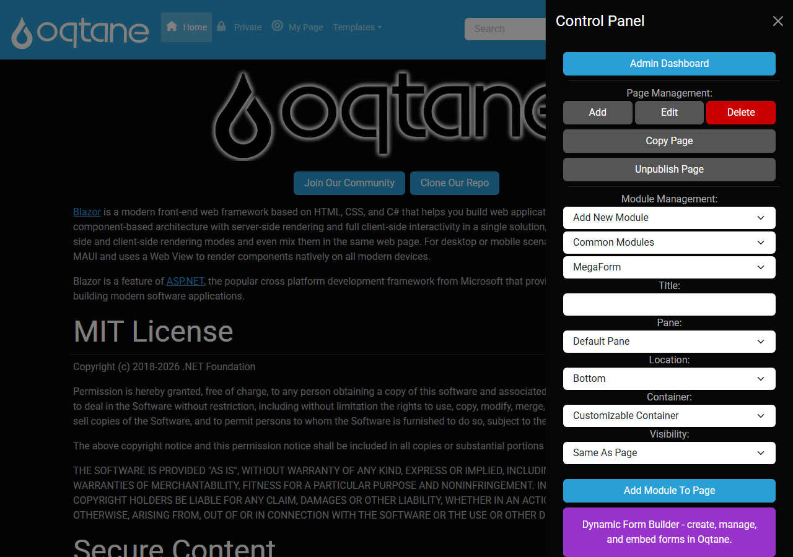
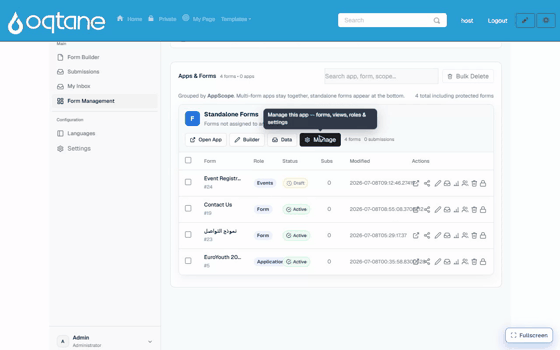

# From a blank page to a working form

This walkthrough goes end-to-end on Oqtane: start on an empty page, add the MegaForm module,
let the AI build a **product feedback form** with **display logic**, and finish with the form
running live — where a low rating reveals a follow-up question.

## 1. Add the MegaForm module to a page

On any page, open Oqtane's **Control Panel** (the ⚙ in the top bar, in edit mode). Under
**Module Management**, choose **MegaForm** and click **Add Module To Page**:

An empty MegaForm module appears on the page, ready to fill with a form.

## 2. Build the form with AI — including display logic

Open the module's **Form Dashboard** and click **✨ Create with AI** (or use the AI bubble in
the Form Builder). Describe the form *and* the conditional behaviour you want — the assistant
generates the fields **and** the display logic, then you **Save & Use Now** to make it live:

> *"A product feedback form: a star rating 'How would you rate our product?', and a comment box
> 'What could we improve?' that only appears when the rating is 3 stars or lower. Include name
> and email."*

## 3. Display logic (conditional visibility)

The example above asks the AI to make one field **conditional** — the *"What could we improve?"*
box only shows when the rating is low. On the finished form:

- Rate **4–5 stars** → the comment box stays hidden.
- Rate **1–3 stars** → the comment box appears.

You can add or change this yourself in the **Form Builder**: select a field, turn on
**"Only show when…"**, and add a condition (e.g. *rating* **is less than** *4*). Conditions can
combine multiple rules with *And* / *Or*, and the same engine can also make fields **required**
or **set values** based on other answers. The rules run in the live form instantly — no page
reload.

## 4. The result: a working form

The finished feedback form is live on the page, collecting submissions into
[Submissions & My Inbox](submissions-inbox.md). From here you can theme it, translate it, add a
[workflow](workflow.md), or connect it to [storage](storage-options.md) — all covered in the
rest of this guide.
