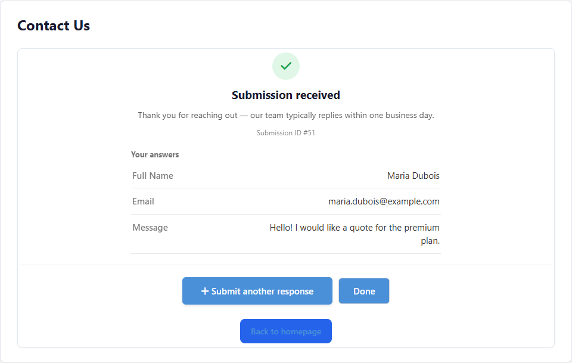
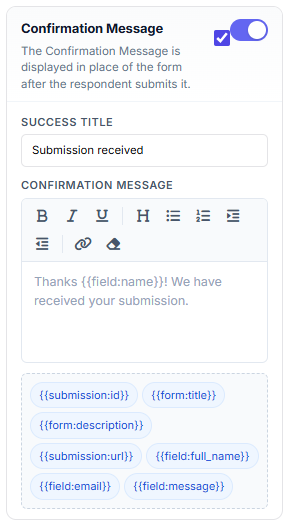
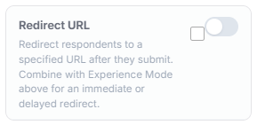
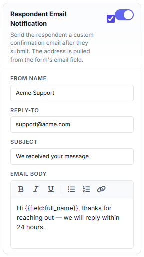
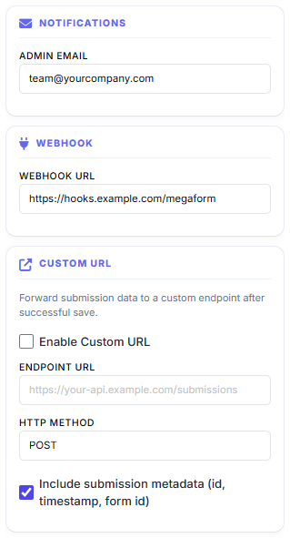
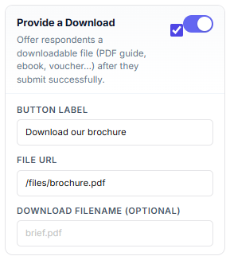

# After Submission: Confirmation, Emails & Notifications

What should happen the moment a visitor presses **Submit**? MegaForm gives you a full
post-submit toolbox: an in-form confirmation screen (or redirect), a thank-you email to the
respondent, an alert email to your team, a file download, webhooks and analytics events.

Everything below is configured in the **Form Builder → Settings tab** (right rail), so each
form has its own behaviour.

## The confirmation experience

This is what the respondent sees by default — a rich confirmation card shown in place of the
form:

Under **Confirmation** in the Settings tab you choose one of three **confirmation types**:

- **Message** — show a confirmation card in the form (no redirect).
- **Page / Redirect** — send the respondent straight to another page or URL.
- **Message, then redirect** — show the message, then redirect after a configurable delay
  (with a "Redirecting shortly…" notice).

The **Success Title** and **Confirmation Message** support formatting (bold, lists, links)
and **token chips** — click a chip such as `{{submission:id}}`, `{{form:title}}` or
`{{submission:url}}` to insert it into the message.

Optional extras on the same card:

- **Review before submit** — respondents see all their answers on one screen (and can go
  back to edit) before the final Submit. Great for long or multi-step forms.
- **Submission Details** — show the **submission ID** (a reference number the respondent can
  quote), an **answer summary** (with empty answers hidden if you like) and a
  **"Submit another response"** button.
- **CTA buttons** — up to two custom buttons (primary + secondary) linking anywhere, e.g.
  "Back to homepage" or "Book a call".

### Redirect URL

Toggle **Redirect URL** on and combine it with the confirmation type above for an immediate
or delayed redirect — useful for thank-you landing pages and conversion tracking.

## Emails

### Respondent email (autoresponder)

Send the person who submitted the form a confirmation email. The recipient address is pulled
automatically from the form's email field; you control the From name, Reply-To, subject and
a formatted body:

### Admin notification

Under **Notifications**, enter the address (or addresses) that should be alerted on every new
submission — the email includes the submitted answers:

> Emails are sent through your site's configured SMTP server (Oqtane host settings → SMTP).
> If nothing arrives, check the SMTP configuration and the site logs first.

## Give something back: a download

Toggle **Provide a Download** to offer a file — a PDF guide, brochure, ebook or voucher —
right on the confirmation screen:

## Push the data somewhere else

The same Settings tab wires post-submit integrations:

- **Webhook** — POST the submission as JSON to any URL (outgoing URLs are validated
  server-side against SSRF).
- **Custom URL** — forward the submission to your own API endpoint (POST or PUT, with
  optional metadata: id, timestamp, form id).
- **Google Analytics** — fire a configurable GA event on each successful submit.
- **Database insert / Google Sheets** — write each submission into your own database table
  or a spreadsheet; see [Storage & Integrations](storage-options.md).

## What happens automatically

Independent of the settings above, every successful submit:

1. **Stores the submission** — browse, filter, export and manage columns in
   [Submissions & My Inbox](submissions-inbox.md).
2. **Runs the form's workflow** (if one is attached) — approvals, service tasks, user tasks
   in My Inbox; see [Workflow](workflow.md).
3. **Applies anti-spam and rate limits** configured for the form (honeypot, per-window
   submission caps).

## Quick checklist

| Goal | Where |
|---|---|
| Change the thank-you text | Settings → Confirmation → Success Title / Message |
| Redirect to a landing page | Settings → Confirmation Type + Redirect URL |
| Email the respondent | Settings → Respondent Email Notification |
| Alert your team | Settings → Notifications → Admin Email |
| Offer a brochure download | Settings → Provide a Download |
| Send data to another system | Settings → Webhook / Custom URL, or [Storage & Integrations](storage-options.md) |
| Review & approve submissions | [Submissions & My Inbox](submissions-inbox.md) + [Workflow](workflow.md) |
