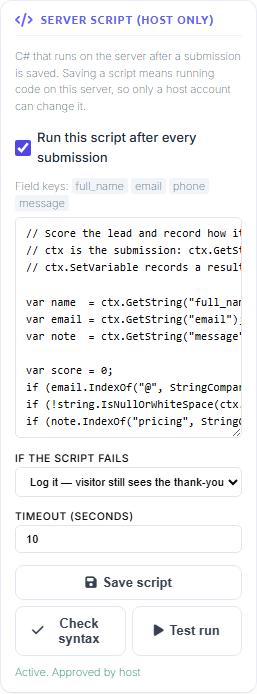

# Run your own C# after a submission

MegaForm can compile and run **C# you write yourself**, on the server, immediately after a
submission is saved. This page is the reference: when to reach for it, what the script is handed,
and what the language and the runtime will and will not accept. The worked recipes live on their own
pages and are linked at the end.

> [!IMPORTANT]
> If you arrived from an older version of this page describing `ctx.Db` or `ctx.Http`: those no
> longer exist. A script now calls platform APIs directly — `SqlConnection`, `HttpClient`,
> `UserController` — with an ordinary `using`.

---

## 1. Why, and when

Start by not writing a script. Most of what has to happen after a submission is already
configuration, and configuration survives an export, needs nobody to enable scripting, and cannot
stop compiling after an upgrade.

| If the requirement is | Use |
|---|---|
| every submission goes to one endpoint | [Webhook / API service task](integration-webhook.md) |
| every submission is mirrored into one table | [Form Settings → Database](integration-sql-insert.md) |
| email, approval, create user, add role, branch on a value | workflow nodes |

What no node expresses is a **decision with shape**. A node does one thing to every submission.
These are the shapes that keep arriving, and none of them is a node with more checkboxes:

- **The write is more than one row, and the second depends on the first.** An order header whose
  generated key the line items need. No node holds a value between two writes.
- **The destination depends on the answer.** Enterprise enquiries to one CRM, everyone else to the
  internal queue, with a different payload shape for each.
- **The number has to be right, not close.** Tax by country and product class, a rate rounded the
  way your finance team rounds it, a discount table that lives in another system.
- **The rule is a lookup, not a value on the form.** Whether this class code is still open, whether
  this account is past due, whether this postcode is inside the service area.
- **Two systems have to agree.** Write locally, call the remote API, and record what the remote one
  answered so a person can reconcile it later.

The honest test: if you can describe the requirement as *"for every submission, do X"*, a node
already does it, and the node is the better answer — one fewer thing to read at review time. If the
requirement is *"it depends"*, this is the tool.

The trade is real. A script is code, running in your website's process under your website's
identity, with no sandbox. [Safety and responsibility](scripting-safety.md) sets out what a host is
agreeing to before switching it on.

---

## 2. A first script

You write the body. `ctx` is the submission; there is no boilerplate to type.

```csharp
var name    = ctx.GetString("full_name");
var country = ctx.GetString("country", "GB");
var rate    = country == "DE" ? 0.19m : 0.20m;
var total   = ctx.GetDecimal("order_total", 0m) * (1m + rate);

ctx.Log($"country={country} rate={rate} total={total:0.00}");
ctx.SetVariable("totalIncVat", total);

if (total > 1000m)
{
    ctx.Response.SuccessMessage = "Thank you " + name + ". An account manager will call you today.";
}
```

That script reads two answers, computes a third, records it on the run, and changes what this one
visitor sees on the thank-you screen. Everything past that — writing a row, calling an API, sending
a message, creating an account — is ordinary C# with a `using`, and is covered by the recipe pages.

### Where the editor is

**Builder → Design → Form Settings → Server Script.** Save the form once first: a script belongs to
a form, so there has to be a form to attach it to.



The panel lists the current form's field keys above the editor, so you do not have to remember
whether it was `full_name` or `fullname`. It also holds the enable switch for this form, what
happens when a run fails, the run timeout, and **Save script**, **Check syntax** and **Test run**.
Compilation happens at Save, so mistakes come back on your own line numbers while you are still
looking at the editor rather than on a visitor's submission.

The script is not part of the form's schema and does not travel with it. Saving the form does not
save the script, and saving the script does not save the form. They are separate because they carry
different authority — see [§6](#6-the-three-gates).

---

## 3. What `ctx` holds

This is the whole surface. Nothing else exists on it.

### Reading the submission

| Member | What it is |
|---|---|
| `ctx.Data` | `IDictionary<string, object>` of the submitted values; keys are case-insensitive |
| `ctx.Has(fieldKey)` | `bool` — whether the field was submitted at all |
| `ctx.GetString(key, fallback = "")` | value as text |
| `ctx.GetDecimal(key, fallback = 0m)` | parsed decimal |
| `ctx.GetInt(key, fallback = 0)` | parsed integer |
| `ctx.GetBool(key, fallback = false)` | parsed boolean |
| `ctx.GetDate(key)` | `DateTime?` — `null` when absent or unparseable |

`Has` and a fallback answer different questions. `GetDecimal("discount", 0m)` returns `0` both for
"the visitor typed 0" and for "the field was never on the form"; `Has("discount")` tells them apart.

### Which submission, and whose

| Member | What it is |
|---|---|
| `ctx.FormId`, `ctx.SubmissionId`, `ctx.PortalId`, `ctx.FormTitle` | which form, which stored row |
| `ctx.UserId`, `ctx.UserName`, `ctx.UserEmail` | the signed-in submitter — `0` and empty strings for an anonymous submission |
| `ctx.IpAddress` | the caller's address |
| `ctx.UtcNow` | the run's timestamp |

Public forms are the normal case, so treat `UserId == 0` as expected input rather than as an error.

### Recording what happened

| Member | What it is |
|---|---|
| `ctx.Log(string)` | one line in the run record |
| `ctx.Logs` | the lines logged so far |
| `ctx.SetVariable(key, value)` | a value carried onto the run record |
| `ctx.Variables` | the variables set so far |
| `ctx.Fail(string)` | marks the run failed |

### Changing the submission, and the visitor's experience

| Member | What it is |
|---|---|
| `ctx.SetValue(key, value)` | queues a change to a stored value — **refused after the commit**, see [§5](#5-stages-and-what-they-stop-you-doing) |
| `ctx.PendingChanges` | what `SetValue` has queued |
| `ctx.Response.SuccessMessage` | replaces the thank-you text for this submission |
| `ctx.Response.RedirectUrl` | sends this visitor somewhere else |
| `ctx.Response.CustomData` | extra data returned with this submit response |

`ctx.Response` affects **this submission only**. It is not a form setting and it does not persist.

### Where in the pipeline you are

| Member | What it is |
|---|---|
| `ctx.Stage` | which stage is running |
| `ctx.CanAbort` | whether the current stage can still refuse the submission |

---

## 4. What is supported

### The shape your body is compiled into

The body you type is spliced into this method:

```csharp
// SIGNATURE ONLY — this is generated around your body; you never type it.
async Task RunAsync(SubmissionScriptContext ctx, CancellationToken ct)
```

So `await` works directly, `ct` is in scope, and a bare `return;` is a valid way to stop early. You
never write the signature.

Pass `ct` to the calls you await. Cancellation is cooperative — a token you do not pass is a timeout
that cannot fire.

### Language version: C# 7.3

The compiler is pinned to **C# 7.3**. Modern syntax you may be used to is a compile error at Save:

```csharp
// FRAGMENT — none of these lines compile in a script.
using var cn = new SqlConnection(cs);   // no using declarations; use using (…) { }
List<string> names = new();             // no target-typed new
var text = """raw""";                   // no raw string literals
```

Interpolated strings, `nameof`, tuples, pattern matching as of 7.3, `async`/`await`, expression-bodied
members and **local functions** are all available. Top-level statements are not a thing here — your
body already is a method body.

```csharp
using System.Globalization;

// Local functions are allowed, which is usually enough to keep a longer script readable.
decimal Net(decimal gross, decimal rate)
{
    return decimal.Round(gross / (1m + rate), 2);
}

var net = Net(ctx.GetDecimal("order_total", 0m), 0.20m);
ctx.Log("net=" + net.ToString("0.00", CultureInfo.InvariantCulture));
```

### Namespaces already in scope

Do not repeat these — they are imported for you:

```text
System
System.Collections.Generic
System.Linq
System.Text
System.Threading
System.Threading.Tasks
MegaForm.Core.Scripting
```

A script may begin with its own `using` directives. They are lifted above the generated wrapper, so
they belong at the very top of the body, and a trailing comment after the semicolon is fine:

```csharp
using System.Net.Http;              // the CRM call below
using Newtonsoft.Json;

var payload = JsonConvert.SerializeObject(new
{
    name  = ctx.GetString("full_name"),
    email = ctx.GetString("email")
});

using (var http = new HttpClient())
using (var body = new StringContent(payload, Encoding.UTF8, "application/json"))
{
    var reply = await http.PostAsync("https://crm.contoso.com/api/leads", body, ct);
    ctx.Log($"crm status={(int)reply.StatusCode}");
    if (!reply.IsSuccessStatusCode) ctx.Fail("CRM rejected the lead");
}
```

### Which libraries you can name

The reference set is **every assembly the site has loaded**. Anything a DNN module can name, a
script can name — including:

| Namespace | For |
|---|---|
| `DotNetNuke.*` | users, roles, mail, config, the platform's own services |
| `System.Data.SqlClient` | your own tables, with parameters |
| `System.Net.Http` | REST, SOAP, anything over HTTP |
| `Newtonsoft.Json` | serialising and parsing payloads |

Two limits sit on top of that:

- **`unsafe` code is refused** — pointers and `stackalloc` — in every configuration.
- **An optional strict mode exists and is off by default.** Turned on, it restores an older
  namespace deny-list that refuses most of the table above. It is a process-wide startup flag, not a
  per-form setting. [Safety and responsibility](scripting-safety.md) is where it is documented; do
  not assume it is on.

### Size and time

| Limit | Value |
|---|---|
| Source length | 64 KB |
| Run timeout | 10 seconds by default, 60 seconds maximum |

> [!WARNING]
> The timeout bounds **what the visitor waits for**, not what the script does. .NET has no safe way
> to abort work already running, so on expiry the request stops waiting and the submission
> completes, while the script keeps its thread until it finishes or the application recycles. Treat
> the timeout as a seatbelt, not a brake: bound your own loops, and pass `ct` to every call you
> await.

---

## 5. Stages, and what they stop you doing

Four stages exist in the engine. They differ in where they sit relative to the database commit,
which decides everything else.

| Stage | Runs | Can refuse the submission | Can change stored values | Configurable today |
|---|---|---|---|---|
| PreValidate | before validation finishes | yes | yes | **no** |
| PreInsert | inside the submit transaction | yes | yes | **no** |
| PostCommit | after the row is committed | no | no | **yes** |
| AsyncWorker | later, off a queue | no | no | **no** |

> [!IMPORTANT]
> **Only PostCommit can be configured.** The script you write and approve is stored as the form's
> after-submit hook, and the engine runs that hook as PostCommit. Nothing in the product writes a
> script into the other three stages — no editor, no API, no import path.

Two consequences, stated plainly because they are the biggest constraint on this page:

- **A script cannot refuse a submission.** Refusing needs PreInsert. `ctx.Fail("…")` at PostCommit
  records the run as failed; the row is already stored. To turn away unwelcome-but-valid input, use
  the anti-spam settings and workflow rules.
- **A script cannot rewrite a stored value.** `ctx.SetValue` is *refused* after the commit rather
  than quietly ignored, on purpose: a script that believes it corrected a stored value and did not
  is a data bug that surfaces months later in a report.

What a PostCommit script can do is compute a value and send it onward — into your own table, to an
API, into an email, onto the run record, into `ctx.Response`. It just does not go back into the
submission.

---

## 6. The three gates

A script does not run until all three hold. There is no fallback path and no per-site override.

**1 — a config file switch.** In `web.config` appSettings:

```xml
<appSettings>
  <add key="MegaForm:AfterSubmitScriptEnabled" value="true" />
</appSettings>
```

Off on every install. Anything other than `true` means off. It is a file rather than a settings
screen on purpose: turning this on means *people may run code on this server*, and the right bar for
that is **can edit files on this server** — a smaller group than *knows the superuser password*. It
also means a site restored from a backup and a fresh config file comes back with the feature off.

**2 — a host account saves the script.** Host / SuperUser only. Not a site Administrator, not
someone with Edit permission on the module. "Edit module" is a content-editor permission several
people usually hold, and an Administrator's reach stops at one site while a script runs in the
process shared by the whole installation.

**3 — an approval hash over the source.** Saving stores a hash of the exact source the server
accepted, with who approved it and when. Before every run the server re-hashes and compares.
Mismatch, no run.

That third gate is what makes every other route into your forms inert. A form export, a template
install, a gallery download, a restored backup, a hand-built save request — all of them can carry a
script's source, and none of them can carry a valid approval, because an approval is written
server-side at the instant a host pressed Save on **that** site. The ordinary form Save path goes
further: it discards the caller's copy of this block and writes back the one the server already had.
A content editor saving a form cannot introduce a script, alter an approved one, or switch one off.

---

## 7. What is recorded when it runs

Every run is written down, and so is every approval. Between them they answer the two questions that
only have answers if something wrote them at the time: *what did this script do on that submission*,
and *who put this code on the server*.

A run keeps the form, the submission, the stage, the hash of the source that ran, success or
failure, the duration, the error if there was one, and everything the script logged. A **skipped**
run is not a failed one — disabled, empty, not approved on this site, or a hash mismatch each record
a reason rather than an error.

This is what one measured run looks like from the log side. On a DNN 10.3 site, an anonymous
submission ran a PostCommit script that did four things in 927 ms: a parameterised `INSERT` through
`SqlConnection`, an `HttpClient` POST to an external endpoint, a message handed to DNN's own sender,
and an account created with a role granted.

```text
country=DE rate=0.19 total=892.50
insert rowsAffected=1
crm status=200
mail handed to DNN's sender for jane.carter@example.com
```

Four `ctx.Log` lines, one per effect, is a good habit: a script that catches everything and logs
nothing will fail for months without anyone noticing. The tables, their columns, and the host-only
endpoint that reads them are documented in
[Safety and responsibility](scripting-safety.md).

---

## 8. Where to go next

[Writing your own C# after a submission](automation-overview.md) is the branch overview. Each recipe
below is one job, with the script and what the run record shows afterwards.

| Recipe | What it covers |
|---|---|
| [Write to your own database](automation-custom-db.md) | `SqlConnection`, parameters, several tables in one run |
| [CRM, ERP, REST and SOAP](automation-rest-crm.md) | `HttpClient`, payload shape, what to do with the reply |
| [Email and messaging](automation-notifications.md) | DNN's own sender, and calling a provider's API |
| [Create users and grant roles](automation-user-provisioning.md) | `UserController`, `RoleController`, and what to check first |
| [Safety and responsibility](scripting-safety.md) | the gates in detail, strict mode, and reviewing a script before you approve it |

## Related

- [Push submissions to a CRM or ERP over HTTP](integration-webhook.md)
- [Write submissions into an existing SQL table](integration-sql-insert.md)
- [Four fields → BPMN → an API service task](integration-bpmn-api-task.md)
