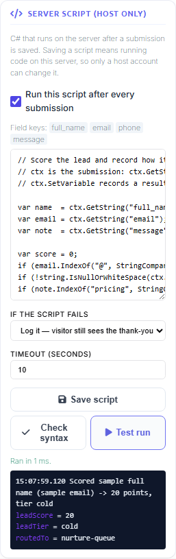
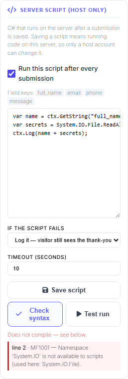

# Run your own C# after a submission

Sometimes what has to happen after a submission is not one email, one webhook or one `INSERT` — it
is a decision followed by several of those. Score the lead, then write it to the CRM database and
tell the sales API about it. Work out which branch office owns this postcode, then route the
approval there. Round a total the way your finance team rounds it, then push the corrected figure
into the ERP.

MegaForm can run a piece of **C# you write yourself**, on the server, immediately after the
submission is saved. You write statements; MegaForm compiles them when you press Save and runs the
compiled code on every submission after that. Scripts can write to your databases
([`ctx.Db`](#5-writing-to-a-database-and-calling-an-api)) and call your APIs
([`ctx.Http`](#5-writing-to-a-database-and-calling-an-api)).


> **This is remote code execution, on purpose.** A script runs inside your website's own process,
> with your website's own permissions. Read [§1](#1-who-can-do-this) before you switch it on —
> especially the part about who *cannot*.

---

## 1. Who can do this

Two separate things must both be true. Neither has a shortcut.

**The installation must allow scripting.** It is off on every install. A host turns it on by editing
`web.config` on the server:

```xml
<appSettings>
  <add key="MegaForm:AfterSubmitScriptEnabled" value="true" />
</appSettings>
```

On Oqtane the same key goes in `appsettings.json`. Saving the file restarts the application, so the
switch takes effect at a moment you chose.

It is a config file rather than a settings screen deliberately. Turning this on means "people may
run code on this server", and the right bar for that is *can edit files on the server* — a smaller
group than *knows the superuser password*.

**The person must be a host (superuser).** Not a site administrator. Not someone with Edit
permission on the module. On DNN, "edit module" is a content-editor permission that several people
usually hold; on Oqtane, Admin is scoped to one site while a script runs in the process shared by
every site on the installation. Only Host/SuperUser can open, change or save a script, and anyone
else gets a plain refusal instead of a disabled-looking editor.

There is a third guard you never interact with, and it is the one that matters most. When a host
saves a script, MegaForm stores a **hash of the exact source it approved**, together with who
approved it and when. Before running anything, the server re-hashes the stored source and compares.
If the two do not match, the script does not run.

That makes every other route into your form inert by construction. A form export, a template
install, a gallery download, a restored backup, a hand-crafted save request from someone with Edit
permission — all of them can carry a `source` field, and none of them can produce a matching
approval, because the approval is written server-side at the moment a host pressed Save. The
ordinary form Save endpoint goes further: it discards whatever the caller sent for this block and
puts the stored copy back, so a content editor cannot introduce a script, edit one, or quietly
switch one off.

---

## 2. Where the editor is

**Builder → Design → Form Settings → Server Script (host only).**

Save the form once first — a script belongs to a form, so there has to be a form to attach it to.

The panel is not part of the form's schema and does not travel with it. Saving the form does not
save the script, and **Save script** does not save the form. They are separate on purpose: they have
different authority.

If you are signed in as a site administrator rather than a host, or the installation switch is off,
the panel tells you which of the two it is instead of failing silently.

---

## 3. Writing the script

You write the *body*. `ctx` is the submission; there is no boilerplate to type.

```csharp
// Score the lead and record how it should be routed.
var name  = ctx.GetString("full_name");
var email = ctx.GetString("email");
var note  = ctx.GetString("message");

var score = 0;
if (email.IndexOf("@", StringComparison.Ordinal) > 0)                  score += 10;
if (!string.IsNullOrWhiteSpace(ctx.GetString("phone")))                score += 20;
if (note.IndexOf("pricing", StringComparison.OrdinalIgnoreCase) >= 0)  score += 40;

var tier = score >= 60 ? "hot" : (score >= 30 ? "warm" : "cold");

ctx.SetVariable("leadScore", score);
ctx.SetVariable("leadTier", tier);
ctx.Log("Scored " + name + " -> " + score + " points, tier " + tier);
```

The field keys of the current form are listed above the editor, so you do not have to remember
whether it was `full_name` or `fullname`.

### What `ctx` gives you

| Reading the submission | |
|---|---|
| `ctx.GetString(key, fallback)` | value as text |
| `ctx.GetDecimal(key, fallback)` · `ctx.GetInt` · `ctx.GetBool` | parsed, with a fallback when absent or unparseable |
| `ctx.GetDate(key)` | `DateTime?` |
| `ctx.Has(key)` · `ctx.Data` | presence, and the whole map (field keys are case-insensitive) |

| Who submitted it | |
|---|---|
| `ctx.UserId` | `0` for an anonymous submission |
| `ctx.UserName` · `ctx.UserEmail` · `ctx.IpAddress` | |
| `ctx.FormId` · `ctx.SubmissionId` · `ctx.PortalId` · `ctx.FormTitle` · `ctx.UtcNow` | |

| Writing a result | |
|---|---|
| `ctx.Log("…")` | one line in the run record (capped at 200 lines) |
| `ctx.SetVariable("key", value)` | a value stored on the run record |
| `ctx.Fail("why")` | marks the run failed — see [§6](#6-when-a-script-fails) |

| Acting on other systems | |
|---|---|
| `ctx.Db` | parameterised SQL against a named connection — [§5](#5-writing-to-a-database-and-calling-an-api) |
| `ctx.Http` | outbound HTTP with the site's URL guard — [§5](#5-writing-to-a-database-and-calling-an-api) |

If you need private helper methods, write the whole class instead and MegaForm compiles it as-is:

```csharp
public sealed class MyScript : ISubmissionScript
{
    public void Run(SubmissionScriptContext ctx)
    {
        ctx.SetVariable("net", WithoutVat(ctx.GetDecimal("total")));
    }

    private decimal WithoutVat(decimal gross) => decimal.Round(gross / 1.2m, 2);
}
```

---

## 4. Try it before a visitor does

**Test run** compiles the script and runs it against sample values, right there in the panel. No
submission is created and nothing is stored — you are watching the same compiled code the pipeline
would call, against made-up input.

The output pane shows what the script logged and every variable it set.



**Check syntax** compiles without running, which is the quicker loop while you are still typing.

Both report errors on **your** line numbers, not on some line inside a wrapper you never saw.

---

## 5. Writing to a database and calling an API

A hook that could only do arithmetic would not be worth having — the Calculate field already does
arithmetic. Scripts write to databases and call APIs. They do it through two capabilities on `ctx`
rather than by opening a connection or an HTTP client themselves.

### `ctx.Db` — parameterised SQL against a named connection

```csharp
var leadId = ctx.Db.Scalar("CustomerCrm",
    "SELECT LeadId FROM CRM_Leads WHERE Email = @email", new { email = ctx.GetString("email") });

if (leadId == null)
{
    ctx.Db.Execute("CustomerCrm",
        "INSERT INTO CRM_Leads (FullName, Email, Score) VALUES (@name, @email, @score)",
        new { name = ctx.GetString("full_name"), email = ctx.GetString("email"), score = 70 });
}

foreach (var row in ctx.Db.Query("CustomerCrm",
             "SELECT LeadId, FullName FROM CRM_Leads WHERE Score > @min", new { min = 50 }))
    ctx.Log(row.Str("FullName"));
```

The first argument is the **name** of a connection an administrator registered in
[Database Settings](integration-sql-insert.md) — the same catalog Form Settings → Database and the
workflow Database node resolve from. A script therefore never carries a connection string, so
rotating a password stays one change in one place, and an exported form cannot leak a credential.

Values are bound as real parameters; they are never concatenated into the statement. `Query` is
capped server-side, so a forgotten `WHERE` returns a bounded page instead of pulling a table into the
submit request.

### `ctx.Http` — outbound calls with the site's URL guard

```csharp
var reply = ctx.Http.PostJson("https://crm.example.com/api/leads",
    new { name = ctx.GetString("full_name"), email = ctx.GetString("email") },
    new Dictionary<string, string> { { "Authorization", "Bearer " + apiToken } });

if (!reply.Ok) ctx.Fail("CRM refused the lead: HTTP " + reply.Status);
```

`Get`, `PostJson` and `Send` (for SOAP, PUT, or anything else) all run the URL through the same
outbound-address guard the Webhook node uses, with a timeout and a response-size cap. Every call
adds a line to the run record.

That guard matters most when any part of a URL came from the submission itself: without it, an
anonymous public form becomes a way to make the server issue requests against its own network.

### What stays closed

`System.Net`, `System.Data`, `System.IO`, `System.Reflection`, `System.Diagnostics`,
`System.Threading` and friends are refused at compile time — you find out while you are looking at
the editor, not on a visitor's submission:



The check runs on what the compiler *resolved*, not on the text you typed, so it is not fooled by
aliases, fully-qualified names, `global::`, generic arguments or `var`.

This is capability injection, not a smaller feature. `new SqlConnection(…)` and `new HttpClient()`
would give the same power while losing the properties that make it safe to run on a customer's
server: a named connection instead of an embedded credential, a guarded URL instead of an
unchecked one, and a record of what the script actually did.

Some jobs still belong to a purpose-built surface rather than to a script:

| You wanted to | Use instead |
|---|---|
| A retrying, authenticated call as part of a flow | a [Webhook / API service task](integration-webhook.md) node |
| Mirror every submission into one table | [Form Settings → Database](integration-sql-insert.md) — no code at all |
| Send an email | the workflow **Email** node, which holds the credentials |
| Normalise or encrypt a value **before** it is stored | a pre-insert lifecycle hook — by the time a script runs, the row exists |
| Stop a submission from being saved | the same pre-insert hook |

A script **can** still loop forever. See the timeout in [§6](#6-when-a-script-fails).

---

## 6. When a script fails

The submission has already been committed by the time your script runs. Nothing a script does can
undo it. If you need to *veto* a submission, that is a pre-insert lifecycle hook, which runs inside
the same database transaction as the insert.

Given that, `ctx.Fail("…")` and an unhandled exception both mean the same thing: this run failed, it
is recorded, and the row stays. **If the script fails** decides what the visitor sees:

- **Log it — visitor still sees the thank-you** (default). The failure is in the run record and the
  site event log.
- **Also report the message to the caller.** Use this while you are rolling a script out.

**Timeout** (1–60s, default 10) bounds how long the submit waits. It does not bound the script: .NET
has no safe way to stop a thread that has already started, so a script stuck in a loop keeps running
until the application recycles — it just stops holding up the visitor. Treat the timeout as a
seatbelt, not a brake, and do not write unbounded loops.

---

## 7. What is recorded

Every approval and every run is written down.

**Approvals** — who saved which script, when, and its hash. This is the record that answers "who put
code on this server", and it can only be answered later if it was written at the time.

**Runs** — one row per submission: success or failure, duration, error, and everything the script
logged.

---

## 8. Performance

Compilation happens when you press **Save**, not on submissions. That is why syntax errors appear
while you are still in the editor, and why a submission on a warm site costs a delegate call —
single-digit milliseconds for the sample above.

The first submission after an application restart pays one compile (roughly 100–300 ms, once).
Identical source is recognised by its hash and never recompiled.

Editing a script produces a new compiled assembly each time. On .NET-based hosts (Oqtane) those are
loaded so they can be reclaimed. On .NET Framework (DNN) they cannot be unloaded and stay until the
application recycles — which is fine for authoring, and worth knowing if you sit and edit a script
fifty times in one afternoon.

---

## 9. Before you switch it on

- Turn it on only on installations where you are comfortable with anyone holding the host password
  running code on the server.
- Read a script before approving it, especially one that arrived with an imported form. Your Save is
  the approval.
- Reach for a node first. A single webhook or a single table mirror needs no code, and a
  no-code integration is one fewer thing to read at review time. Scripts earn their place when the
  logic decides *which* of those happens.
- Watch the run records after a change. A script that stopped compiling after an upgrade reports
  itself there instead of failing quietly.

## Related

- [Push submissions to a CRM or ERP over HTTP](integration-webhook.md)
- [Write submissions into an existing SQL table](integration-sql-insert.md)
- [Four fields → BPMN → an API service task](integration-bpmn-api-task.md)
