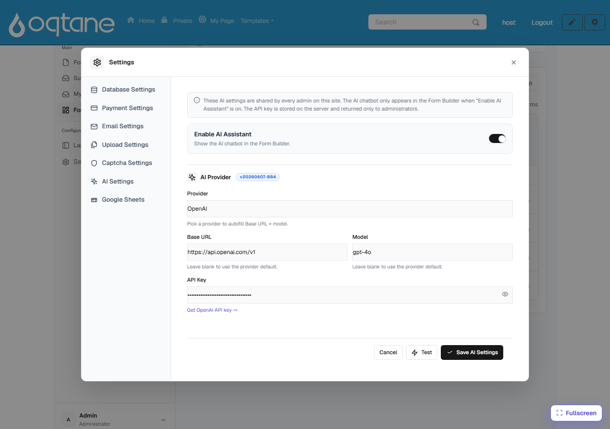

# Configuring the AI Assistant

The [AI Form Designer](ai-form-designer.md) works with **your own** AI account. A site
administrator sets it up once, and every admin on the site then shares the same configuration.
Nothing is sent to MegaForm's servers — requests go straight from your site to the AI provider
you choose.

## Where the settings live

Open **Form Dashboard → Settings → AI Settings**:

## The fields

| Field | What it does |
|---|---|
| **Enable AI Assistant** | Master switch. When on, the AI chatbot appears in the Form Builder and the *Create with AI* button appears on the dashboard. Turn it off to hide AI entirely. |
| **Provider** | Pick your AI provider — **OpenAI**, **Anthropic (Claude)**, **OpenRouter**, **Kimi (Moonshot)**, or any **OpenAI-compatible** endpoint. Choosing a provider auto-fills the Base URL and a default model. |
| **Base URL** | The provider's API endpoint (e.g. `https://api.openai.com/v1`). Leave blank to use the provider default. Point this at a local/self-hosted OpenAI-compatible server if you run your own. |
| **Model** | The model to use (e.g. `gpt-4o`). Leave blank to use the provider default. |
| **API Key** | Your provider API key. It is **stored on the server** and only ever returned to administrators. The field is masked; click the 👁 icon to reveal it while typing. |

## Steps

1. Toggle **Enable AI Assistant** on.
2. Choose your **Provider** — the Base URL and Model fill in automatically. Adjust the model if
   you want a different one.
3. Paste your **API Key**. Use the **Get … API key →** link under the field to create one on the
   provider's site if you don't have one yet.
4. Click **Test** to verify the key, base URL, and model can reach the provider — you'll get an
   *OK* or a clear error.
5. Click **Save AI Settings**.

That's it — open any form in the Form Builder and the AI bubble is ready, or use **✨ Create
with AI** on the dashboard.

## Good to know

- **Security.** The API key never leaves your server except back to signed-in administrators;
  it is not exposed to page visitors or in the public form runtime.
- **Shared per site.** The provider, model, and key are shared by all admins on the site — one
  setup covers everyone.
- **Cost.** Requests are billed by your AI provider against your own account, so you stay in
  control of usage and spend.
- **Trial installations** show the assistant but keep it locked — a production license unlocks
  it.

## Choosing a model

`gpt-4o` (OpenAI) and `claude-*` (Anthropic) both work well for form generation. Larger,
more capable models produce better multi-field forms, premium layouts, and SQL-aware designs;
smaller models are cheaper but may need more precise prompts. See
[AI Prompts for Form Design](ai-prompts-form-design.md) for prompt patterns that get good
results on any model.
