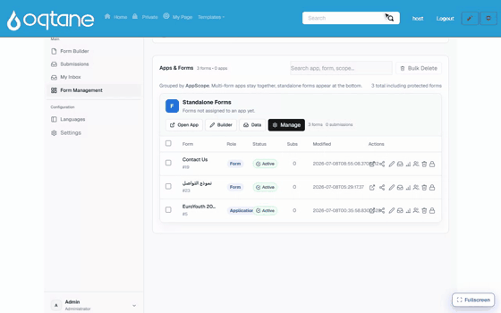

# AI Form Designer

MegaForm ships with a built-in **AI assistant** for designing forms and the data behind them.
You describe what you need in plain English; the assistant proposes the changes and shows them
to you **before anything is applied**. It has been in production use across Oqtane and DNN sites
and is a stable, supported part of the product.

> [!NOTE]
> The AI assistant is available with a **production license**. Trial installations show the
> assistant but keep it locked.

## What you can do with it

**Create complete forms from a description.**

> *"Create a contact form with full name, email, phone, and a dropdown for inquiry type."*

The assistant generates the fields, labels, validation, and layout in one pass — including
premium looks like **choice cards** and **chips**, multi-column layouts, and multi-step wizards
when you ask for them. Review the live preview, then **Save & Use Now** — the finished form is
live on the page:

**Modify an existing form.**

> *"Make the header blue and move the phone field above email."*
> *"Add a leave request section with start date, end date, and a reason textarea."*

Changes are shown as a preview you can accept or discard; your current form is never touched
until you approve.

**Work with your database.** This is where the assistant goes beyond a form generator:

- It can **discover the SQL tables** already in your site's database and build a form on top of
  them — for example a dropdown whose options come from a table, or two dropdowns that cascade
  (pick a *player* → see that player's *rounds*).
- It can **draft a new table** for a form when you ask it to ("create a DB table for this
  form"), so form fields and storage stay in sync.
- It can build **data-driven views** — lists, grids, and repeaters that show rows from your
  tables alongside or instead of input fields.

## Where to find it

| Entry point | What it does |
|---|---|
| **AI bubble** in the Form Builder header | Opens the chat panel for free-form requests on the current form |
| **+ AI Form** (DB tab) | Pick one or more SQL tables and ask the AI to build a form from them |
| **Build fields with AI** | One click: generate form fields from the selected tables |
| **Create DB Table** | Ask the AI to draft a new database table for the current form |

## The review step

Every AI change arrives as a **staging card** in the chat panel:

1. The assistant explains what it is about to change.
2. You click **Apply** to accept or **Discard** to reject.
3. After applying, the builder shows the result immediately — undo is one more prompt away
   ("put it back the way it was").

Nothing is saved to the server until you save the form, so experimenting is safe.

## Setting up a provider

The assistant works with your own AI account (OpenAI, Anthropic, OpenRouter, or any
OpenAI-compatible endpoint). A site administrator configures it once, enters an API key, and
saves — the key is stored server-side and never exposed to page visitors. Full step-by-step
instructions are in **[Configuring the AI Assistant](ai-configuration.md)**.

## Teaching it your house style

Administrators can add entries to the **AI Knowledge Base** (Form Dashboard → AI Knowledge
Base): reusable form patterns, SQL samples, and layout templates. The assistant consults these
when generating, so repeated requests come out in your organisation's style. Built-in entries
are updated with MegaForm upgrades; entries you add yourself are always preserved.

## Writing effective prompts

Good prompts are specific:

- *"Create a contact form with full name, email, phone, and a dropdown for inquiry type."*
- *"Build a golf score viewer: dropdown player → dropdown round → a table of that round's scores."*
- *"Add a leave request form with start date, end date, reason textarea, and manager approval."*

For database-backed forms, mention the table names if you know them — otherwise just ask
*"what tables do I have?"* and the assistant will list them.

A larger collection of ready-to-use prompts is in
[AI Prompts for Form Design](ai-prompts-form-design.md).
