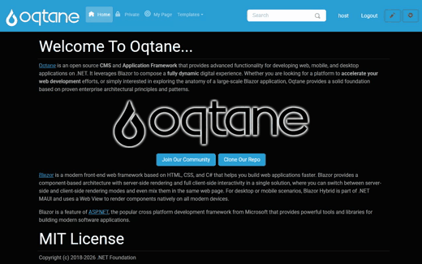

# Creating Forms — Visual Walkthrough

MegaForm gives you four ways to build a form, from a guided wizard to a plain-English AI
assistant. This page walks through each one end to end, with a short recording of the real
builder for every flow. In each case the result is a live, working form on your Oqtane page.

All four flows are reached from the module's **Form Dashboard** (the ⚙ / *Form Dashboard*
button on a MegaForm module, or `?mfpanel=dashboard`).

| Flow | Best for | Jump to |
|---|---|---|
| Wizard | A quick standard form, step by step | [Wizard](#wizard--a-simple-form) |
| Multi-step | Splitting a long form across pages | [Multi-step form](#multi-step-form) |
| Create with AI | Describing a form in plain English | [Create with AI](#create-a-form-with-ai) |
| AI Designer | Changing an existing form by chat | [Modify with AI](#modify-a-form-with-ai) |

---

## Wizard — a simple form

Click **New Form** to open the five-step **Form Wizard** (Setup → Fields → Workflow → Design →
Publish). Name the form, add fields from the field-type gallery — the live preview builds up as
you go — then publish. The form is immediately available on its Oqtane page, ready to fill in.

**Steps shown**

1. **New Form** → the wizard opens on the *Setup* step.
2. Enter a **Form Name** (e.g. *Customer Contact Form*).
3. On **Fields**, click field types to add them — *Full Name*, *Email*, *Long Text* — and watch
   the live preview populate.
4. Step through *Workflow* → *Design* → *Publish* and click **Create Form**.
5. The published form renders on the Oqtane page and accepts input.

> The wizard produces a standard form. You can keep editing it later in the [Form Builder](form-builder.md).

---

## Multi-step form

A long form reads better split across pages. In the wizard's **Fields** step, turn on the
**Multi-step form** toggle and use **+ Add Step** to create pages, then assign fields to each
step. The published form shows a progress bar and *Previous / Next* navigation.

**Steps shown**

1. Name the form (*Event Registration*) and open the **Fields** step.
2. Add the first page's fields (*Full Name*, *Email*, *Phone*).
3. Flip the **Multi-step form** toggle, then **+ Add Step** to create *Step 2*.
4. Add the second page's fields (*Date*, *Dropdown*, *Long Text*).
5. On the live Oqtane page, fill in *Step 1*, click **Next**, and *Step 2* appears with its own
   fields — the stepper marks *Step 1* complete.

> Multi-step also works from the builder using **Page Break** layout blocks — see
> [Form Builder](form-builder.md).

---

## Create a form with AI

Don't want to place fields by hand? Click **✨ Create with AI**, describe the form in one
sentence, and the assistant generates a complete, structured form in the live preview — correct
field types, labels, and validation included. Review it, then **Save & Use Now**.

**Steps shown**

1. **✨ Create with AI** opens the assistant with a chat panel and a live preview.
2. Type a description, e.g. *"a job application form with name, email, phone, position, years of
   experience, expected salary, start date and cover letter."*
3. Click **Send** — the AI (OpenAI GPT-4o in this recording) returns a full form: composite name,
   email, phone with country code, dropdowns, dates, and a message field.
4. Keep it with **Save & Use Now**, or open it in the builder to fine-tune.

> The AI is a licensed feature and is configured under **⚙ Settings → AI** (provider + model +
> API key). It is disabled on trial installs. See [AI Form Designer](ai-form-designer.md).

---

## Modify a form with AI

The same assistant lives inside the builder as the **AI Designer**. Open any form, ask for a
change in plain English, and the AI applies it live to the form on the canvas.

**Steps shown**

1. Open a form in the builder and click **AI Designer**.
2. Ask for a change, e.g. *"Add a phone number field and a preferred appointment date, and make
   the email field required."*
3. The AI applies the edit to the canvas and confirms what it changed.

> Under the hood the AI emits reviewable structured operations (`add_field`, `set_required`, …)
> rather than free-form code. See [AI Form Designer](ai-form-designer.md) for the tool-use model
> and [AI Prompts for Form Design](ai-prompts-form-design.md) for prompt patterns.

---

## Next steps

- [Form Builder](form-builder.md) — the full visual designer (fields, validation, logic, styling).
- [AI Form Designer](ai-form-designer.md) — how the AI assistant plans and applies changes.
- [Template JSON Reference](form-template-json.md) — the schema behind every form.
- [Workflow](workflow.md) — approvals and automation once submissions arrive.
