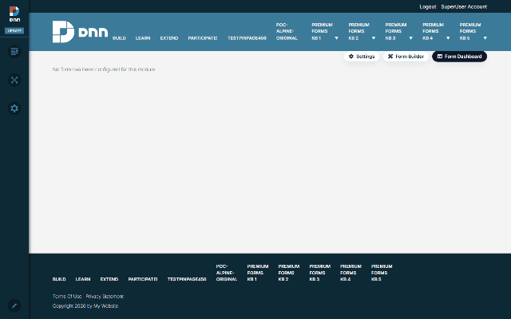

# From a blank page to a working form (DNN)

MegaForm on DNN is one module. Drop it on any DNN page and the page goes from empty to a
working, submittable form in under a minute — no code, no page templates.

## 1. Add the module

Add **MegaForm** to a page the usual DNN way (*Edit page → Add module → MegaForm*). Until a form
is chosen the module renders a single line — *“No form has been configured for this module.”* —
plus, for admins, the MegaForm toolbar in the top-right corner:

| Toolbar button | What it opens |
|---|---|
| **Module View** | What THIS module instance displays — the form picker below |
| **Settings** | Module-level settings & theme (see [Module Settings & Theme](dnn-settings-theme.md)) |
| **Form Builder** | The full form designer (see [Form Builder](dnn-form-builder.md)) |
| **Form Dashboard** | The admin dashboard — forms, submissions, reports |

Visitors see nothing of this — the toolbar and the unconfigured notice are admin-only.

## 2. Pick the form — Module View

**Module View** is where you bind a form to this page. The popup has:

- a **display mode** — *Fixed form* (render inline on the page) or *Popup form* (open on a
  trigger: time delay, scroll depth, or click — see [Module Settings & Theme](dnn-settings-theme.md));
- the **form picker** — every form on the portal with its status (*Store · Published*,
  *Contact Form · Published*, …);
- **Use selected form on this page** — applies the choice to this module instance only.

Pick a form, apply, done. The same form can be bound on any number of pages, and each module
instance keeps its own display settings.

## 3. The form is live

The page now renders the chosen form — fields, validation, uploads and all. Submissions land in
the [Form Dashboard](dnn-submissions-inbox.md) (and anywhere else the form is configured to
deliver: email, webhooks, or [your own SQL tables](dnn-storage-options.md)).

Where to go next:

- No forms yet? Build one in minutes — [Creating Forms](dnn-creating-forms.md), or start from a
  ready-made [template](dnn-form-templates.md).
- One module shows **one surface** at a time. Beyond the form itself, the same module can serve
  a whole admin **Dashboard page** or a **My Inbox page** for approvers — set up in
  [Module setup: fixed form, dashboard & inbox pages](dnn-module-setup.md).
