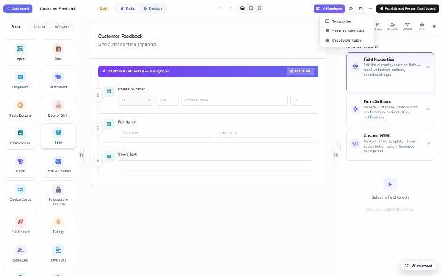

# After submission (DNN)

What happens when someone hits Submit? That's the **Form Settings** panel in the builder —
open the **⋯** menu (or the Settings gear) and the right panel switches to the form-level
configuration: *General, Database, After-Submit confirmation, redirect, CTA, notifications*.

## The sections

| Section | What you configure |
|---|---|
| **General** | Require login, Save & Continue (resumable drafts), Multi-step form, Display Only, Hide form header. |
| **Display style** | How the published card renders — corners, shadows, borders, mobile padding. |
| **Database** | Mirror each submission into YOUR SQL table the moment it arrives — see [Storage & Integrations](dnn-storage-options.md). |
| **After-Submit** | The confirmation experience: a thank-you message (rich text), a **redirect** to any URL, or a call-to-action button; optionally show a summary of the submitted answers. |
| **Notifications** | Email the submitter and/or staff on each submission — templated subject/body with `{{field}}` tokens. |

## Beyond the confirmation

The After-Submit hook is also where automation chains on:

- **Workflow** — route the submission for approval ([Approval Workflows & Inbox](dnn-workflow-approvals.md)).
- **Webhooks / integrations** — push the record to an external endpoint (server-side, SSRF-guarded).
- **Database insert** — the ERP demo's pattern: the submission lands in `MF_Submissions` AND
  your own table in the same request, parameterized and fail-soft.

Everything here is per-form and lives in the form's settings JSON — exporting the form carries
its after-submit behavior along.
