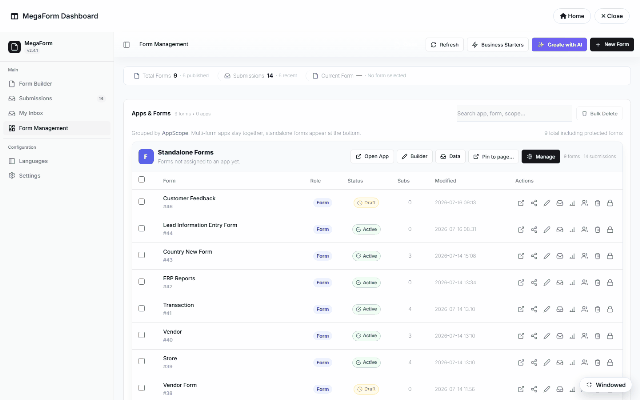

# Configuring the AI assistant (DNN)

The [AI Designer](dnn-ai-form-designer.md) needs a model behind it. Configuration is one
panel: dashboard → **Settings → AI Settings**.

## What you set

| Setting | Notes |
|---|---|
| **Provider** | OpenAI-compatible endpoints (OpenAI, Azure OpenAI, or any compatible base URL). |
| **Base URL / Model** | e.g. `https://api.openai.com/v1` + `gpt-4o`. |
| **API key** | Stored **server-side as a protected site setting** — it never ships to the browser and is not part of any export. |
| **Enabled** | Master switch for the whole AI surface. |

Save, then open the builder — the ✨ AI Designer and the dashboard's *Create with AI* light up
immediately. If the key is missing or the license is trial-locked, the AI buttons explain
instead of failing silently.

## Scope & safety

- The key is per-site; multi-portal installs configure each portal separately.
- The AI surface is **admin-only** — visitors never trigger model calls.
- Model calls carry the form-design catalog, not your submission data; database-aware design
  reads schema metadata over allow-listed connections with SELECT-only proof queries
  (see [AI form designer](dnn-ai-form-designer.md)).
- The same key powers **Translate (AI)** in the [Languages manager](dnn-multi-language.md).
