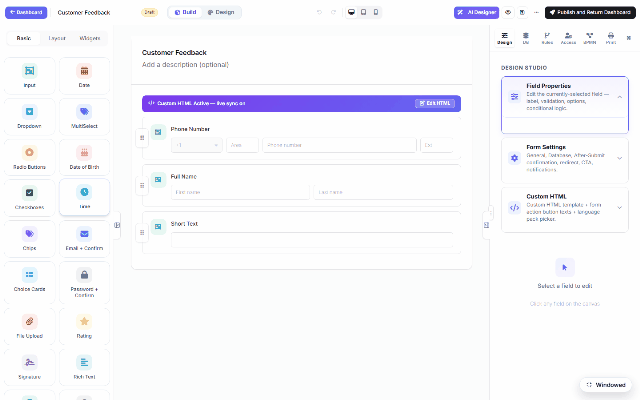

# AI form designer (DNN)

Describe the change; watch it land on the canvas. The **✨ AI Designer** (builder top bar)
opens a chat panel whose instructions are applied **live to the form you're editing** — the
recording below asks for a rating field and gets it, applied, in one round trip:

## What it can do

- **Add / modify fields** — *"add a star rating field named Overall satisfaction"*, *"make
  Full Name required"*, *"turn the Country input into a dropdown with EU countries"*.
- **Fix validation & layout** — *"validate email format"*, *"put First and Last name side by
  side"*.
- **Whole forms** — the dashboard's **✨ Create with AI** drafts a complete form from one
  sentence (fields, layout, validation), which you then refine here.
- **Database-aware design** — the panel's **Database** tab lets the AI see your allow-listed
  tables, so it can build forms bound to real columns (this is how the demo site's AI created
  SQL-backed forms — with SELECT-only proof queries before anything ships).

## On rails, not on trust

The AI proposes **structured operations**, not raw code: every operation is validated against
the schema catalog before it's applied, SQL it suggests is checked and preview-executed
read-only, and nothing touches your form until the ops pass. You always see the result on the
canvas with undo available — and the form stays a Draft until YOU publish.

Setup lives one page over: [Configuring the AI Assistant](dnn-ai-configuration.md). Ready-made
wording that gets good results: [AI Prompts for Form Design](dnn-ai-prompts.md).
