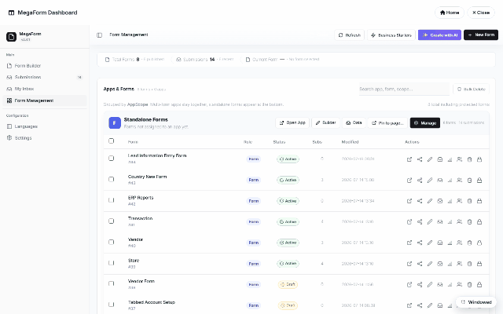

# Creating forms (DNN)

The fastest path from nothing to a live form on DNN is the **Form Wizard** — five guided steps
(*Setup → Fields → Workflow → Design → Publish*), and the form is on your page before the
coffee cools. Open the **Form Dashboard** (admin toolbar or your
[dashboard page](dnn-module-setup.md)) and hit **New Form**.

## The five steps

| Step | What you do |
|---|---|
| **Setup** | Name the form — or skip typing entirely and start from a [template](dnn-form-templates.md) / an imported JSON export. |
| **Fields** | Click field cards to add them — *Full Name*, *Email*, *Phone Number*, *Long Text*, ratings, uploads… Each click drops a preconfigured field (the Phone card, for instance, arrives with country code + area + extension already wired). A live preview builds alongside. Multi-step forms are one toggle (+ *Add Step*). |
| **Workflow** | Optionally attach an approval chain now (or later — see [Workflow](dnn-workflow.md)). |
| **Design** | Colors & typography presets — the theme is per-form and can be tuned later in the [builder](dnn-form-builder.md). |
| **Publish** | Access & sharing, then **Create Form**. |

The wizard saves a complete draft and — when launched from a page's module — binds it to that
page, so the working form is immediately in front of you (that's the last shot in the recording:
the *Customer Feedback* form, live, with the three fields added in step 2).

## Wizard, AI, or builder?

- **Wizard** — the structured five steps above; best when you know the fields you want.
- **✨ Create with AI** — describe the form in a sentence and let the
  [AI Form Designer](dnn-ai-form-designer.md) draft it.
- **Form Builder** — the full drag & drop designer for anything the wizard doesn't cover:
  layout rows, widgets, rules, per-field permissions — see [Form Builder](dnn-form-builder.md).

All three land in the same place: a form you can keep editing in the builder at any time.
