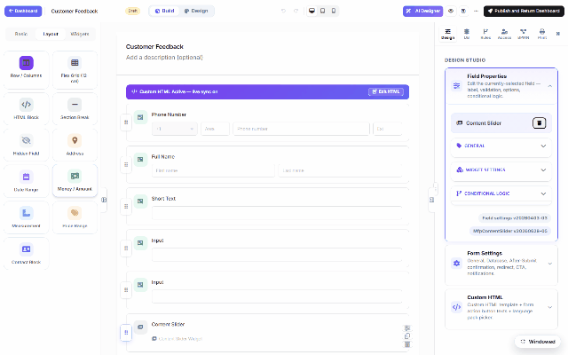

# Drag & drop layout (DNN)

Forms aren't single columns. The palette's **Layout** group builds structure — rows with
columns, a 12-column flex grid, section breaks, HTML blocks — and every field on the canvas can
be dragged into place by its handle.

## The Layout group

| Item | Use |
|---|---|
| **Row / Columns** | A row with 2+ columns; drop fields side by side (First/Last name, City/ZIP). |
| **Flex Grid (12-col)** | Finer control — each cell spans N of 12 columns, responsive. |
| **Section Break** | Titled separators that structure long forms. |
| **HTML Block** | Free content between fields (sanitized server-side). |
| **Hidden Field** | Values submitted but never shown. |
| **Address / Date Range / Money / Measurement / Price Range** | Composite presets — one palette click drops a whole preconfigured group. |

## Moving things

- **Reorder** — grab a field's ⠿ handle and drag it above/below any other field; a drop
  indicator tracks the target as you move.
- **Into columns** — drag a field into a row's column; drag it back out to leave.
- **Click-to-add** places new palette items at the end — drag afterwards to position, or
  select a field first and the next added item lands after it.

Multi-step forms add another level: the wizard's multi-step toggle (or the builder's step bar)
splits the canvas into pages with their own progress indicator — layout works the same within
each step.
