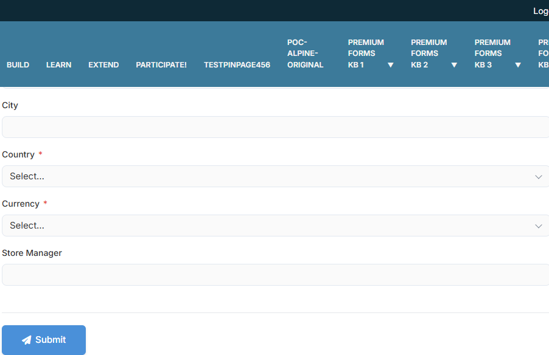
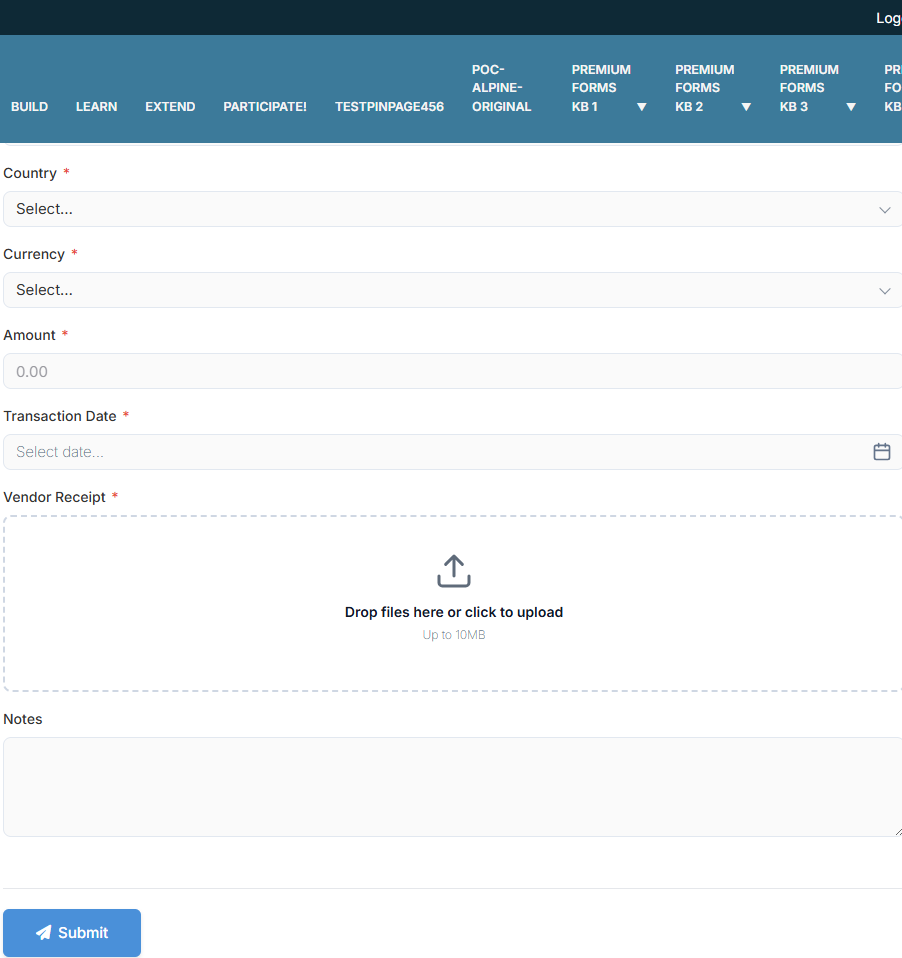
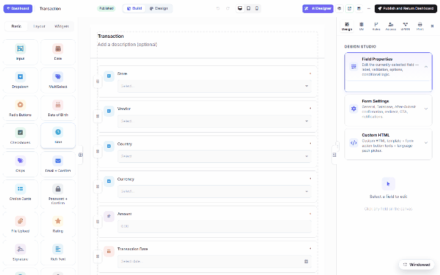
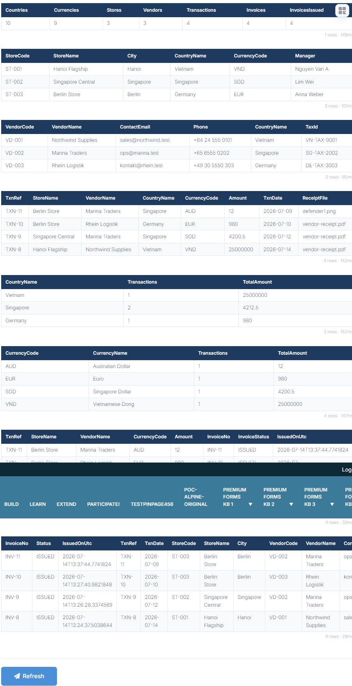

# End-to-end demo: ERP flow (DNN)

Everything in this section, chained: SQL master data → forms that read AND write your own
database → an approval workflow that **issues invoices automatically** → a live report page.
Built on a DNN 10 site with **no custom code**, same recipe as the
[Oqtane walkthrough](erp-end-to-end.md).

> **Master data → Store → Vendor → Transaction (with receipt) → Invoice on approval → Reports**

## 1. Master data & the connection

`dbo.Country` and `dbo.Currency` are plain tables in **your** SQL Server database. The site
knows that database by a **named connection** (configured once — see
[Storage & Integrations](dnn-storage-options.md)); every dropdown, insert, workflow node and
report below refers to the connection by name, never by a raw connection string in a form.

## 2. Store & Vendor forms — read AND write your tables

The *Store* form's Country/Currency dropdowns are SQL-driven (`optionsSource: "sql"` on the
field), and a per-form **database insert** mirrors each submission into `dbo.Stores`:

Three stores registered through the form = three rows in `dbo.Stores` — parameterized,
INSERT-only, fail-soft. The *Vendor* form repeats the pattern into `dbo.Vendors`.

## 3. Transaction form — where it meets

Every reference dropdown reads the ERP database live — the Store list (*Berlin Store, Hanoi
Flagship, Singapore Central*) IS `dbo.Stores`, maintained by the Store form; Vendors likewise.
Add amount, date, a **vendor receipt** upload — and the subtitle keeps the promise: *"An
invoice is issued automatically."*

## 4. The workflow that issues invoices

The Transaction form carries a [BPMN workflow](dnn-workflow.md) — *"Issue invoice for a
completed transaction"*: a **Service Task (DB)** mapped to an `Insert` into the invoice table,
wired to run when the transaction completes its [approval](dnn-workflow-approvals.md):

Approve a transaction in [My Inbox](dnn-submissions-inbox.md) and the invoice row appears —
`INV-8 … INV-11` below, each stamped with its issue time. No scheduled job, no plugin.

## 5. The reports page — eight live SQL widgets

One MegaForm page whose body is [Data Repeater widgets](dnn-widgets.md), each with a read-only
query on the ERP connection: summary counts, the Stores/Vendors/Transactions lists,
**country-wise** and **currency-wise** `GROUP BY` rollups, and the invoice-status join:

Worth noticing: the data is **live** (TXN-8's 25,000,000 VND rolls up into the Vietnam and VND
summary rows in the same render); every transaction shows its uploaded receipt file; all four
transactions have a matching `ISSUED` invoice; each widget prints its row count + query time,
and queries run server-side, SELECT-only, on the named connection.

## Same JSON, either platform

Nothing here is DNN-specific — the forms, workflow and report page are ordinary MegaForm
schema JSON, interchangeable with the [Oqtane build](erp-end-to-end.md) of the same demo.
For embedding MegaForm data in your own Razor views, see
[Consumer — DNN Razor Host](dnn-razor-host.md).
