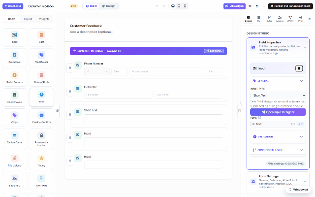

# Field permissions (DNN)

A form doesn't have to look the same for everyone. Per field, you decide **who can see it** and
**who can see but not edit it** — using the DNN roles your portal already has. Rules are applied
**server-side** when the form is delivered: a hidden field never even reaches the browser.

## Per-field rules

1. Select a field on the canvas and open the **Access** tab (right panel).
2. Under **Field visibility by role**:
   - **Visible to** — tick the roles that may see the field; untick everything and it's
     visible to everyone (the default).
   - **Read-only for** — tick roles that may *see* the field but not change it.
3. Save. The rules ride inside the form schema and are enforced when the schema is served —
   the JSON each user downloads is *projected* for that user, so a field they may not see is
   stripped before it leaves the server. Anonymous or unresolvable callers always get the
   most-restricted projection.

## The permission matrix

Above the per-field rules, the same Access tab holds the form-level **Permissions & Access
matrix** — role/user rows (*All Users, Anonymous Users, Authenticated Users*, plus every portal
role) against form actions (submitting, reading records, inbox access, approvals). The matrix
is **canonical shared data across DNN, Oqtane and Web** — granting a role here means the same
thing on every host. **Expand** shows all columns; **Save Access Rules** persists it.

> Roles are the **host's** roles — on DNN that's your portal's role list (the recording shows
> this site's own: Administrators, Content Editors, Content Managers, Finance, Operations…).
> Create roles in DNN's admin as usual; MegaForm picks them up automatically.
