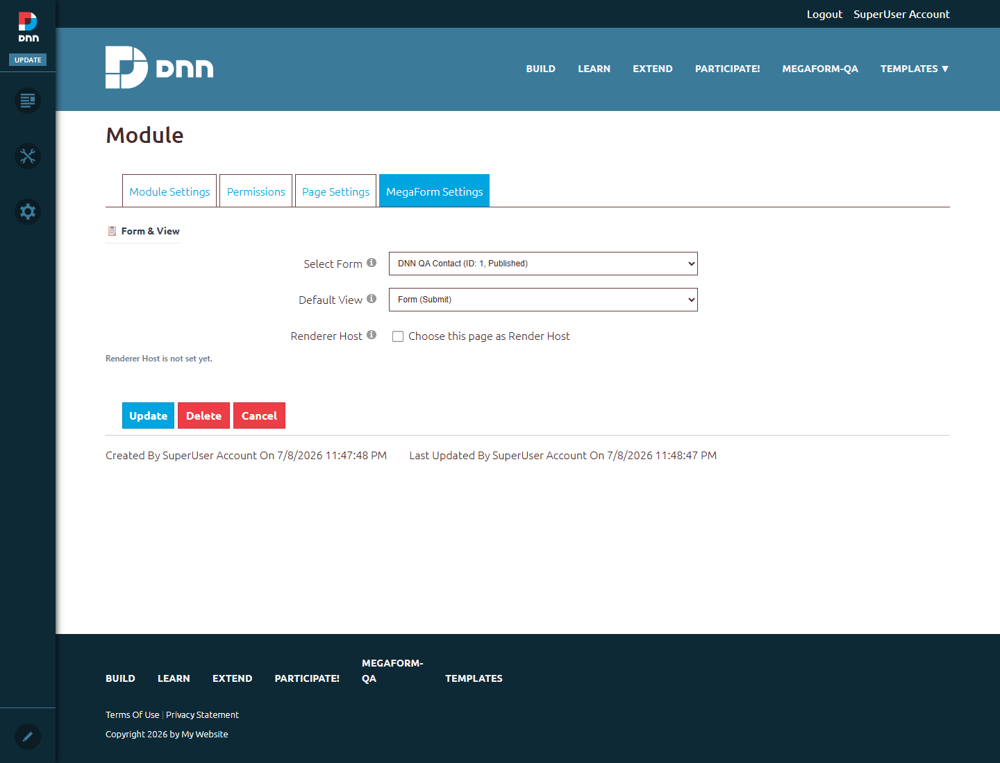
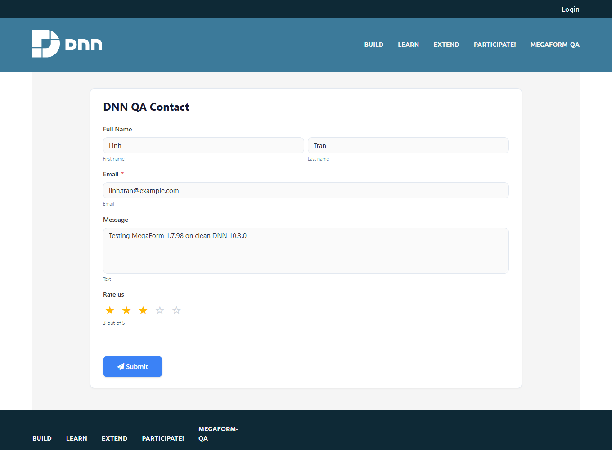
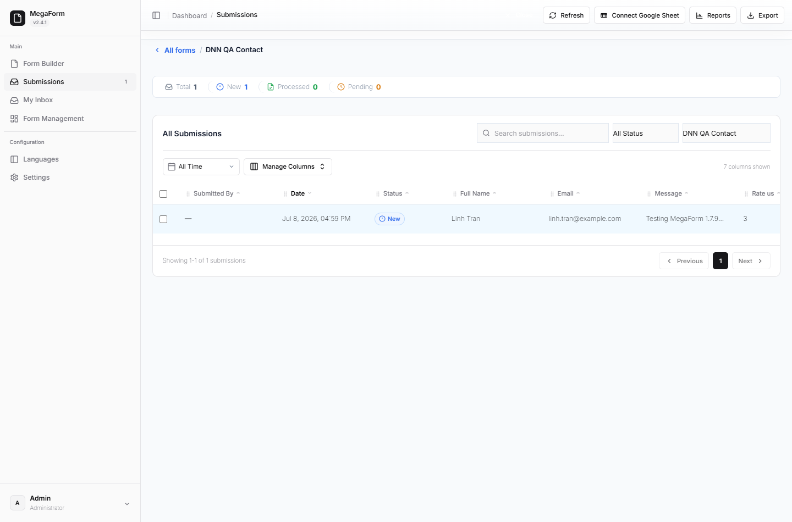
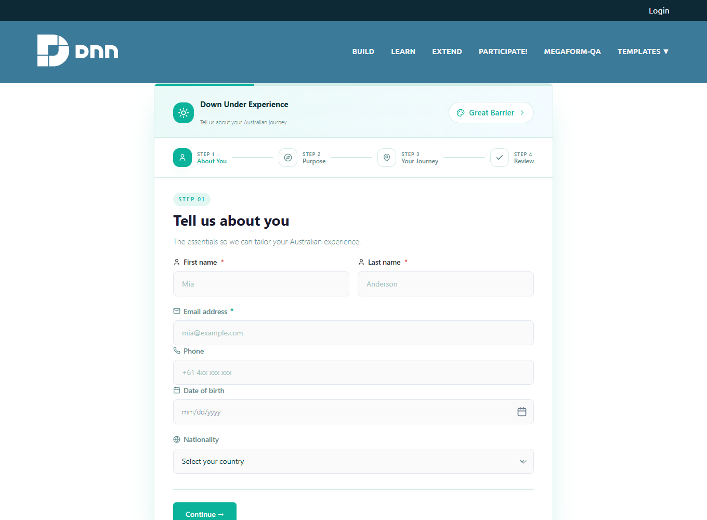
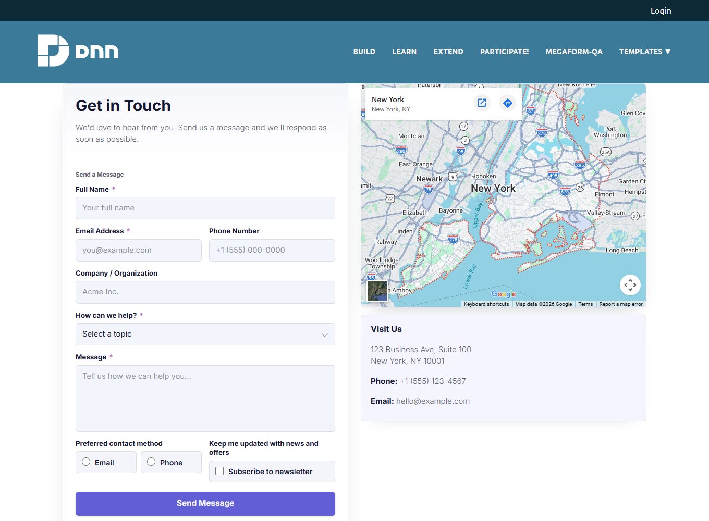

# Your First Form on DNN

This walkthrough goes from an empty MegaForm module to a live public form with submissions —
everything below was captured on a clean DNN 10.3.0 install.

## 1. Create a form

Open the module's **Dashboard** and create a form any way you like:

- **New Form** — the 5-step wizard (name, fields, workflow, design, publish); see
  [Creating Forms](creating-forms.md).
- **Template library** — start from a premium template (travel, intake, RSVP, contact-with-map…).
- **✨ Create with AI** — describe the form and let the assistant build it; see
  [AI Form Designer](ai-form-designer.md).

Design the fields in the builder ([Controls & Widgets](widgets-reference.md),
[Drag & Drop and Layout](drag-drop-layout.md)), then **Save** and **Publish**.

## 2. Assign the form to the module

Open the module's action menu (✏ pencil) → **Settings** → the **MegaForm Settings** tab.
Pick your form in **Select a Form** and click **Update**:

The page now renders the published form for every visitor.

## 3. Try it as a visitor

Open the page in a private/incognito window — anonymous visitors can fill and submit:

After **Submit**, the confirmation screen appears (message, submission ID, answer summary —
all configurable per form, see [After Submission](after-submission.md)).

## 4. Watch submissions arrive

Back in the **Dashboard → Submissions**, every entry lands in the per-form grid with
KPI counters, status workflow (New / Processed / Pending), manage-columns, export and reports:

Each submission is stored in the site database (`MF_Submissions` + indexed values), so your
data lives inside your own SQL Server alongside DNN. You can additionally forward each
submission to your own tables, Google Sheets or webhooks — see
[Storage & Integrations](storage-options.md).

## Premium templates on DNN

The full premium template set renders pixel-identically on DNN — multi-step travel forms,
map contact pages, intake forms and more:

> **Tip:** create one page per template and assign each template's form to its module — a
> quick way to build a template showcase (that's exactly how the pages in these screenshots
> were made).

## Where to go next

- [Controls & Widgets Reference](widgets-reference.md) — every palette control
- [After Submission](after-submission.md) — confirmation, emails, notifications
- [Submissions & My Inbox](submissions-inbox.md) — grids, approvals, workflow inbox
- [Multi-language](multi-language.md) — translated forms + admin UI in 19 languages
