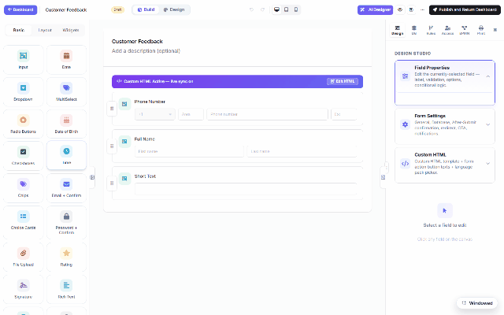

# Form Builder (DNN)

The builder is MegaForm's full designer — a fullscreen canvas with a field palette on the left,
the live form in the middle, and per-field/per-form panels on the right. On DNN it opens from
the admin toolbar's **Form Builder**, from any form's row on the dashboard, or straight after
the [wizard](dnn-creating-forms.md) creates a form.

## The layout

| Area | What's there |
|---|---|
| **Left — palette** | Three groups: **Basic** (Input, Date, Dropdown, MultiSelect, Radio, Checkboxes, Chips, Email + Confirm, Password + Confirm, File Upload, Rating, Signature, Rich Text…), **Layout** (rows, grid, sections — see [Drag & Drop Layout](dnn-drag-drop-layout.md)) and **Widgets** (the advanced controls — see [Controls & Widgets](dnn-widgets.md)). Click to add; drag to place. |
| **Center — canvas** | The form as users will see it, live. Select any field to edit it; drag handles reorder. Viewport toggles preview desktop/tablet/phone. |
| **Right — panels** | Per-selection **properties**, plus form-level tabs: **Design** (theme), **DB** ([write to your own tables](dnn-storage-options.md)), **Rules** (conditional logic), **Access** ([permissions](dnn-field-permissions.md)), **BPMN** ([workflow](dnn-workflow.md)), **Print**. |
| **Top bar** | Build/Design mode toggle, undo/redo, **✨ AI Designer** ([describe changes in plain language](dnn-ai-form-designer.md)), preview, save draft, and **Publish and Return Dashboard**. |

## Draft → Publish

Every edit saves into the form's **Draft**; the public page keeps serving the last published
version until you hit **Publish**. That means you can rework a live form safely — the wizard's
output starts as a Draft too.

The builder UI is the same engine across DNN, Oqtane and the standalone host — a form designed
here exports/imports unchanged anywhere MegaForm runs.
