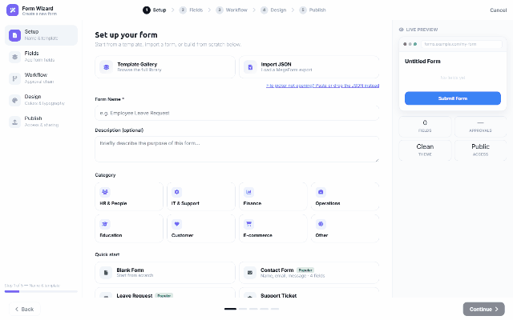

# Form templates (DNN)

Don't start from a blank canvas. The **Template Gallery** ships ready-made forms — from a
4-field contact form to a 27-field patient intake — and any MegaForm JSON export can be
imported as a starting point.

## Where it lives

The gallery opens from the **Form Wizard's Setup step** (*Template Gallery — browse the full
library*), with quick picks right on the step: *Blank Form*, *Contact Form*, *Leave Request*,
*Support Ticket*, *Feedback Survey* — plus the premium set (EuroYouth application, Wellness &
Patient Intake, Vendor Application, Tabbed Account Setup, Project Intake & Onboarding, …).

## Using it

- **Filter** by category chips — *Event-registration, Health, Application, Business, Travel,
  Authentication, Contact, Reports, Healthcare…* — or search by name.
- **Pick a card** and the wizard continues with that template's fields, layout, theme and
  (where the template carries one) its workflow — everything stays editable in the
  [builder](dnn-form-builder.md) afterwards.
- **Import JSON** — upload (or paste) a MegaForm export. Exports are cross-platform: a form
  exported from an Oqtane site imports on DNN unchanged, which is also the practical way to
  move forms between environments.

Templates are starting points, not locks — after import the form is yours: rename it, add
fields, restyle it, attach a different workflow.
