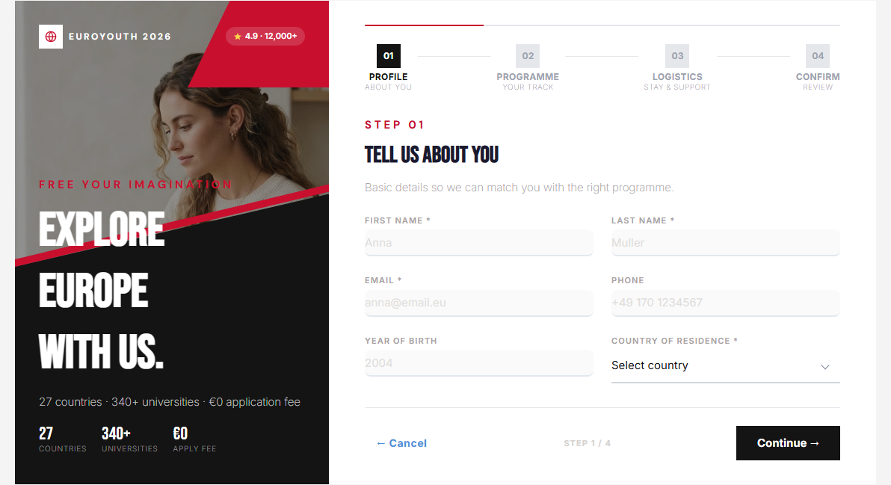
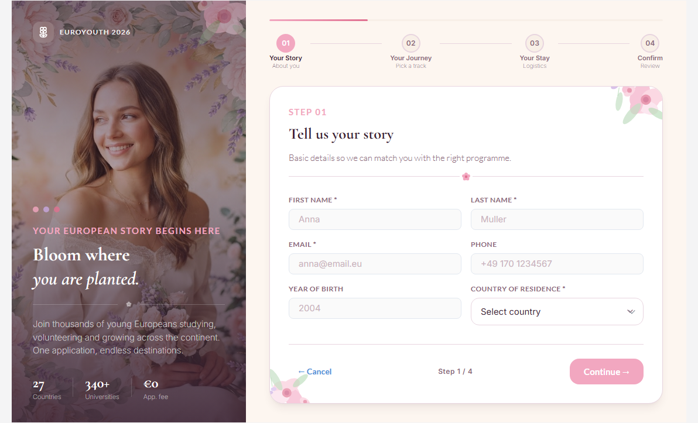
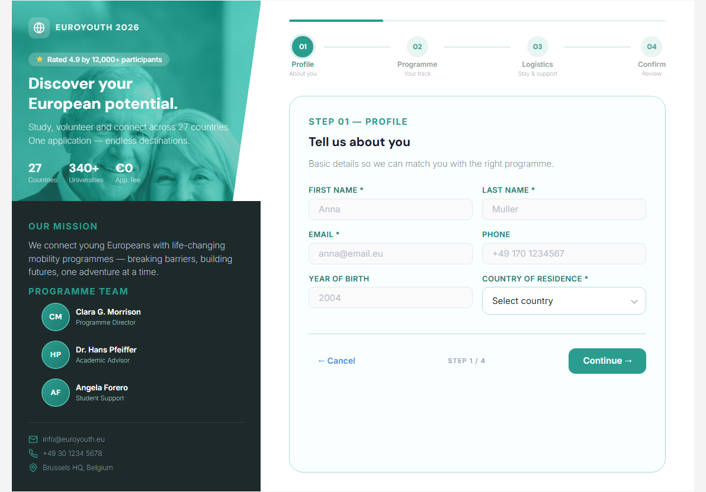

# Form templates (DNN)

Don't start from a blank canvas. The **Template Gallery** ships ready-made forms — from a
4-field contact form to a 27-field patient intake — and any MegaForm JSON export can be
imported as a starting point.

## Where it lives

The gallery opens from the **Form Wizard's Setup step** (*Template Gallery — browse the full
library*), with quick picks right on the step: *Blank Form*, *Contact Form*, *Leave Request*,
*Support Ticket*, *Feedback Survey* — plus the premium set (EuroYouth application, Wellness &
Patient Intake, Vendor Application, Tabbed Account Setup, Project Intake & Onboarding, …).

## Using it

- **Filter** by category chips — *Event-registration, Health, Application, Business, Travel,
  Authentication, Contact, Reports, Healthcare…* — or search by name.
- **Pick a card** and the wizard continues with that template's fields, layout, theme and
  (where the template carries one) its workflow — everything stays editable in the
  [builder](dnn-form-builder.md) afterwards.
- **Import JSON** — upload (or paste) a MegaForm export. Exports are cross-platform: a form
  exported from an Oqtane site imports on DNN unchanged, which is also the practical way to
  move forms between environments.

Templates are starting points, not locks — after import the form is yours: rename it, add
fields, restyle it, attach a different workflow.

## Premium skins: one form, several different faces

Several templates in the gallery are *premium skins* — a magazine-style layout wrapped around
the form, with a photographic hero pane on the left and the wizard on the right. The EuroYouth
application ships in four such skins that share **exactly the same 16 fields and the same four
steps**, so you can change the look without changing the data you collect.

### EuroYouth — Brochure

Editorial crimson-and-black treatment: a diagonal photo collage, condensed display type and
underlined inputs.

### EuroYouth — Floral

Soft botanical variant: watercolour florals, an italic Cormorant Garamond headline and rounded
blush cards.

### EuroYouth — Teal Brochure

Institutional teal layout that adds a mission statement and a programme-team block beneath the
hero — useful when the form doubles as a landing page.

### Working with premium skins

- **The hero is desktop-only.** The hero pane appears from **1024 px** upward. In the builder's
  **Design** tab the live preview sits between the Presets and Theme Designer rails, so it can
  drop below that width — in which case the hero is hidden by design. Collapse one rail, switch
  the preview to **desktop**, or open **Fullscreen** to see (and edit) it.
- **Swap the hero image and hero text in the builder.** With the hero visible, hover it in the
  Design preview and use **Change image**; click a headline, kicker or stat to edit it inline.
  Both are written back into the form.
- **Keep the layout, change the words.** The skin's CSS lives in the template, so editing
  content never rewrites it — a reworded form stays pixel-consistent with the original design.
