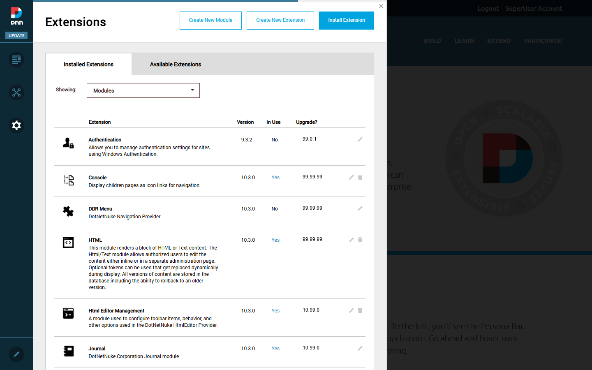
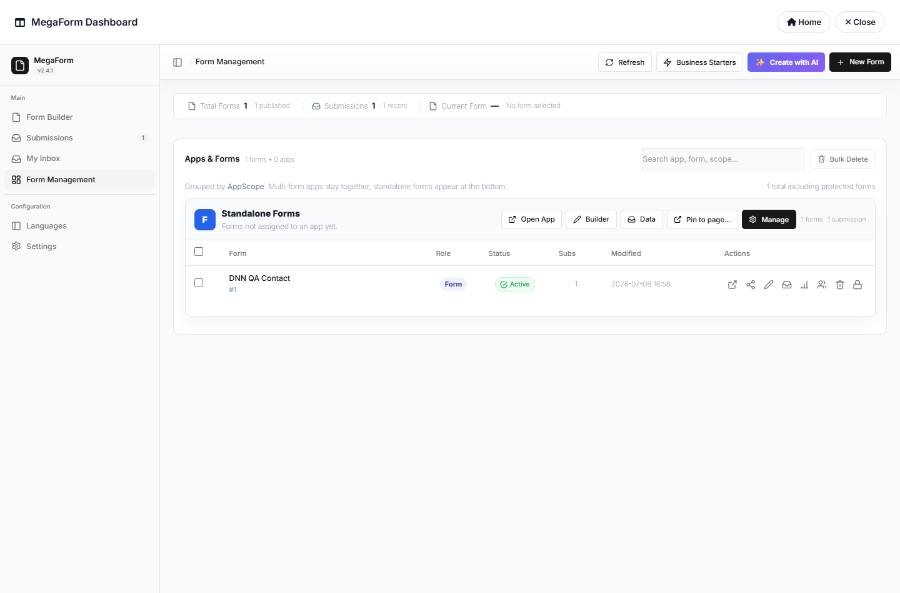

# Installing MegaForm on DNN

MegaForm ships as a standard DNN install package (`MegaForm_xx.xx.xx_Install.zip`) and runs on
**DNN Platform 9.13+ and 10.x** (this guide was captured on a clean DNN 10.3.0). One package
installs everything: the module, the Form Dashboard, the builder, and the database schema.

## Install the extension

1. Log in as a **Host / SuperUser**.
2. Open the Persona Bar → **Settings → Extensions** and click **Install Extension**:

3. Drag the MegaForm install zip into the upload box and step through the 5-step wizard —
   package info → release notes → **accept the license** → install.
4. Click **Done**. MegaForm now appears under **Extensions → Installed Extensions → Modules**.

During installation the package provisions the `MF_*` database tables (forms, submissions,
workflow, AI knowledge base), deploys the UI assets under `DesktopModules/MegaForm/`, and seeds
the premium template gallery. The site restarts once; the first page load afterwards takes a
little longer while ASP.NET recompiles.

## Add MegaForm to a page

Create (or open) a page, enter **Edit** mode from the Persona Bar pencil, choose
**Add Module**, search for **MegaForm** and drag it onto a pane — the standard DNN flow.
Until a form is assigned, the module shows *"No form has been configured for this module"*
plus two links for editors: **Render Form** and **Dashboard**.

> Prefer the command line? The DNN Prompt works too:
> `add-module --name MegaForm --pageid <id> --pane ContentPane --title "MegaForm"`.

## Open the Form Dashboard

Click **Dashboard** on the module (or append `#mf-dashboard` to the page URL). This is the
same MegaForm admin shell documented throughout this guide — Form Builder, Submissions,
My Inbox, Form Management, Languages and Settings:

From here everything works exactly like the rest of this documentation describes — the
builder, controls, theming and post-submit behaviour are identical across platforms:

- [Creating Forms](creating-forms.md) — wizard, templates, AI
- [Controls & Widgets Reference](widgets-reference.md)
- [Drag & Drop and Layout](drag-drop-layout.md)
- [After Submission](after-submission.md)

Next step: [Your First Form on DNN](dnn-first-form.md) — create a form, assign it to the
module, and watch submissions arrive.
