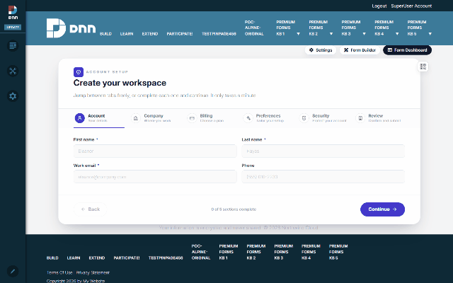
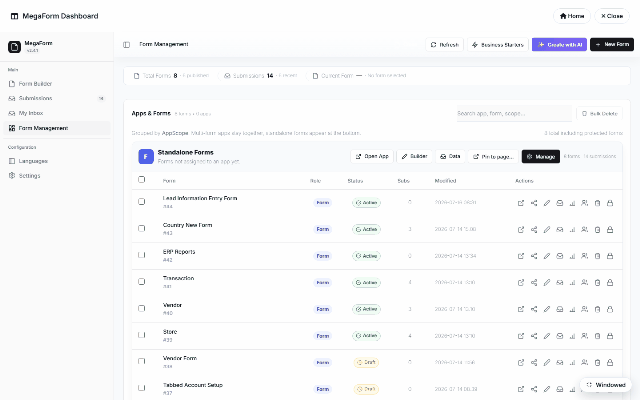

# Module setup — fixed form, dashboard page, inbox page (DNN)

One MegaForm module instance shows **one surface at a time**. The same module that renders a
form on a public page can, on another page, BE the admin dashboard — or a "My Inbox" page for
approvers. A typical site sets up three pages:

| Page | Module mode | Who sees it |
|---|---|---|
| Any content page | **Fixed form** (default) | Visitors — the form itself |
| e.g. `/megaform-admin` | **Admin dashboard** | Staff — forms, submissions, reports |
| e.g. `/my-inbox` | **My Inbox** | Approvers — their assigned workflow tasks |

## 1. Fixed form — what visitors see

**Module View** (admin toolbar) binds the form to this page and picks how it displays:

- **Fixed form** — renders inline in the module's pane (what the previous
  [walkthrough](dnn-add-to-page.md) set up).
- **Popup form** — the page stays clean and the form opens as a popup on a **trigger**: a time
  delay, a scroll depth, or a click on an element you name. Popup timing, border style and
  show-once-per-session live in the same pane.

## 2. A dashboard page

Create a normal DNN page (e.g. *MegaForm Admin*), add the MegaForm module, and switch the
module's mode to **Admin dashboard**. That page now IS the dashboard — no overlay, no toolbar
hopping; bookmark it, protect it with DNN page permissions for staff roles:

Everything the admin overlay offers is here: Form Builder, Submissions, My Inbox,
Form Management, Configuration, Languages and Settings — see
[Submissions & My Inbox](dnn-submissions-inbox.md) and [Creating Forms](dnn-creating-forms.md).

## 3. An inbox page for approvers

Same trick with **My Inbox** mode: a page whose module shows each signed-in user THEIR
workflow tasks — assigned approvals, forwarded items, completed history — grouped by form:

Give the page a friendly URL (`/my-inbox`), grant it to the approver roles, and your reviewers
never need to see the admin dashboard at all. How tasks get INTO the inbox is the workflow's
job — see [Approval Workflows & Inbox](dnn-workflow-approvals.md).

## Where the mode lives

The mode is a per-module setting (`MegaForm_ModuleMode`: `render` | `admin_dashboard` |
`myinbox`) — so one site can host any number of form pages, one dashboard page and one inbox
page, all from the same installed module.
