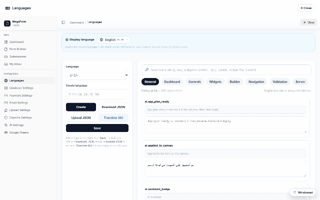

# Multi-language (DNN)

MegaForm's UI — builder, dashboard, and the forms themselves — ships localized, with a
per-language JSON catalog you can edit, export, import, or machine-translate from the
**Languages** section of the dashboard.

## The Languages manager

- **Language picker + Create language** — ~38 locales ship out of the box; add your own.
- **The catalog** — every UI string, grouped by area (*General, Dashboard, Controls, Widgets,
  Builder, Navigation, Validation, Server*), editable inline. English is the built-in
  fallback: an untranslated key renders its English text, never a blank.
- **Download / Upload JSON** — the whole catalog round-trips as one JSON file per locale
  (translate offline or hand to an agency).
- **Translate (AI)** — machine-translate the missing keys using the configured
  [AI assistant](dnn-ai-configuration.md), then hand-polish.

## What language a visitor sees

The renderer resolves its locale from (in order): an explicit `?mflocale=` on the URL, the
persisted site choice, the server-provided locale, then the browser's language — falling back
to `en-US`. Right-to-left locales flip the layout automatically.

Form *content* (labels, options) is authored in the form itself — the catalog covers the
product UI (buttons, validation messages, dashboard chrome). For per-form multilingual
labels, author per-locale forms or use tokens in your templates.
