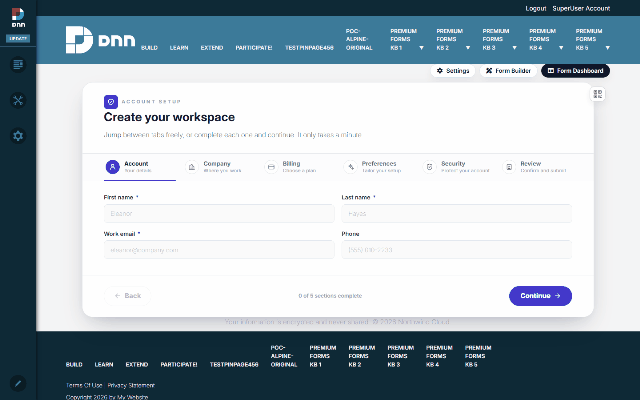

# Module settings & theme (DNN)

**Settings** on the admin toolbar opens the module's configuration popup — three tabs that
control what this page shows and how it looks, without touching the form itself.

## The three tabs

| Tab | What it holds |
|---|---|
| **Module form** | Which published form this module displays (same picker as [Module View](dnn-module-setup.md)). |
| **Theme & Layout** | Module-level look: a **theme preset** row (Default, Ocean, Forest, Sunset, Lavender, Midnight, Rose, Amber, Slate, Emerald, Coral, Cyber, Carbon, Arctic, Berry, Earth — one click recolors the whole form), **Layout** (max width 480→Full, field spacing slider, hide form header) and **Typography** (body/heading font, base text size). |
| **Current Form settings** | A shortcut into the FORM's own settings (the same ones the [builder's Form Settings panel](dnn-after-submission.md) edits). |

**Save module settings** applies to THIS module instance — the same form on another page can
look completely different.

## Theme layers

Styling is layered, most-specific wins:

1. **Form theme** — designed with the form in the builder's Design tab / Theme Designer.
2. **Module Theme & Layout** (this popup) — per-page overrides: presets + layout + typography.
3. **Update Theme** (toolbar button) — re-syncs the module's cached style from the form's
   current theme after you restyle the form.

Presets here are the same set as the Theme Designer's, so a page override and a form-level
design stay visually consistent.
