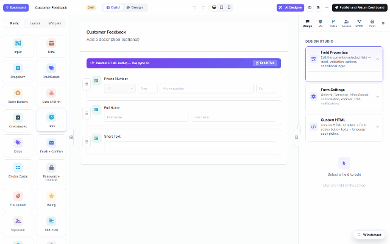

# Storage & integrations (DNN)

Submissions always land safely in MegaForm's own store — but they don't have to stay there
alone. Forms can **write into your own SQL tables**, read them for dropdowns and grids, and
push records out to sheets and webhooks. Two surfaces configure all of it.

## In the builder — the DB tab

The **DB** tab browses the databases the site may use (allow-listed connections), lists their
tables with a **capability probe** (what MegaForm concluded it can safely do with each), and
offers per-table shortcuts — *+ DataGrid* drops a grid widget bound to that table; **Create DB
Table** generates a table matching the form's fields:

The write-half lives in [Form Settings → Database](dnn-after-submission.md): an enabled
**database insert** mirrors each submission into your table the moment it arrives —
`INSERT INTO dbo.Stores (…) VALUES (:store_code, …)` with `:tokens` bound to field keys.
Parameterized, INSERT-only (guarded server-side), and fail-soft: a database hiccup never loses
the submission.

## Site-wide — the Settings panel

The dashboard's **Settings** section holds the shared plumbing:

| Panel | What it configures |
|---|---|
| **Database Settings** | Named, reusable connections (provider, connection string, encrypt/trust flags) with **Test Connection** — the names that forms, dropdowns, workflow DB nodes and reports refer to. |
| **Payment Settings** | Stripe/PayPal keys for the [Payment widget](dnn-widgets.md). |
| **Email Settings** | SMTP + templates for notifications. |
| **Upload Settings** | Allowed extensions, size caps, storage location. |
| **Captcha Settings** | Bot protection keys. |
| **AI Settings** | The [AI assistant's](dnn-ai-configuration.md) provider/model/key. |
| **Google Sheets** | Service-account link for the *Connect Google Sheet* action on the [submissions grid](dnn-submissions-grid.md). |

## The security frame

Connection strings live server-side under named keys; the client only ever sends a **key**,
and only allow-listed keys resolve. Reads are capped and paged in SQL; writes go through
parameterized statements. User-configured outbound URLs (webhooks) pass an SSRF guard. That's
what makes it safe to point forms at a real ERP database — as the
[end-to-end demo](dnn-erp-demo.md) does.
