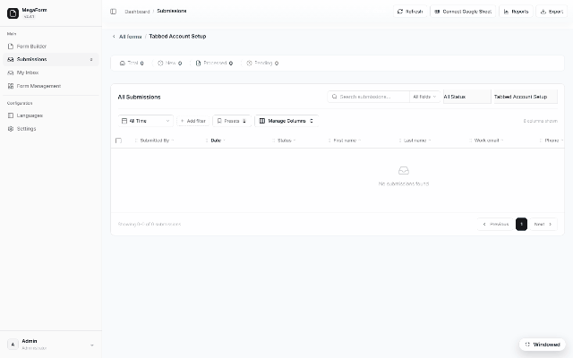

# Submissions grid — filters at scale (DNN)

A grid that only works on 30 rows isn't a grid. The submissions grid filters **server-side** —
search, status, date and field conditions travel to SQL, so the page you see is the page the
database computed, whatever the table size.

## The toolbar

- **Search** — as-you-type, across the submission's data (with a field-scope selector inside
  the box to limit which field is searched).
- **Status** — New / Processed / Starred / Archived.
- **All Time** — date-range shortcut.
- **Add filter** — field-level conditions built from the form's own schema (equals, contains,
  number/date ranges…), combinable.
- **Presets** — save a filter combination under a name and recall it in one click.
- **Manage Columns** — choose (and reorder) which form fields appear as columns; widths drag;
  the layout is remembered per form.

## At scale

Paging, counts and filters are pushed into SQL with server-side caps — the grid never loads
"everything" into the browser or the server's memory. On forms mirrored to
[your own SQL tables](dnn-storage-options.md), the same grid can read the live table directly,
and the same push-down rules apply there.

Bulk actions (status changes, delete, Send-to-Inbox) operate on the selection; **Export**
produces CSV of the current filter — not just the visible page.
