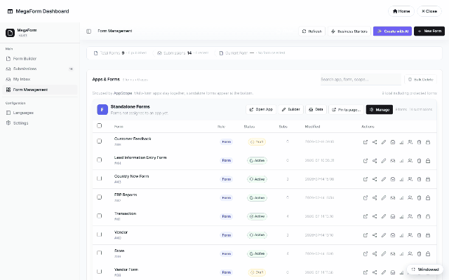
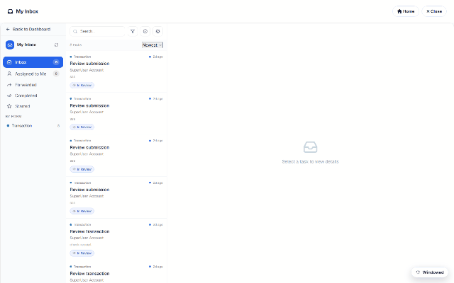

# Submissions & My Inbox (DNN)

Two surfaces handle everything that comes IN: **Submissions** (every record, admin view) and
**My Inbox** (each user's own workflow tasks). Both live in the Form Dashboard — and both can
be [a dedicated DNN page](dnn-module-setup.md).

## Submissions

The Submissions section opens on a per-form overview (KPIs + a table of forms with counts,
completion and trends), and clicking a form drills into its **grid** — every submission as a
row, with the form's own fields as columns:

From the grid you can open any record's detail sheet (values, files, workflow history), change
status, print an A4 document of one submission, export CSV, connect a Google Sheet, or open
[Reports](dnn-erp-demo.md). Filtering at scale gets its own page —
[Submissions Grid — Filters at Scale](dnn-submissions-grid.md).

## My Inbox

My Inbox is the approver's view — only THEIR tasks, grouped by form, filterable by state
(*Inbox, Assigned to Me, Forwarded, Completed, Starred*):

Opening a task shows the submission's responses plus the action bar — **Approve / Reject /
Return / Forward / Comment / Print / Export** — covered in
[Approval Workflows & Inbox](dnn-workflow-approvals.md).

## Who sees what

Submissions honor the form's **Access matrix** ([Field permissions](dnn-field-permissions.md)):
admins see everything; other roles need an explicit view/manage grant, and row-level rules
(own-records-only, approver-of-record) are enforced server-side. My Inbox is inherently
per-user — tasks are resolved from the workflow tables, never from the client.
