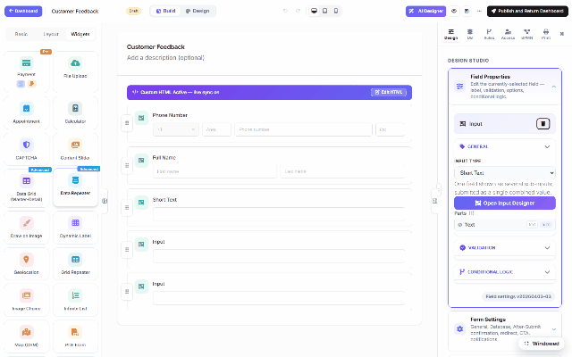

# Controls & widgets (DNN)

Beyond the basic inputs, the palette's **Widgets** group holds MegaForm's advanced controls —
payments, data grids that read your SQL tables live, appointment pickers, calculators,
geolocation and more. Same click-to-add as any field.

## What's in the box

| Widget | What it does |
|---|---|
| **Payment (Pro)** | Stripe/PayPal checkout inside the form — amount fixed, from a field, or a running total; the server verifies every payment independently. |
| **File Upload** | Multi-file dropzone with extension/size limits; files attach to the submission. |
| **Appointment** | Date + time-slot booking. |
| **Calculator** | Live computed values from other fields. |
| **CAPTCHA** | Bot protection (alongside the built-in honeypot + spam scoring). |
| **Content Slider** | Marketing-style slides inside or around the form. |
| **Data Grid (Master-Detail) / Data Repeater / Grid Repeater / Infinite List** | Read-only, paged views over SQL you configure — the building blocks of the [ERP demo's report page](dnn-erp-demo.md). |
| **Draw on Image / Signature** | Annotate an image, capture a signature. |
| **Dynamic Label** | Text that recomputes from live SQL or form values. |
| **Geolocation** | Capture the submitter's location (with consent). |
| **Image Choice / Choice Cards / Chips** | Visual pickers. |

…plus composite presets (Address, Date Range, Money/Amount, Measurement, Price Range) in the
Layout group.

Each widget carries its own properties panel — data-driven ones take a **connection + query**
([Storage & Integrations](dnn-storage-options.md)); interactive ones expose their options
directly. Widgets render identically in the DNN page and in the standalone/embedded hosts, and
the widget JS ships as separate per-widget bundles so a form only loads what it uses.
