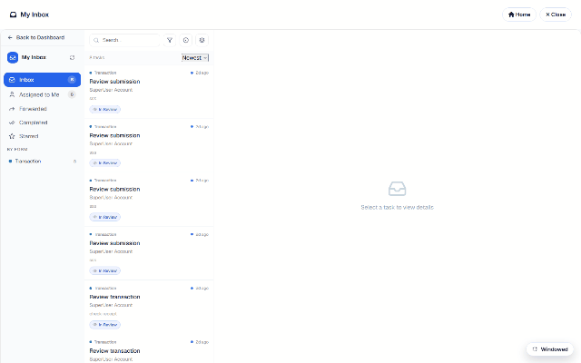

# Approval workflows & inbox (DNN)

An approval workflow is a `User Task` in the form's [BPMN diagram](dnn-workflow.md): when a
submission reaches it, a **task** is created for the assigned users/roles — and shows up in
their [My Inbox](dnn-submissions-inbox.md). This page follows a real task on the demo site's
*Transaction* form.

## The task detail

Opening a task shows everything the approver needs:

| Tab | Content |
|---|---|
| **Details** | The task itself — who assigned it, due date, priority, comments. |
| **History** | The audit trail: every prior action on this record with actor + timestamp. |
| **Workflow** | Where this record sits in the diagram right now. |
| **Form Responses** | The submitted answers (an approver can read the record they're deciding on — enforced server-side, whether or not they hold general submission rights). |

## The actions

- **Approve** — the workflow continues along the approved path (in the ERP demo, that's what
  fires the Database node and issues the invoice).
- **Reject** — the record takes the rejection branch (or ends).
- **Return** — send it back to the submitter for fixes.
- **Forward** — hand the task to another user (tracked in History).
- **Comment / Print / Export** — annotate without deciding, print the A4 record, export it.

## Assignment & security

Task assignees are resolved server-side from the workflow definition (users or DNN roles) —
membership comes from the workflow tables, never from the request. Multi-approver setups
(anyone-of-role claims the task) and multi-stage chains (manager → finance) are just more
User Tasks and gateways in the diagram. Ad-hoc, workflow-less review also exists: select
submissions in the grid and **Send to Inbox** assigns them to a teammate as review tasks.
