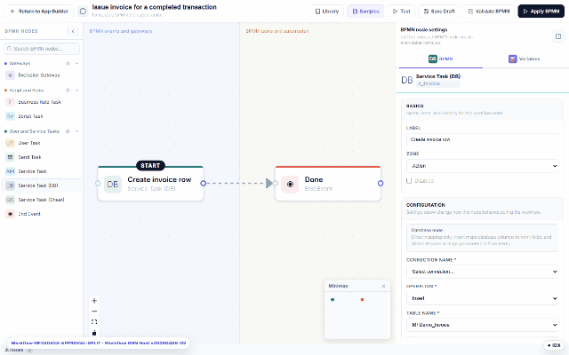

# Workflow library (DNN)

Approval chains repeat — *manager sign-off*, *two-stage finance approval*, *auto-invoice on
completion*. The **Library** stores workflows as reusable, versioned templates you attach to
forms instead of redrawing them.

## Using it

- **Library** (BPMN editor toolbar) — the saved flows on this site; **Samples** ships
  ready-made patterns to start from.
- **Save to library** — publish the current diagram as a template others can attach.
- **Attach to a form** — pick a library flow and bind it: the editor proposes **variable
  mappings** from the flow's inputs to the current form's fields (*Use suggested: Amount /
  Country / Currency…*) so a generic "approve if amount is high" template snaps onto any form
  that has an amount.

## Versioning & governance

Library workflows are **versioned** — forms bind to a pinned version by default, so editing a
template later never silently changes a production form's behavior; rebind to upgrade.
One template can serve many forms (each with its own mappings), which is how a site keeps a
single canonical "finance approval" instead of five drifting copies.

A form can carry both: its own inline diagram OR a library binding — the
[BPMN editor](dnn-workflow.md) shows which is active, and Apply always validates before
anything goes live.
