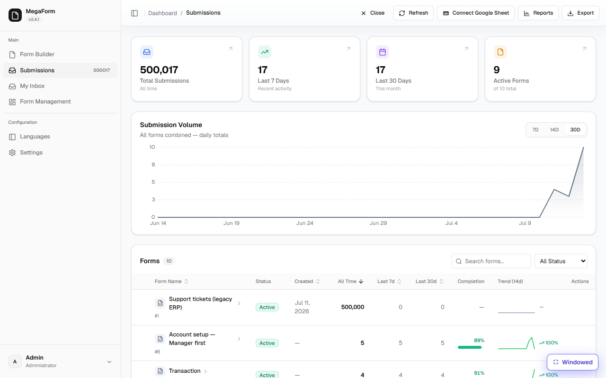
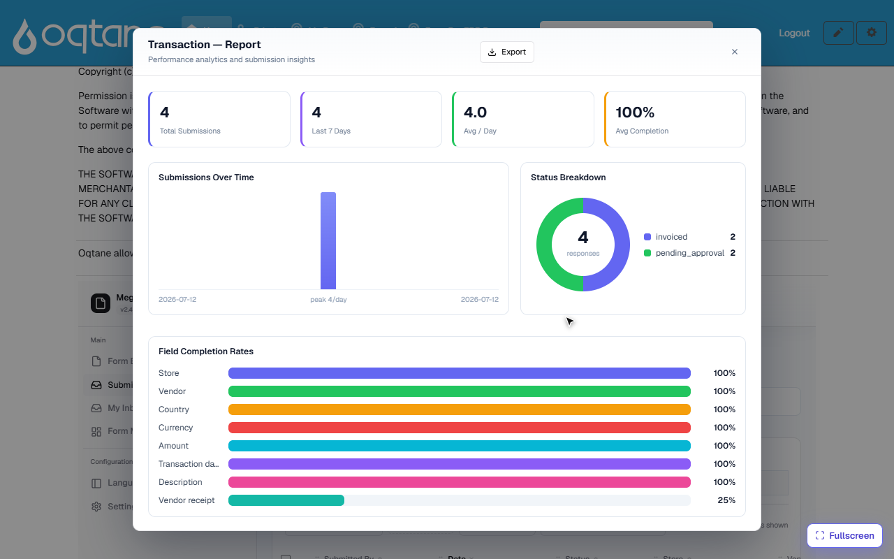

# End-to-end demo — master data, stores, vendors, transactions, invoices, reports

This walkthrough builds a small ERP-style flow with **no custom code** — only SQL tables, forms,
and configuration. Every step below was built and verified on a live site before being written up:

> **Master data → Store → Vendor → Transaction (with receipt) → Invoice on approval → Dashboard & reports**


## 1. Master data — plain SQL tables, no UI

Country and Currency live as ordinary tables in **your** database (here: a `LegacyErp_Demo`
SQL Server database). MegaForm reads them; nobody has to build an admin UI for them:

```sql
CREATE TABLE dbo.Country  (CountryCode CHAR(2) PRIMARY KEY, CountryName NVARCHAR(80), Region NVARCHAR(40));
CREATE TABLE dbo.Currency (CurrencyCode CHAR(3) PRIMARY KEY, CurrencyName NVARCHAR(60), Symbol NVARCHAR(5), DecimalPlaces TINYINT);
-- seeded with 8 countries and 7 currencies for the demo
```

The site knows this database by a **named connection** — either a connection string in
`appsettings.json` (`ConnectionStrings:CustomerErp`) or a reusable connection saved under
**Settings → Database Settings** (see [Storage & Integrations](storage-options.md)).

## 2. Store form — dropdowns driven by the master tables

The *Store* form has `store_code`, `store_name`, `city` — and two **data-source-driven
dropdowns**. A dropdown becomes SQL-driven through its field properties:

```json
"properties": {
  "optionsSource": "sql",
  "optionsConnectionKey": "CustomerErp",
  "optionsSql": "SELECT CountryCode, CountryName FROM dbo.Country ORDER BY CountryName"
}
```

The first selected column is the stored value, the second is the label (the Currency dropdown
uses ``CurrencyName + ' (' + Symbol + ')'`` for labels like *Vietnamese Dong (₫)*). Options are
fetched live per render — add a row to `dbo.Country` and it appears on the next load. Queries are
SELECT-only, run server-side on the named connection, and support `:field` tokens for
[cascading dropdowns](form-builder.md).

The Store form also **writes back to the ERP database**: a per-form database insert
(*Settings → Database*) mirrors every submission into `dbo.Stores` the moment it arrives:

```json
"databaseInsert": {
  "enabled": true,
  "connectionKey": "CustomerErp",
  "insertSql": "INSERT INTO dbo.Stores (StoreCode, StoreName, City, CountryCode, CurrencyCode)
                VALUES (:store_code, :store_name, :city, :country, :currency)"
}
```

Registering three stores through the form produced exactly three rows in `dbo.Stores` — the
insert is parameterized (`:token` → field key), INSERT-only, and fail-soft (a database problem
never loses the submission).

## 3. Vendor form

Same pattern: `vendor_name`, `contact_name`, `email`, `phone`, `tax_id`, plus the same SQL-driven
*Country* dropdown, mirrored into `dbo.Vendors`. Three vendors were registered for the demo.

## 4. Transaction form — reference fields + receipt

The *Transaction* form is where everything meets. Its reference dropdowns all read the ERP
database live:

| Field | Options come from |
|---|---|
| **Store** | `dbo.Stores` — the table the Store form maintains (label *Riverside Flagship — ST-001*) |
| **Vendor** | `dbo.Vendors` — maintained by the Vendor form |
| **Country** | `dbo.Country` master table |
| **Currency** | `dbo.Currency` master table |

plus `amount` (Number), `transaction_date` (Date), `description`, and a **Vendor receipt** File
field (PDF/JPG/PNG, 10 MB limit). Receipts are held in private storage — never under the public
web root — recorded against their transaction, and streamed back through an authenticated
download URL (see [File download](file-download.md)).

> One dropdown gotcha worth knowing: give the label column an **alias** when it is derived
> (`VendorName + ' (' + CountryCode + ')' AS VendorLabel`) — a result set that repeats the same
> column name twice returns no options.

## 5. Invoice on approval

The Transaction form carries a small BPMN workflow:
*Transaction submitted → **Finance review — issue invoice** (Approval, candidate role `Finance`) → Done.*

The approval node's outcome statuses do the invoicing bookkeeping:

| Setting | Value |
|---|---|
| Pending status | `pending_approval` |
| **Approved status** | **`invoiced`** |
| Rejected status | `rejected` |

So the moment a transaction is submitted it goes to the Finance role's
[My Inbox](workflow-approvals.md); when Finance approves (with an optional note), the submission
is stamped **`invoiced`** — no one updates a status by hand. In the recording, the transaction
submitted at the start is approved by the finance user and lands in the report as *invoiced*
seconds later. On a host with SMTP configured, a *Send Task* node after the approval can also
email the invoice details automatically (see [Workflow](workflow.md)).

## 6. Dashboard & reports



The **Submissions** dashboard covers all entities at once — totals, recent activity, a
submission-volume chart, and a per-form table (stores, vendors, transactions each with their
counts, completion rate and 14-day trend).

Each form also has a one-click **Reports** view:



- **Status Breakdown** is the *transaction summary with invoice status*: the donut splits
  `invoiced` vs `pending_approval` straight from the workflow's outcome statuses.
- **Field Completion Rates** shows data quality per field (the demo's *Vendor receipt* sits at
  25% — exactly one of four transactions carries a receipt).
- **Country-wise and currency-wise views** come from the grid itself: add a filter chip
  (*Country is VN*, *Currency is USD*), save it as a preset, and **Export** the slice — see
  [Submissions Grid](submissions-grid.md).

## What this demo proves

| Requirement | How it is met |
|---|---|
| Master data without UI | Plain SQL tables (`Country`, `Currency`) read live by dropdowns |
| Store / Vendor entry | Forms with SQL-driven reference dropdowns, mirrored into ERP tables |
| Transaction with references | Store, Vendor, Country, Currency dropdowns all resolved from the ERP database |
| Receipt upload | File field with type/size validation; receipts stored privately per transaction |
| Invoice generation | Approval workflow stamps `invoiced` automatically on completion |
| Dashboard & reports | All-forms dashboard + per-form report with invoice-status breakdown + filterable, exportable grid |

Everything above is configuration: two master tables, three forms, one workflow — about an hour
of setup, no compiled code.
