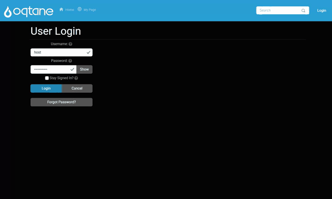

# Four fields → BPMN → an API service task

A complete walkthrough: build a four-field form, open its BPMN workflow, drop in one API service
task, point it at an endpoint, and watch the four answers arrive on the other side. About ten
minutes, no code.

In BPMN terms the node is a **service task** — an automated step that calls out to a system. The
palette lists it under *User and Service Tasks* as **Service Task**, with an `API` badge; its
internal type is `Webhook`, which is the name you will see in exported JSON and in error messages.
Everything on [Push submissions to a CRM or ERP over HTTP](integration-webhook.md) applies to it.



---

## 1. The form

Builder → **New form** → add four fields and set their keys. Keys are what the service task maps, so
name them deliberately:

| Field | Type | Key |
|---|---|---|
| Customer code | Text | `customer_code` |
| Contact name | Text | `contact_name` |
| Contact email | Email | `contact_email` |
| Order amount | Number | `amount` |

**Save the form before opening the workflow.** A workflow attaches to a form id, and an unsaved form
has none — the designer will say *"Save the form first so the workflow can be attached to a real form
ID."*

---

## 2. Open the workflow canvas

Right rail → **BPMN** tab. The full-screen BPMN 2.0 canvas opens with the palette on the left.

A new workflow starts with a trigger node — **Form submitted** — which is the BPMN start event. It
anchors on the form's first field and never branches on it.

---

## 3. Add the API service task

1. Drag **Service Task** (the `API` one, under *User and Service Tasks*) onto the canvas.
2. Connect **Form submitted → Service Task**, and **Service Task → End Event**.
3. Click the node to configure it.

> The palette also offers **Service Task (DB)** and **Service Task (Sheet)** — the Database and
> Google Sheets nodes. Neither runs on Oqtane yet; see §7.

### Destination

| Field | Value |
|---|---|
| Webhook URL | `https://erp.example.com/api/orders` |
| Method | `POST` |

### Payload — map the four fields

Set **Payload mode** to **Map selected fields**, then **Auto-map fields** and adjust the JSON paths.
Dot notation nests, which is usually what an ERP wants:

| Form field | JSON key / path |
|---|---|
| `customer_code` | `customerCode` |
| `contact_name` | `contact.name` |
| `contact_email` | `contact.email` |
| `amount` | `amount` |

The panel previews the exact body:

```json
{
  "customerCode": "{{field.customer_code}}",
  "contact": { "name": "{{field.contact_name}}", "email": "{{field.contact_email}}" },
  "amount": "{{field.amount}}"
}
```

> Leave **Fixed value** empty on every row. It is only for stamping a constant, and a row with a
> fixed value ignores the form field you selected.

### Authentication

**Advanced options → Auth type.** Leave `None` for an open intake endpoint; pick `BearerToken`,
`ApiKey` or `BasicAuth` otherwise. See
[the authentication section](integration-webhook.md#4-authentication) for what each one puts on the
wire.

---

## 4. Use the reply

An ERP usually answers with an order number and a status. Two settings turn that into workflow state:

**Response variable** — set it to `erpResult`. The whole response body is then readable by later
nodes as `{{var.erpResult}}`.

**Response routes** — branch on a value inside the reply:

| JSON path | Operator | Value | Next node id |
|---|---|---|---|
| `$.status` | Equals | `needs_approval` | `node-approval` |

Anything that matches no route continues along the default edge.

---

## 5. Apply it

**Apply** publishes the workflow. **Save draft** only stores it; a draft never runs, and the log will
say so:

```
Form 13 has a workflow draft but no applied workflow. Submission 9 will use legacy post-submit actions
until the workflow is applied.
```

Apply-mode validation is strict — a Webhook node with no URL blocks the publish with *"Webhook 'x':
URL is required."*, which is the intended behaviour: a node that cannot run should not be live.

---

## 6. Try it end to end

The repo ships a mock ERP so this is testable without a real system:

```bash
node tools/mock-crm/mock-crm-server.mjs          # http://localhost:5199
```

Point the node at `http://localhost:5199/erp/orders`. It replies with an order number and a status
(`approved` under 10,000, `needs_approval` above), which is exactly the shape the response routes in
§4 branch on. Open `http://localhost:5199/` to watch requests land.

Loopback is blocked by the SSRF guard, so the host needs `MEGAFORM_ALLOW_PRIVATE_WEBHOOKS=1` —
see [Calling a CRM on your own network](integration-webhook.md#7-calling-a-crm-that-is-on-your-own-network).

A ready-made version of this form is seeded by:

```bash
node tools/samples/seed-integration-demos.mjs
```

which creates *Demo 3 — Order intake (BPMN API task)* alongside the two CRM demos.

---

## 7. When the task does not fire

Work down this list; each item is something that has actually happened.

**The submission was scored as spam.** The anti-spam gate skips the entire workflow — no webhook, no
notification emails — and only says so in the host log:

```
[SubmissionProcessor] Submission 5 for form 12 marked as spam (score=55). Workflow and notifications skipped.
```

The threshold is 50. A form of more than two fields completed in under three seconds scores 30, and a
bot-like User-Agent another 25 — which is 55, and is why automated smoke tests trip it while humans do
not. Sign in as a trusted user, or fill the form at human speed.

**The workflow was saved but not applied.** See §5.

**The node type is not registered on the host.** The workflow fails at that node with:

```
No executor registered for node type 'Database' (node: n-db 'Write order').
```

Oqtane enables a reviewed subset of node executors. **Webhook is enabled** (MegaForm 2.0.30 and
later); **Database and Google Sheets are not** — for those, see
[Write submissions into an existing SQL table](integration-sql-insert.md#5-the-other-route-a-database-node-in-the-workflow).

**The body arrived with the right shape but empty values.** Fixed in MegaForm 2.0.31. Before that,
every "Map selected fields" row was treated as a fixed value, so the payload went out with the keys
present and the values blank. Upgrade, or switch the node to **Send all form fields** as a workaround.

**The URL was rejected.** `Blocked webhook URL: …` means the SSRF guard stopped it — §6.

---

## 8. What the saved workflow looks like

```json
{
  "version": "1.0.0",
  "startNodeId": "n-start",
  "nodes": [
    { "id": "n-start", "type": "FormField", "label": "Form submitted",
      "config": { "FieldKey": "customer_code", "IsPageNode": false } },
    { "id": "n-api", "type": "Webhook", "label": "API service task — create ERP order",
      "config": {
        "Url": "https://erp.example.com/api/orders",
        "Method": "POST",
        "Auth": { "Type": "None" },
        "BodyMappings": [
          { "FormFieldKey": "customer_code",  "BodyPath": "customerCode" },
          { "FormFieldKey": "contact_name",   "BodyPath": "contact.name" },
          { "FormFieldKey": "contact_email",  "BodyPath": "contact.email" },
          { "FormFieldKey": "amount",         "BodyPath": "amount" }
        ],
        "TimeoutSeconds": 15,
        "Retry": { "MaxAttempts": 2, "DelaySeconds": 3, "BackoffMultiplier": 2 },
        "ResponseVariableKey": "erpResult"
      } },
    { "id": "n-end", "type": "End", "label": "Done", "config": { "EndType": "Success" } }
  ],
  "edges": [
    { "id": "e1", "sourceNodeId": "n-start", "targetNodeId": "n-api", "sourceHandle": "default", "targetHandle": "in" },
    { "id": "e2", "sourceNodeId": "n-api",   "targetNodeId": "n-end", "sourceHandle": "default", "targetHandle": "in" }
  ]
}
```

> **Config keys are PascalCase.** The builder writes them that way, and Apply-mode validation reads
> them out of a plain dictionary with a case-sensitive lookup — a hand-written workflow using `url`
> instead of `Url` is rejected with "URL is required" even though the URL is right there. This only
> matters when posting a workflow to the API by hand; the builder never gets it wrong.

---

## 9. Importing a real BPMN file

A `.bpmn` file exported from Camunda or bpmn.io can be imported instead of drawn: service tasks
become Webhook nodes, user tasks become Approval nodes, exclusive gateways become Conditions, and
sequence-flow conditions are translated into MegaForm expressions. See
[Workflow](workflow.md) for the mapping table and its limits.

See also: [Push submissions to a CRM or ERP over HTTP](integration-webhook.md) ·
[Write submissions into an existing SQL table](integration-sql-insert.md) · [Workflow](workflow.md)
