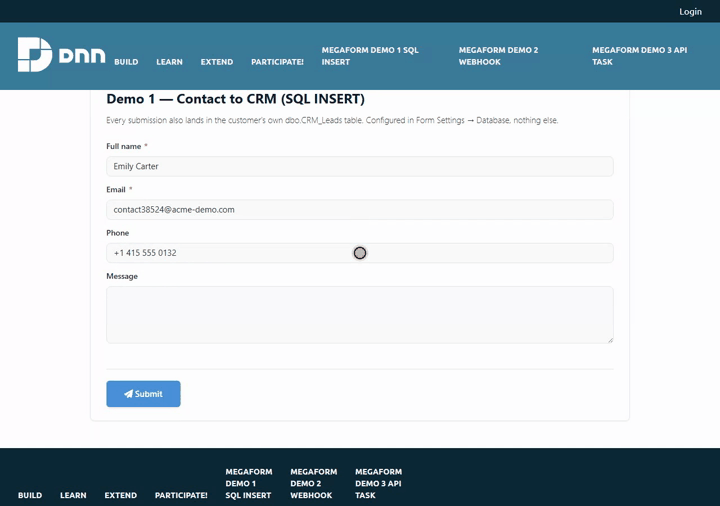
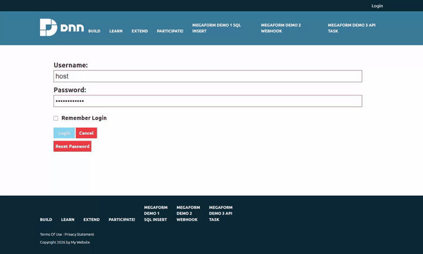

# Write submissions into an existing SQL table

MegaForm stores every submission in its own tables. This page is about the *other* copy: writing
each submission straight into a table the customer already owns — a CRM's `Leads`, an ERP's
`SalesOrders`, a reporting staging table — with an `INSERT` statement and parameters you configure
in the builder. No code, no scheduled export.

If the other system speaks HTTP rather than SQL, use
[Push submissions to a CRM or ERP over HTTP](integration-webhook.md) instead.



---

## 1. Register the customer's database as a named connection

MegaForm never takes a connection string from the browser. It resolves one, server-side, from a name.

**Admin → MegaForm → Database Settings → Named connections → Add.**

| Field | Example |
|---|---|
| Name | `CustomerCrm` |
| Provider | `SqlServer` · `PostgreSql` · `MySql` · `Sqlite` |
| Connection string | `Server=…;Database=CRM;User Id=megaform_writer;Password=…` |

The name must start with a letter and contain only letters, digits, `-` or `_`. These names are
reserved and cannot be reused: `DashboardDatabase`, `DefaultConnection`, `SiteSqlServer`,
`DnnDefault`, `MegaForm`. Connection strings are stored server-side and masked whenever they are
echoed back to a browser.

To write into a table that lives in the site's *own* database — which is the case in the sample
below — you do not need a new connection at all: use the built-in `DashboardDatabase`.

> Grant the account only what it needs. `INSERT` on the one target table is enough.

---

## 2. Create the target table

Any table works. The sample schema used throughout these docs ships in the repository as
`Docs/samples/sql/megaform-demo-crm-erp.sql` — run it against the site database and you get
`CRM_Leads`, `CRM_Customers`, `ERP_SalesOrders`, `ERP_OrderLines` and a stored procedure:

```bash
sqlcmd -S .\SQLEXPRESS -d <YourDatabase> -E -I -i Docs/samples/sql/megaform-demo-crm-erp.sql
```

> Make every column the form writes **nullable, or give it a default**. The insert is fail-soft
> (§6): a `NOT NULL` column with no default turns one mapping mistake into rows that silently never
> arrive, while the visitor still sees "thank you".

Once the table exists it shows up in the builder's right rail → **DB** tab, under **Your tables** —
the group above MegaForm's own tables and the platform's. Clicking a table lists its real columns
with their types and marks the primary key, which is the fastest way to get column names right.
Tick **Show system tables** to see MegaForm's and the platform's tables as well; each group collapses
and pages, so the list stays short whatever the database holds.



---

## 3. Configure the insert

**Builder → right rail → Settings (Design) → Database → "Enable database INSERT on submit".**

| Setting | What to put in it |
|---|---|
| **Connection** | The named connection from §1 — picked from a list the server allows, not typed. |
| **Table** | Pick the table; the panel then loads its real columns. |
| **INSERT SQL** | A single `INSERT` statement with `:token` placeholders. |
| **Parameter mapping** | `:token` → form field key. |

A worked example, exactly as shipped in `Demo 1 — Contact to CRM (SQL INSERT)`:

```sql
INSERT INTO CRM_Leads (FullName, Email, Phone, Message, Source, SubmissionId)
VALUES (:full_name, :email, :phone, :message, 'Website form', :_submissionId)
```

```json
{
  ":full_name": "full_name",
  ":email": "email",
  ":phone": "phone",
  ":message": "message",
  ":_submissionId": "_submissionId"
}
```

Rules that decide whether this works:

- **A token with no mapping falls back to a field of the same name.** `:email` finds the `email`
  field on its own. Mapping is only needed when the column token and the field key differ.
- **Tokens are `:name`, and MegaForm rewrites them to `@name`** before execution, so the same
  statement runs on SQL Server, SQLite and PostgreSQL.
- **Values are always bound as parameters.** Nothing a visitor types is ever concatenated into SQL.
- **A field left blank sends `NULL`** for numeric and date columns rather than an empty string,
  which would otherwise fail with "Error converting data type nvarchar to numeric".
- **Only one `INSERT` is accepted.** Anything else — `UPDATE`, `DELETE`, `DROP`, a second statement
  after a semicolon — is refused with *"DatabaseInsert.InsertSql must be a single INSERT statement."*

### Three tokens MegaForm supplies

Name them in the statement and they are filled in for you:

| Token | Value |
|---|---|
| `:_submissionId` | MegaForm's own submission id — the join key back to `MF_Submissions` |
| `:_formId` | The form id |
| `:_submittedOnUtc` | Submission timestamp, UTC |

Carry `:_submissionId` into a column of your own. Without it, a row in the customer table cannot be
matched to the submission it came from, and a "DB View" tab can only guess by taking the latest row.

Use the panel's **Test insert** button before publishing: it reports the parameters it found and
which ones are unbound.

---

## 4. Where the SQL is stored, and who can read it

The statement, the connection alias and the parameter map live in the form's settings on the
server. They are stripped out of the schema the public page downloads
(`FormSchemaSensitivePropertyStripper`), so a visitor who reads the anonymous schema endpoint learns
neither your table names nor your SQL. The insert itself runs server-side at submit time, from the
stored settings — never from anything the request carries.

---

## 5. The other route: a Database node in the workflow

The workflow designer also has a **Database** node, which covers what a plain `INSERT` cannot:
`Update`, `Upsert`, and calling a **stored procedure**. It maps columns to fields rather than taking
raw SQL, validates table and column names against an identifier whitelist, and parameterises every
value.

| | Form Settings → Database | Workflow → Database node |
|---|---|---|
| Operations | `INSERT` only | Insert · Update · Upsert · Stored procedure |
| Configured as | one SQL statement | column → field mappings |
| Runs | on every accepted submission | at its point in the workflow, so it can sit behind a condition or an approval |
| Available on | every host | MegaForm.Web, Umbraco, the ASP.NET Core component |

> **Not yet enabled on Oqtane.** Oqtane registers a reviewed subset of workflow node executors, and
> the Database node is not in it — a workflow containing one fails at that node with *"No executor
> registered for node type 'Database'"*. On Oqtane, use Form Settings → Database (§3), which is fully
> supported there. The sample stored procedure `usp_CRM_InsertLead` in the demo schema is there for
> the hosts that do run the node.

---

## 6. Fail-soft — read this before you rely on the row being there

**If the insert fails, the submission still succeeds.** The visitor sees the success message, the
submission is saved in MegaForm's own tables, and the failure is written to the host log:

```
MegaForm DatabaseInsert failed for form 11: <provider message>
```

This is deliberate — a broken CRM must not cost you the lead — but it means **a green form is not
proof the row landed**. After changing the statement, the table or the connection, check the table
itself:

```sql
SELECT TOP 5 * FROM CRM_Leads ORDER BY LeadId DESC;
```

Two consequences worth knowing:

- **A submission flagged as spam still writes the row.** The anti-spam gate stops the workflow and
  the notification emails; the database insert runs before it. If your CRM must never see spam, put
  the write in a workflow Database node behind a condition instead (on the hosts that support it).
- Common causes of a silent miss: a `NOT NULL` column with no default and no mapping; a column name
  that does not exist (`Invalid column name`); an account without `INSERT` rights; a connection name
  that no longer exists.

---

## 7. Troubleshooting

| Symptom | Cause |
|---|---|
| Form succeeds, table stays empty | The insert failed and was swallowed. Check the host log, then §6. |
| `DatabaseInsert.InsertSql must be a single INSERT statement.` | More than one statement, or not an `INSERT`. |
| `Invalid column name 'X'` | The statement names a column the table does not have. Expand the table in the builder's **DB** tab to see the real names. |
| `Connection string 'X' not found.` | The named connection was renamed or removed — re-pick it in the panel. |
| Every row has `NULL` in one column | The token does not match a field key and has no mapping entry. |
| `Error converting data type nvarchar to numeric` | An older build; blank numerics are now sent as `NULL`. |
| Table missing from the **DB** tab | It may be grouped under *MegaForm system* or *Site platform*, or hidden until **Show system tables** is ticked. |

See also: [Push submissions to a CRM or ERP over HTTP](integration-webhook.md) · [Workflow](workflow.md)
