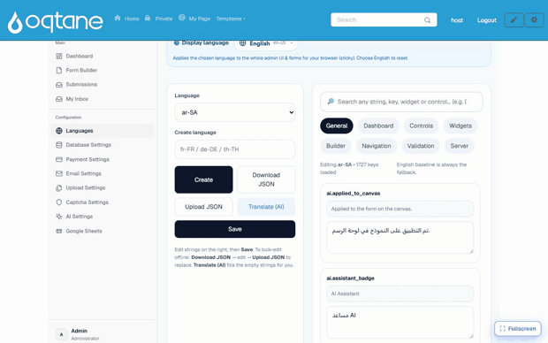

# Multi-language (built-in)

MegaForm is multilingual out of the box, on two independent layers:

1. **Your forms** — one form can carry translations for its title, description, field labels,
   help texts, placeholders, and option lists. Visitors see the form in their language and can
   switch languages right on the page.
2. **The product UI** — the Form Builder, dashboards, and admin screens themselves can be
   displayed in the administrator's preferred language.

No extra module or third-party service is required for either layer.

## Translated forms

### How visitors experience it

When a form declares more than one supported language, the rendered page shows a small
**🌐 language strip** above the form. Clicking a language reloads the form with every
translated text — title, labels, help, placeholders, options — in that language. The choice is
carried in the URL (`?locale=fr-FR`), so a link can point straight to a specific language
version of the form.

Texts that have no translation for the selected language fall back to the form's default
language, so a partially translated form still renders completely. The selected language is
also applied to the built-in chrome (buttons, validation messages) from the shared language
catalog described below.

### How authors add translations

Translations live inside the form itself (the template JSON carries a `translations` map per
locale, at form level and per field — see the
[Template JSON Reference](form-template-json.md)). In practice you fill them in one of these
ways:

- **Ask the AI assistant** — *"translate this form to French and German"* — and review the
  result before applying, like any other [AI Form Designer](ai-form-designer.md) change.
- **Edit the template JSON** directly for full control, or import/export forms with their
  translations included — translations travel with the form.

Then list the languages the form should offer in the form's settings
(`supportedLanguages`, e.g. `["en-US", "fr-FR", "de-DE"]`) and pick its `defaultLanguage`.

## The admin UI in your language

Every screen — the Form Builder, dashboards, submissions, and settings — can be shown in the
administrator's own language. Pick a **Display language** and the whole interface switches
instantly:

Administrators manage product-UI languages from the **Languages** screen on the Form
Dashboard:

- **19 languages** are available out of the box — English, Spanish, French, German,
  Portuguese (BR), Italian, Dutch, Polish, Russian, Turkish, Arabic, Vietnamese, Thai,
  Indonesian, Hindi, Japanese, Korean, and Chinese (Simplified & Traditional).
  Right-to-left scripts (Arabic) are supported.
- The editor is organised in **tabs by area** (Dashboard, Builder, Widgets, Controls, …) and
  works "copy from English → translate": you always see the source string next to your
  translation.
- **Translate (AI)** fills every untranslated string automatically using the site's configured
  AI provider — review and adjust afterwards. Manual editing works without any AI provider.
- Each administrator picks their own **display language**; the choice does not affect what
  site visitors see.

## Quick checklist

| Goal | Where |
|---|---|
| Offer a public form in 3 languages | Form settings → `supportedLanguages` + translations (AI or template JSON) |
| Deep-link a specific language | Append `?locale=de-DE` to the form page URL |
| Switch the builder/dashboard language | Form Dashboard → **Languages** → display language |
| Translate the admin UI to a new language | Form Dashboard → **Languages** → pick language → translate (or **Translate (AI)**) |
