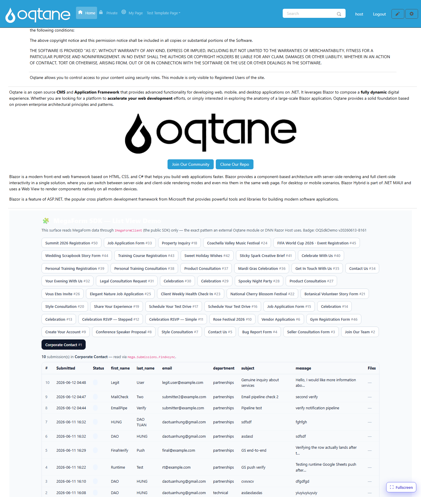
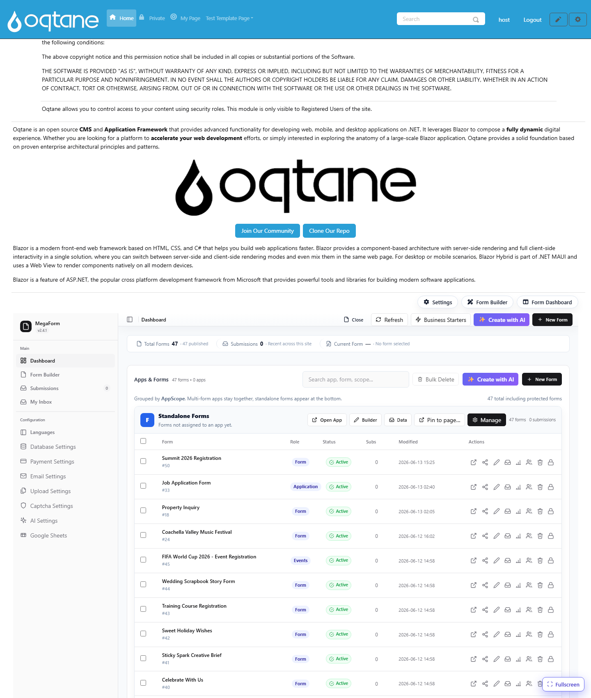

# Consumer — Oqtane (Blazor)

On Oqtane, the SDK is consumed by **constructor/`@inject` injection** of `IMegaFormClient`. This
is the recommended pattern for any DI host.

This page documents the live demo that ships with MegaForm: a Blazor component that reads forms,
submissions, and files through only `IMegaFormClient`, and renders a list view with download
links. It opens by URL at **`/?mfpanel=sdkdemo&formId=N`**.



## 1. Register the SDK

The MegaForm Oqtane server registers the repositories, storage, and the SDK in its
`IServerStartup`:

```csharp
services.AddScoped<IFormRepository, EfFormRepository>();
services.AddScoped<ISubmissionRepository, EfSubmissionRepository>();
services.AddScoped<MegaForm.Core.Interfaces.IFileRepository, EfFileRepository>();
services.AddScoped<IStorageService, OqtaneStorageService>();
MegaFormSdkServiceCollectionExtensions.AddMegaFormSdk(services);
```

## 2. Inject it into a component

```razor
@inject MegaForm.Sdk.IMegaFormClient Mega
@using MegaForm.Sdk

@code {
    [Parameter] public int PortalId { get; set; }

    private List<FormDto> _forms = new();
    private List<SubmissionDto> _rows = new();

    protected override async Task OnInitializedAsync()
    {
        var scope = new MegaFormScope { PortalId = PortalId };

        var formsPage = await Mega.Forms.ListFormsAsync(new FormQuery { PageSize = 100 }, scope);
        _forms = formsPage.Items.ToList();

        var page = await Mega.Submissions.FindAsync(
            new SubmissionQuery { FormId = 1, PageSize = 100 }, scope);
        _rows = page.Items.ToList();

        foreach (var s in page.Items)
        {
            var files = await Mega.Files.ListForSubmissionAsync(s.SubmissionId, scope);
            // keep files keyed by s.SubmissionId for rendering the download column
        }
    }
}
```

> [!IMPORTANT]
> `MegaForm.Sdk.FormDto`/`SubmissionDto` can collide with the Oqtane module's own
> `MegaForm.Oqtane.Shared.Models` types of the same name. **Fully-qualify** the SDK types
> (`MegaForm.Sdk.FormDto`) in your `@code` block to avoid `CS0104` ambiguous-reference errors.

## 3. Render the list view

```razor
<table>
  <thead><tr><th>#</th><th>Submitted</th><th>Status</th><th>Files</th></tr></thead>
  <tbody>
    @foreach (var s in _rows)
    {
      <tr>
        <td>@s.SubmissionId</td>
        <td>@s.SubmittedOnUtc.ToString("yyyy-MM-dd HH:mm")</td>
        <td>@(s.Status ?? "new")</td>
        <td>
          @foreach (var file in FilesFor(s.SubmissionId))
          {
            <a href="@($"/api/MegaForm/SdkDemo/Download?submissionId={s.SubmissionId}&fileId={file.FileId}")">
              ⬇ @file.FileName
            </a>
          }
        </td>
      </tr>
    }
  </tbody>
</table>
```

## 4. The download endpoint

A controller action streams the file through the SDK (see [File Download](file-download.md)):

```csharp
[HttpGet("SdkDemo/Download")]
[Authorize(Roles = RoleNames.Admin)]
public async Task<IActionResult> SdkDemoDownload(int submissionId, int fileId)
{
    var scope   = new MegaFormScope { PortalId = _tenantManager.GetAlias().SiteId };
    var content = await _sdk.Files.OpenAsync(submissionId, fileId, scope);
    return content is null ? NotFound()
        : File(content.Content, content.ContentType, content.FileName);
}
```

## Verified

This demo was **live-verified** on Oqtane: 47 forms listed, 10 submissions of form #1 rendered
with parsed field columns, and a seeded file downloaded end-to-end (`HTTP 200`, `text/plain`,
`Content-Disposition: attachment`). The four core MegaForm surfaces (home form, dashboard,
submissions, builder) remained intact — confirming the SDK addition is non-invasive.


