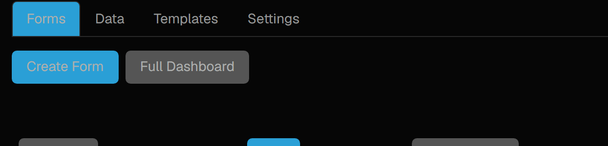
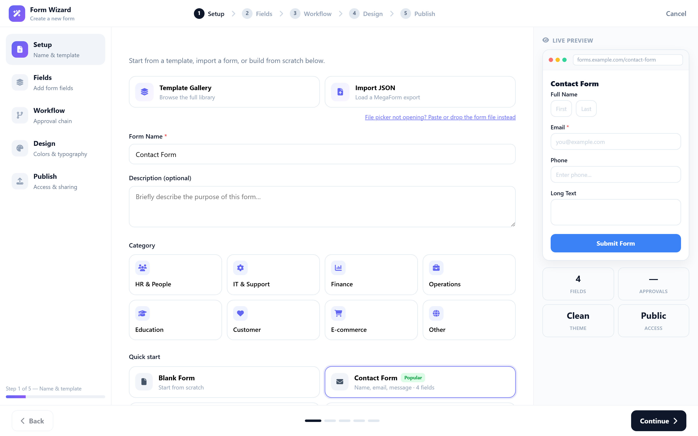
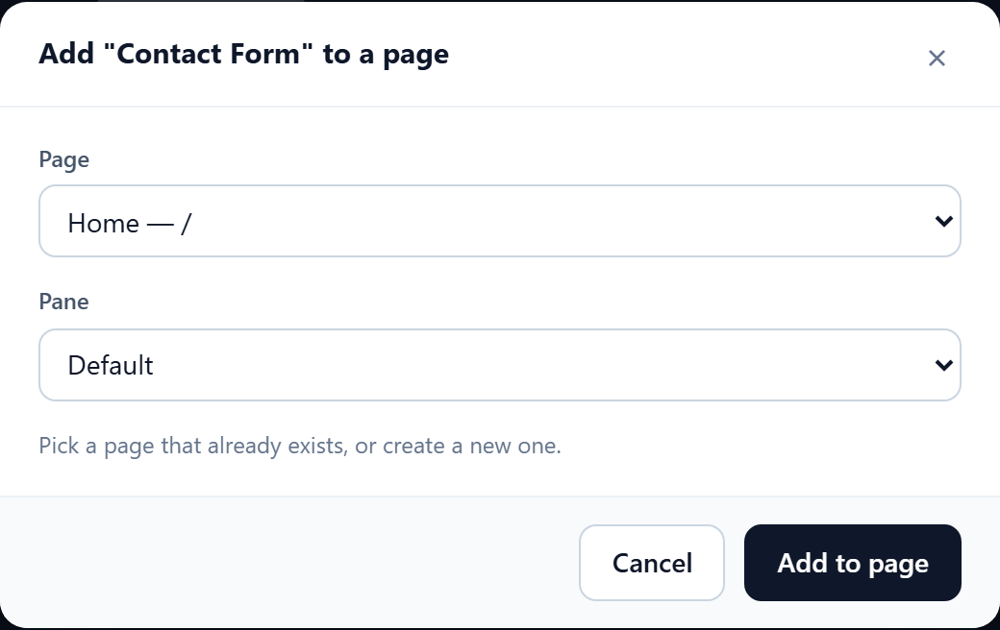

# Create a form on Oqtane

The shortest path from a fresh Oqtane install to a form your visitors can fill in. Five steps in a
wizard, then one dialog to choose where the form lives. No page editing, no module settings.

## 1. Open MegaForm from the Admin area

Sign in as a host or admin and open **Admin → MegaForm**. The pane lists your forms and gives you
the two buttons you need:

**Create Form** opens the wizard. **Full Dashboard** opens the complete MegaForm workspace (form
list, submissions, inbox, languages) when you want more than form creation.

## 2. Set up — name and starting point

The wizard runs in five steps: **Setup → Fields → Workflow → Design → Publish**.

On Setup you choose what to start from — the full **Template Gallery**, an **Import** of a MegaForm
export, one of the **Quick start** sets, or a blank form — and give the form its name.

Two things worth knowing:

- **Picking a template names the form for you.** Choose *Contact Form* and the name box fills in
  with "Contact Form". Change it whenever you like — once you type your own name, switching
  templates will not overwrite it.
- **A form needs a name before you can continue.** *Continue* stays disabled until the name box has
  something in it, and tells you so next to the button.

The panel on the right previews the form as you build it, including the field count and the access
level you will end up with.

## 3. Fields, workflow, design, publish

- **Fields** — add fields from the palette, or keep the set the template brought. Turn on multi-step
  here if the form should be split across pages.
- **Workflow** — optional approval chain. Skip it for a plain form; add approvers when a submission
  needs a decision before it counts.
- **Design** — theme, colours, typography, corner radius.
- **Publish** — who may submit (public, signed-in, or specific roles), whether to collect the
  submitter's email, whether to limit one response per person, and an optional closing date.

Press **Create Form** on the last step. **You land on the live form**, on a page, exactly as a
visitor will see it — not in the editor. To change something, use **Edit** on the form list, which
opens the builder; publishing from the builder brings you back to the live form.

## 4. Put the form on the page you want

A new form is reachable at its own URL straight away. To place it on one of your site's pages, use
**Add To Page** on the form list:

- **Page** — every page on the site, plus *Create a new page…* if you would rather start a fresh one.
  When you open the dialog from a content page, that page is preselected.
- **Pane** — where on the page the form goes. The list shows the panes that page actually uses,
  starting with `Default`.

Press **Add to page** and the form is placed with the target page's own view permissions, so
whoever can already see that page can see the form. The dialog then offers a link straight to it.

## 5. Check it as a visitor

Open the page in a private window, or sign out. You should see the form and its submit button. This
is worth doing once: it is the only check that proves the form is visible to the people you meant,
rather than only to you.

Submissions arrive under **Data → Submissions** in the MegaForm pane, or in the Full Dashboard.

## Where to go next

- [Form Builder](form-builder.md) — the editor behind **Edit**, field by field.
- [Form Templates](form-templates.md) — what ships in the gallery and how to install more.
- [After Submission](after-submission.md) — confirmation message, redirect, notifications.
- [Field Permissions](field-permissions.md) — showing or hiding individual fields by role.
