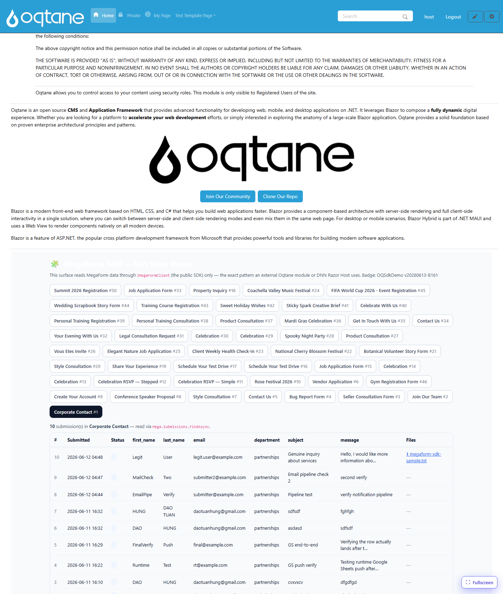

# Quick Start

This builds the scenario shown on the home page: read a form's submissions through the SDK and
render them as a list — in about 20 lines.

## The goal



## Step 1 — get a client + a scope

```csharp
IMegaFormClient client = /* injected, or MegaFormSdk via RunAsync */;
var scope = new MegaFormScope { PortalId = 1 };   // your portal/site id
```

## Step 2 — list forms

```csharp
var forms = await client.Forms.ListFormsAsync(new FormQuery { PageSize = 50 }, scope);
foreach (var f in forms.Items)
    Console.WriteLine($"#{f.FormId}  {f.Title}  ({f.SubmissionCount} submissions)");
```

## Step 3 — read submissions for one form

```csharp
var page = await client.Submissions.FindAsync(
    new SubmissionQuery { FormId = 1, PageSize = 100 }, scope);

Console.WriteLine($"{page.TotalCount} submissions");
foreach (var s in page.Items)
    Console.WriteLine($"#{s.SubmissionId}  {s.SubmittedOnUtc:yyyy-MM-dd}  {s.Status}");
```

## Step 4 — parse the submitted values

`SubmissionDto.DataJson` is a JSON object of `fieldKey → value`:

```csharp
using System.Text.Json;

using var doc = JsonDocument.Parse(s.DataJson ?? "{}");
foreach (var prop in doc.RootElement.EnumerateObject())
    Console.WriteLine($"  {prop.Name} = {prop.Value}");
```

> On classic DNN (net472) use `Newtonsoft.Json.Linq.JObject.Parse(...)` instead of
> `System.Text.Json`.

## Step 5 — list & link uploaded files

```csharp
var files = await client.Files.ListForSubmissionAsync(s.SubmissionId, scope);
foreach (var file in files)
    Console.WriteLine($"  ⬇ {file.FileName} ({file.SizeBytes} bytes)");
```

To actually stream a file to the browser, see [File Download](file-download.md).

## Full minimal example

```csharp
var scope = new MegaFormScope { PortalId = 1 };
var page  = await client.Submissions.FindAsync(
    new SubmissionQuery { FormId = 1, PageSize = 100 }, scope);

var sb = new StringBuilder("<table><tr><th>#</th><th>Submitted</th><th>Files</th></tr>");
foreach (var s in page.Items)
{
    var files = await client.Files.ListForSubmissionAsync(s.SubmissionId, scope);
    var links = string.Join(" ", files.Select(f =>
        $"<a href=\"/download?submissionId={s.SubmissionId}&fileId={f.FileId}\">⬇ {f.FileName}</a>"));
    sb.Append($"<tr><td>{s.SubmissionId}</td><td>{s.SubmittedOnUtc:yyyy-MM-dd}</td><td>{links}</td></tr>");
}
sb.Append("</table>");
```

Next: see the platform-specific consumers — [Oqtane](oqtane-consumer.md) and
[DNN Razor Host](dnn-razor-host.md).
