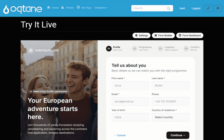

# Module Settings & Theme

Every MegaForm module on an Oqtane page has a **⚙ Settings** button (visible to administrators,
next to *Form Builder* and *Form Dashboard*). It opens the MegaForm settings pane — the fastest
way to control **which form the page shows** and **how it looks**, without opening the builder.

The pane has three tabs: **Module form**, **Theme & Layout**, and **Current Form settings**.
The **Save module settings** button is always visible, whatever tab you are on.

## Module form — choose what the page displays

The *Module form* tab lists every published form on the site. Pick one and save — the page now
renders that form. The same form can be shown by several modules on different pages, and a
module can be re-pointed at any time without touching the form itself.

## Theme & Layout

### Theme presets

Pick from the built-in presets — *Default, Ocean, Forest, Sunset, Lavender, Midnight, Rose,
Amber, Slate, Emerald, Coral, Cyber, Carbon, Arctic, Berry, Earth* — and the form recolors
instantly, including the premium templates.

Each preset shows its **editable colour palette** right on the card: click a swatch to adjust
the primary / text / background / border colours for *this module* without leaving the pane.
Unsaved changes apply when you press **Save module settings**.

### Layout

- **Max width** — 480 / 640 / 768 / 960 / Full, controlling how wide the form renders.
- **Field spacing** — a slider for the vertical rhythm between fields.
- **Hide form header** — suppress the form's title + description when the page already
  provides its own heading.

### Typography & corners

- **Body font / Heading font**, **base text size**, and **line height**.
- **Corner radius** — preset steps or a custom pixel value.

### Page integration

For forms embedded inline in a content page, *Typography source* and *Color source* can be set
to **Inherit from page**, so the form borrows the host skin's font and colours instead of its
own.

> [!TIP]
> Module settings are **per module**, not per form: the same form can look different on two
> pages. Form-level design (fields, layout blocks, custom shells) lives in the
> [Form Builder](form-builder.md); a full theme editor is available there under **Design**.
