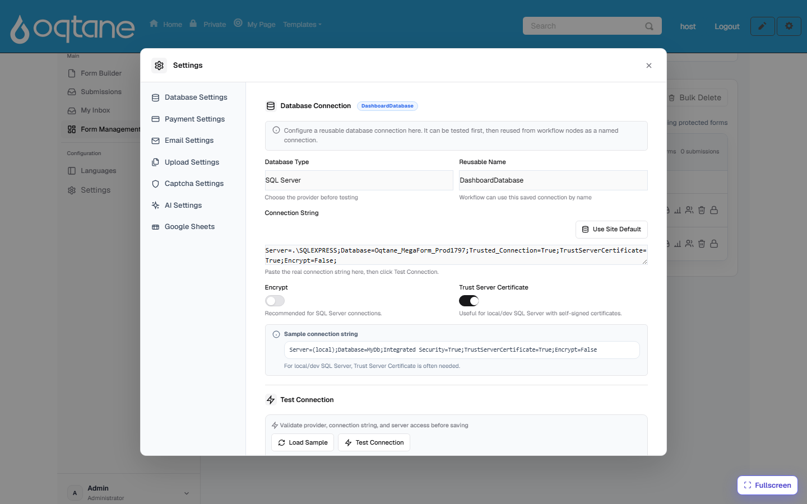
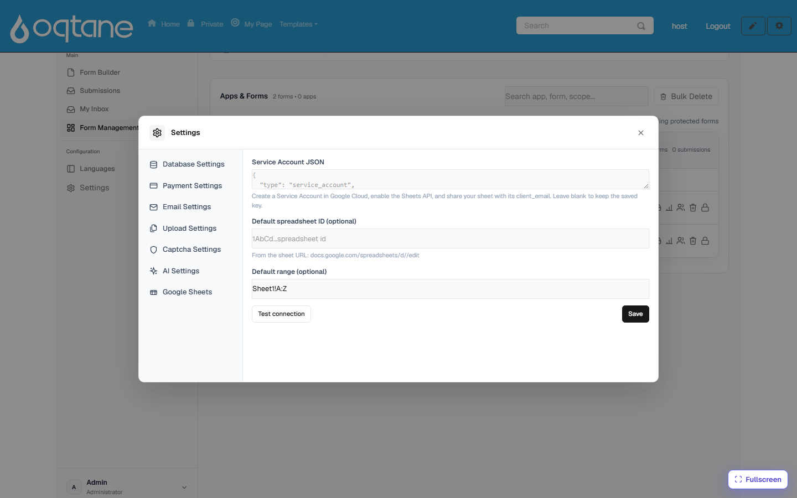

# Storage & Integrations

Submissions always land in MegaForm's own store (browsable under
[Submissions](submissions-inbox.md)). On top of that, MegaForm can **also** write each
submission to storage you own — a SQL database table or a Google Sheet — so your data flows
straight into the systems your team already uses.

Both integrations are configured from **Form Dashboard → Settings**.

## Your SQL database

**Settings → Database Settings** holds one or more **reusable named connections**:

1. Pick the **Database Type** (e.g. SQL Server) and give the connection a **Reusable Name**.
2. Paste the **Connection String** — or click **Use Site Default** to reuse the site's own
   database. *Encrypt* and *Trust Server Certificate* toggles cover local/dev SQL setups.
3. Click **Test Connection** before saving — the provider, connection string, and server
   access are validated first.

What named connections are used for:

- **Per-form database insert** — a form can map its fields to a table so every submission is
  also `INSERT`-ed into that table the moment it arrives (fail-soft: if the insert fails, the
  submission itself is never lost, and the error is logged for the admin).
- **Workflow nodes** — *Service Task (DB)* steps in a [workflow](workflow.md) reference a
  connection by its reusable name.
- **Data-driven forms** — dropdowns, cascades, and data views built from your tables (the
  [AI Form Designer](ai-form-designer.md) can discover the tables and draft new ones).

## Google Sheets

**Settings → Google Sheets** connects a site to Google:

1. In Google Cloud, create a **Service Account**, enable the **Sheets API**, and paste the
   service-account **JSON key** here.
2. Optionally set a **default spreadsheet ID** and **range** (e.g. `Sheet1!A:Z`).
3. **Test connection**, then save. The key is stored server-side.

Then, for any form, use **Connect Google Sheet** (on the form's row in the dashboard) — paste
the sheet's URL, share the sheet with the service account's e-mail as *Editor*, and every new
submission is appended to the sheet as a row. Workflows can also push to Sheets with the
*Service Task (Sheet)* node.

## Other destinations

- **Webhooks** — per form, POST each submission to any URL you configure (with secret +
  custom headers).
- **E-mail** — notification and autoresponder mails per form (Settings → Email Settings).
- **Files** — uploaded files are stored by the host and streamed back through
  [File download](file-download.md) APIs.
