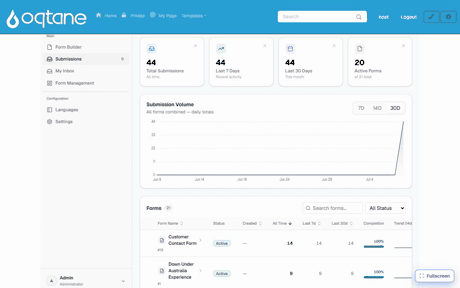
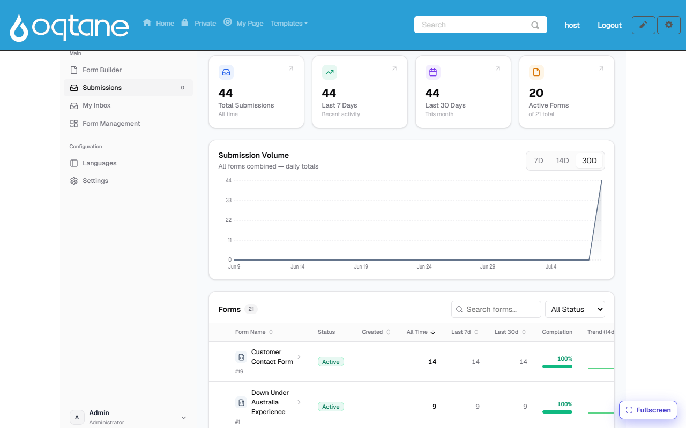
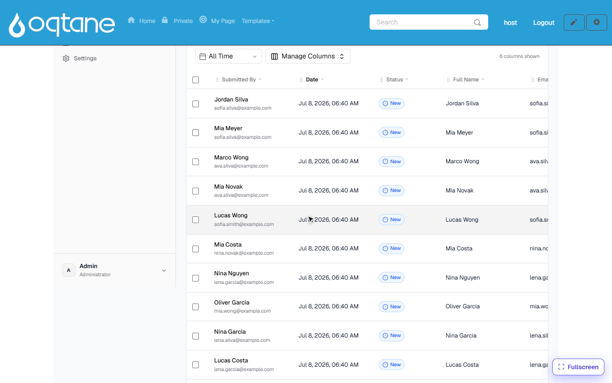
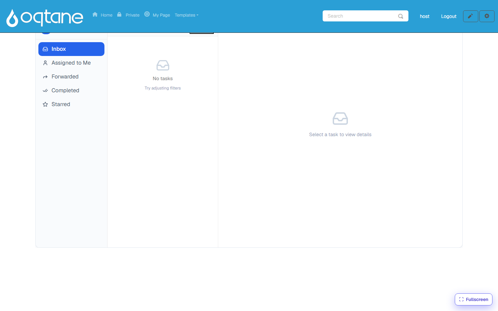

# Submissions & My Inbox

Everything a form collects lands in the **Form Dashboard**, under **Submissions** — analytics
first, then a full data grid per form. Approval-style work items appear in **My Inbox**.

## The overview

**Form Dashboard → Submissions** opens with the big picture:

- **Totals** — all-time, last 7 days, last 30 days, and how many forms are active.
- **Submission Volume** — daily totals across all forms (7D / 14D / 30D).
- **Forms list** — every form with its counts, completion rate and a 14-day trend spark-line.
  Click a form to open its data.

## The per-form data grid

Each row is one submission. From here you can:

- **Search** free-text across submissions, and filter by **status** and **time range**.
- **Manage Columns** — choose which form fields appear as grid columns (the choice is
  remembered per form).
- Track **status** per submission — *New → Processed / Pending* — so a team can work through
  incoming entries.
- **Export** the data, and **bulk-select** rows for batch actions.
- Open a row for the full detail view: every answer, uploaded files, and the submission's
  history.

## My Inbox

**My Inbox** is the task view for approval workflows: when a workflow contains an approval
step, each submission that reaches it creates a task for the assigned users or roles.

- Folders: **Inbox**, **Assigned to Me**, **Forwarded**, **Completed**, **Starred**.
- Open a task to see the submission it belongs to, then **Approve**, **Reject** (a comment can
  be required), or **Forward** it to someone else.
- Tasks can be **claimed** from a shared queue (candidate roles/users are defined on the
  approval step), and each action is recorded in the task's history.

How approval steps are added to a form's process — including who the candidate approvers are
and what status the submission takes while waiting — is covered in [Workflow](workflow.md).
