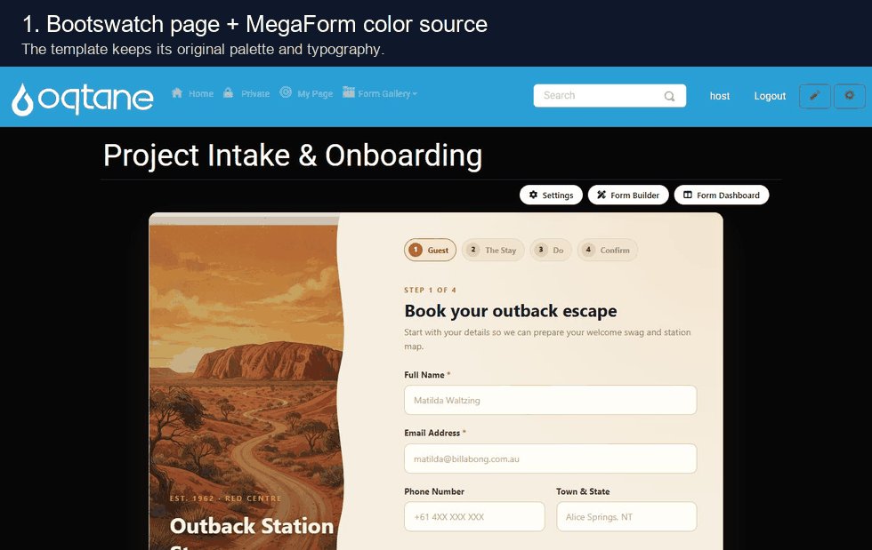

# Theme Compatibility

MegaForm can either keep its own designed template styling or inherit the host page theme. This is
useful on Oqtane sites that use Bootswatch themes: premium forms can stay brand-locked when you
want a polished campaign page, or they can blend into the page when the site theme should control
font and color.

## Two styling modes

Use **MegaForm** as the source when the template should keep its original color palette,
typography, spacing, and custom shell. In the capture above, the page is already running a
Bootswatch theme, but the Outback template initially keeps its own warm illustrated design.

Use **From page** when the form should borrow the host page's font and colors. After switching
both **Typography source** and **Color source** to **From page**, the same module follows the
Bootswatch page treatment.

## How to switch

1. Open the form page in Oqtane as an administrator.
2. Click **Settings** on the MegaForm module.
3. Open **Theme & Layout**.
4. Under **Page integration**, choose the source for **Typography source** and **Color source**.
5. Click **Save module settings**.

The settings are module-aware: a form can keep MegaForm styling on one page and inherit the
Oqtane / Bootswatch theme on another page.
