# Controls & Widgets Reference

Everything you can place on a form lives in the **palette** on the left side of the Form
Builder. It is organised into three tabs — **Basic** (everyday input controls), **Layout**
(structure and field groups) and **Widgets** (rich interactive blocks like maps, sliders and
payments). Click a tile to append it to the form, or drag it exactly where you want it
(see [Drag & Drop and Layout](drag-drop-layout.md)).

| Basic tab | Layout tab | Widgets tab |
|---|---|---|
| 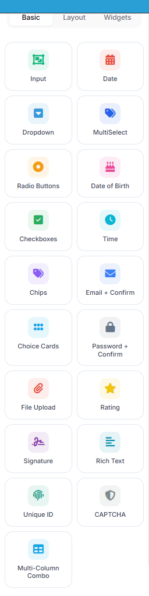 | 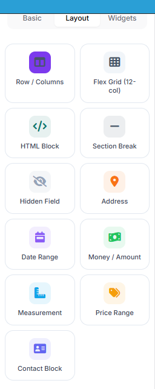 | 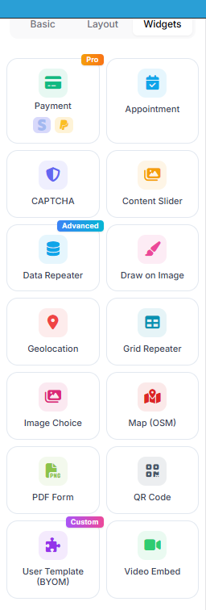 |

Every control — from a plain text box to a payment widget — is a *field* with the same
anatomy: a **key** (used in `{{field:key}}` tokens, exports and the API), a label, optional
validation, and conditional-logic rules. Screenshots below show how each control renders on
the published form.

## The Input control (composite presets)

The single **Input** tile covers the whole text-input family. Drop it once, then pick the
**Input type** in the settings rail: Short Text, Long Text, Email, Number, Website URL — or a
*composite* preset that renders several sub-inputs but stores **one combined value**:

| Preset | What you get |
|---|---|
| Full Name | First + last name side by side (a "+ Prefix/Suffix" variant adds Mr/Dr… and Jr/III…) |
| Phone Number | Country picker with flags + area + number + extension |
| Address | Street, city, state, ZIP — with US / International / Canada / UK format schemes |
| Date of Birth | Day / month / year dropdowns with age validation |
| Time | Hour / minute / AM-PM |
| Email + Confirm | Two email boxes that must match |
| Password + Confirm | Two password boxes that must match |
| SSN | Masked ###-##-#### input |

**Full Name**

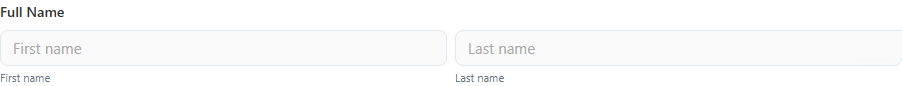

**Phone Number** — the country picker ships with flag icons and dial codes:

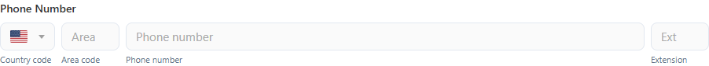

**Address** — pick the format scheme and the sub-fields adapt:

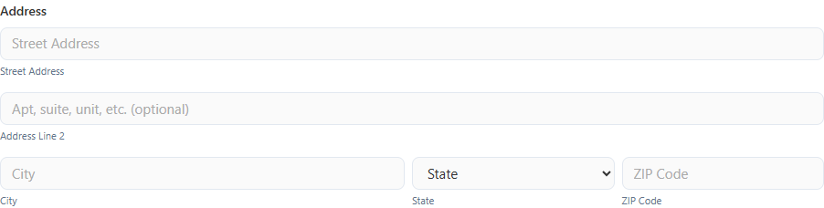

**Date of Birth / Time / Email + Confirm**

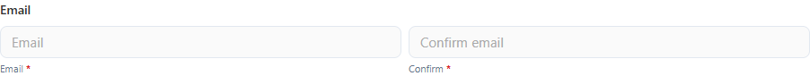

The **Open Input Designer** button in the settings rail opens a full editor where you can add,
remove, resize, relabel or hide individual parts of any composite.

## Choice controls

| Control | Use it for |
|---|---|
| Dropdown | One choice from a compact list. Variants: native select, multi-select chips, multi-column combo. Options can come from a static list **or a SQL query** (with cascading `:fieldKey` parameters). |
| MultiSelect | Several choices as removable chips with search |
| Radio Buttons | One choice, all options visible |
| Checkboxes | Several choices, all options visible |
| Chips | Tag-style multi-select pills — great for interests, skills, categories |
| Choice Cards | Large single-select tiles with a title and description — plans, tickets, packages |
| Image Choice | Pick by clicking a photo card (with optional description and price) |

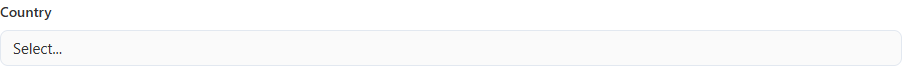

**Chips** — emoji-friendly pills:

**Choice Cards** — each option is a selectable card:

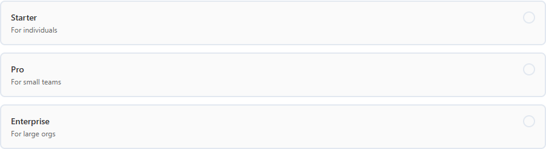

**Image Choice** — options are photo cards:

The builder ships option **templates** (pricing cards, plan cards, yes/no cards, satisfaction
emoji, size chips…) you can apply with one click and then edit.

## Date & time

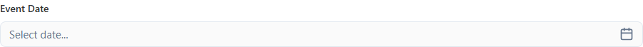

The **Date** control opens a calendar grid; modes: date only, date + time, or month/year.
For structured entry use the composite presets above (Date of Birth, Time) or the
**Date Range** field group from the Layout tab:

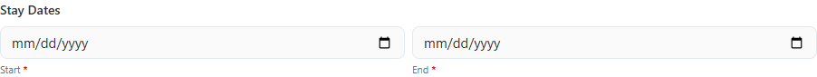

## Files, ratings, signatures & more

| Control | Use it for |
|---|---|
| File Upload | Attachments with size / count / extension limits |
| Rating | Star, emoji, heart or thumbs rating |
| Signature | Draw-to-sign box, stored as an image |
| Rich Text | A small formatted-text editor as an input |
| Unique ID | Auto-generated reference number (prefix + padded counter + optional date/random suffix) |
| CAPTCHA | Anti-spam challenge |
| Multi-Column Combo | Dropdown whose open list shows several columns (e.g. name + position) — ideal for SQL-backed pickers |

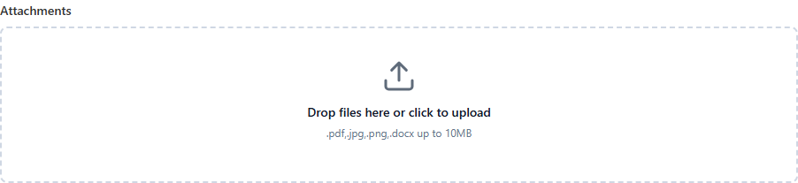

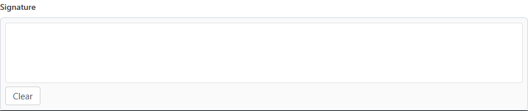

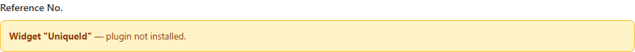

## Layout tab

Structure controls don't collect data by themselves — they arrange other fields:

| Control | What it does |
|---|---|
| Row / Columns | Split the form into 1–4 columns and place fields side by side — see [Drag & Drop and Layout](drag-drop-layout.md) |
| Flex Grid (12-col) | Free-form 12-column CSS grid; place fields in any cell |
| HTML Block | Rich text / HTML content between fields |
| Section Break | Heading + divider; can also **start a new page** (multi-step forms) |
| Hidden Field | Invisible value submitted with the form (defaults, tracking) |

The Layout tab also hosts ready-made **field groups** built on the composite engine:
**Address**, **Date Range**, **Money / Amount**, **Measurement**, **Price Range**, and
**Contact Block** (name + email + phone in one row):

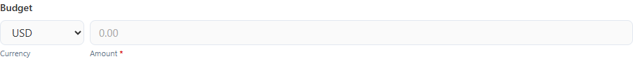

## Widgets tab

Rich blocks that go beyond simple inputs. Badges in the palette mark **Pro** (license),
**Advanced** and **Custom** widgets.

| Widget | What it does |
|---|---|
| Map (OSM) | Embedded OpenStreetMap with a marker — perfect for contact forms |
| Content Slider | Auto-playing image/text carousel for headers and showcases |
| Video Embed | YouTube/Vimeo player; can **require watching** a percentage before submit |
| QR Code | Floating "open on mobile" QR of the current form URL (or a custom URL) with a copy-link button |
| Image Choice | Photo-card options (also listed with the choice controls above) |
| Geolocation | Capture the visitor's location (with their consent) |
| Appointment | Date + time-slot booking |
| Data Repeater | Repeatable sub-form — "add another passenger/item" entry lists |
| Grid Repeater | Spreadsheet-style repeatable rows |
| Draw on Image | Annotate an image (mark damage on a car diagram, etc.) |
| PDF Form | Render a fillable PDF as the form body |
| Payment (Pro) | Stripe & PayPal checkout — the server resolves the price from the field settings |
| Razor Widget (Pro) | Server-rendered Razor snippet with schema-defined SQL actions |
| User Template (BYOM) | Bring-your-own-markup widget: your HTML/CSS/JS as a reusable control |
| CAPTCHA | Same anti-spam control as in Basic |

**Map (OSM)** — configure latitude/longitude, zoom, height and marker colour; visitors see a
live OpenStreetMap embed:

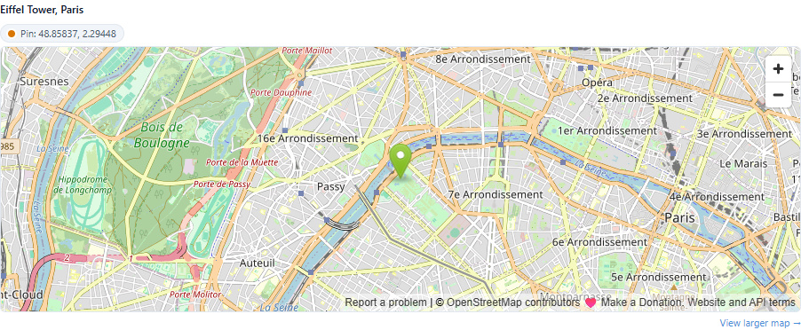

> **Map contact forms.** The template gallery includes ready-made "Contact Us" designs with
> the map on the left or right of the form fields — start from one of those and re-pin the
> marker to your address.

**Content Slider** — slides with image, badge, title and description; autoplay and arrows are
built in:

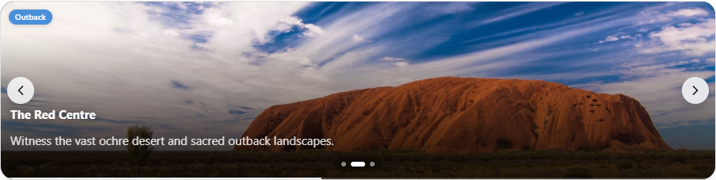

**Video Embed** — paste a YouTube/Vimeo URL; the progress bar under the player tracks the
watched percentage:

**Multi-Column Combo** — a dropdown that opens into a small table; columns are configurable
and options can come from SQL:

## Where to go next

- Place and arrange these controls: [Drag & Drop and Layout](drag-drop-layout.md)
- Configure what happens after a visitor submits: [After Submission](after-submission.md)
- Let the AI build a first draft with these controls: [AI Form Designer](ai-form-designer.md)
