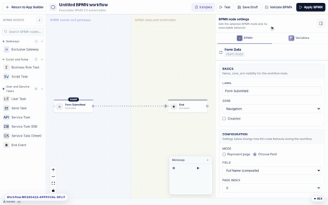
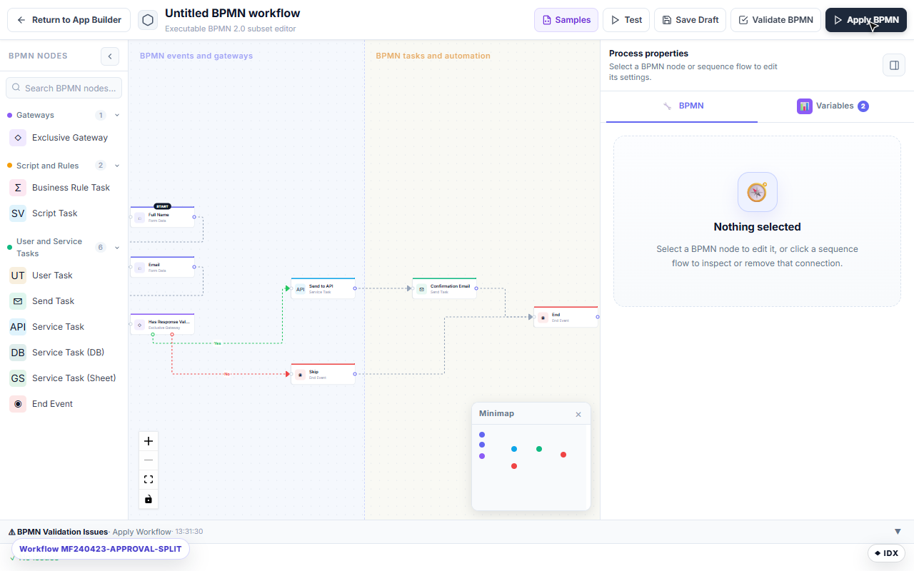

# Workflow

MegaForm **Workflow** turns a form submission into a business process. You design a flowchart of
triggers, conditions, and actions; when a submission arrives or a field changes, the workflow
engine executes the flow.



## Core concepts

| Term | Meaning |
|---|---|
| **Workflow** | A named process attached to one or more forms |
| **Trigger** | The event that starts a workflow run |
| **Step / Node** | A single action or decision in the flow |
| **Run** | One execution of a workflow for a specific submission |
| **Context** | The submission's field values plus runtime variables (`_submissionId`, `now`, `currentUser`, …) |

## Workflow canvas

Open a form in the **Form Builder** and click **BPMN** — the workflow canvas opens as a full
BPMN 2.0 editor:



- The **node palette** on the left offers Gateways (*Exclusive Gateway*), Script & Rules
  (*Business Rule Task*, *Script Task*), and User & Service tasks (*User Task*, *Send Task*,
  *Service Task*, *Service Task (DB)*, *Service Task (Sheet)*, *End Event*).
- **Samples** loads a ready-made starter workflow into the canvas — the fastest way to begin;
  it arrives pre-mapped to your form's fields.
- **Validate BPMN** checks the flow; **Test** dry-runs it; **Save Draft** keeps work in
  progress; **Apply BPMN** attaches the workflow to the form.
- Connect nodes by drawing edges; click any node to edit its properties (and workflow
  **Variables**) in the right panel.
- **User Task** steps create approval items in [My Inbox](submissions-inbox.md) for the
  assigned users or roles.

## Triggers

| Trigger | Fires when… | Example config |
|---|---|---|
| `on_submit` | A form is submitted | `{ "formId": 5 }` |
| `on_update` | A record is edited | `{ "formId": 5, "watchFields": ["status"] }` |
| `on_field_change` | A specific field changes | `{ "formId": 5, "field": "status", "from": "open", "to": "resolved" }` |
| `on_status_change` | The status field changes | `{ "formId": 5, "statusField": "status" }` |
| `scheduled` | A cron schedule elapses | `{ "cron": "0 8 * * *", "formId": 5 }` |
| `manual` | A user clicks a button | `{ "formId": 5, "buttonLabel": "Approve" }` |
| `webhook_received` | An external webhook arrives | `{ "endpoint": "/hook/crm-sync" }` |
| `on_date` | A date field is reached | `{ "formId": 5, "dateField": "due_date", "offset": "-1d" }` |

## Node types

### Condition

Branch the flow based on field values:

```json
{
  "type": "condition",
  "config": {
    "conditions": [
      { "field": "deal_value", "operator": "greaterThan", "value": 10000 },
      { "field": "category", "operator": "equals", "value": "enterprise" }
    ],
    "logic": "and"
  },
  "onTrue": "step_approve",
  "onFalse": "step_review"
}
```

Operators include: `equals`, `notEquals`, `contains`, `startsWith`, `endsWith`,
`greaterThan`, `lessThan`, `greaterOrEqual`, `lessOrEqual`, `in`, `notIn`,
`isEmpty`, `isNotEmpty`, `matchesRegex`.

### Update Field

Set one or more field values:

```json
{
  "type": "update_field",
  "config": {
    "updates": [
      { "field": "status", "value": "approved" },
      { "field": "approved_date", "value": "{{now}}" },
      { "field": "approved_by", "value": "{{currentUser}}" }
    ]
  }
}
```

### Send Email

Send HTML or plain-text email with token substitution:

```json
{
  "type": "send_email",
  "config": {
    "to": "{{email}}",
    "cc": "manager@company.com",
    "subject": "Your request has been {{status}}",
    "body": "Dear {{full_name}},\n\nYour request #{{_submissionId}} has been {{status}}.",
    "attachFields": ["resume"],
    "replyTo": "support@company.com"
  }
}
```

### Approval

Create a human approval task:

```json
{
  "type": "approval",
  "config": {
    "approvers": { "type": "field", "field": "manager_email" },
    "approvalField": "_approval_status",
    "onApprove": "step_approved",
    "onReject": "step_rejected",
    "reminderAfter": "24h",
    "escalateAfter": "72h",
    "escalateTo": "director@company.com"
  }
}
```

Approvers can also be a fixed role, a list of emails, or a round-robin pool.

### Webhook

Call an external HTTP endpoint:

```json
{
  "type": "webhook",
  "config": {
    "url": "https://hooks.slack.com/services/...",
    "method": "POST",
    "headers": { "Content-Type": "application/json" },
    "body": { "text": "New ticket from {{full_name}}: {{title}}" },
    "retryCount": 3,
    "timeout": 30
  }
}
```

### Calculate

Compute values from other fields:

```json
{
  "type": "calculate",
  "config": {
    "updates": [
      { "field": "total", "formula": "{{quantity}} * {{unit_price}}" },
      { "field": "tax", "formula": "{{total}} * 0.1" },
      { "field": "grand_total", "formula": "{{total}} + {{tax}}" }
    ]
  }
}
```

### Other nodes

- **Create Record** — insert a record into another form.
- **Notify** — send an in-app notification.
- **Wait** — pause for a duration or until a date.
- **Assign** — round-robin or load-balance assignment.
- **Generate PDF** — create a PDF from a template.
- **Database** — run a SQL statement.
- **Google Sheets** — push a row to Google Sheets.
- **Add Role / Add User** — identity-management actions.

## Common examples

### Helpdesk ticket escalation

1. `on_submit` → auto-assign round-robin → email submitter confirmation.
2. `scheduled` every hour → find tickets open > 24h → set status `overdue` → notify agent.
3. `scheduled` every 4 hours → find overdue > 48h → escalate to manager.
4. `on_field_change` status → `resolved` → email submitter + wait 72h + send survey.

### CRM lead pipeline

1. `on_submit` lead form → create CRM contact record → assign senior sales if enterprise,
   else round-robin → send welcome email.
2. `on_field_change` `deal_value` > $50K → notify VP Sales.
3. `on_field_change` status → `won` → generate invoice + webhook to accounting.

### HR leave request

1. `on_submit` leave request → create approval task for manager.
2. Approval approved → set status `approved` → notify employee → update leave balance.
3. Approval rejected → set status `rejected` → notify employee with reason.

## Monitoring runs

The workflow engine stores:

- `MF_Workflows` — definitions
- `MF_WorkflowRuns` — one row per run with status and error message
- `MF_WorkflowStepLog` — one row per executed step
- `MF_Approvals` — pending and resolved approval tasks
- `MF_ScheduledTasks` — future tasks (wait, reminder, escalation, scheduled triggers)

Admins can inspect runs from the dashboard to see exactly which nodes executed and where a run
failed.

## Permissions

Designing workflows requires the module permission `MEGAFORM_WORKFLOW` (typically Admins).
Running workflows is automatic and subject to the form-level permissions of the triggering
submission.
