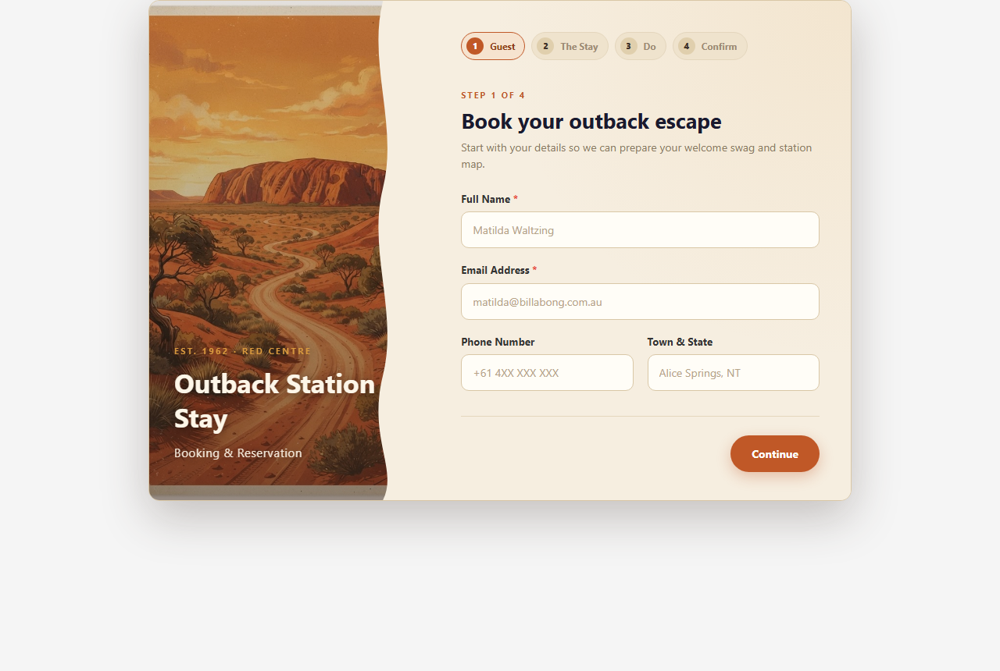
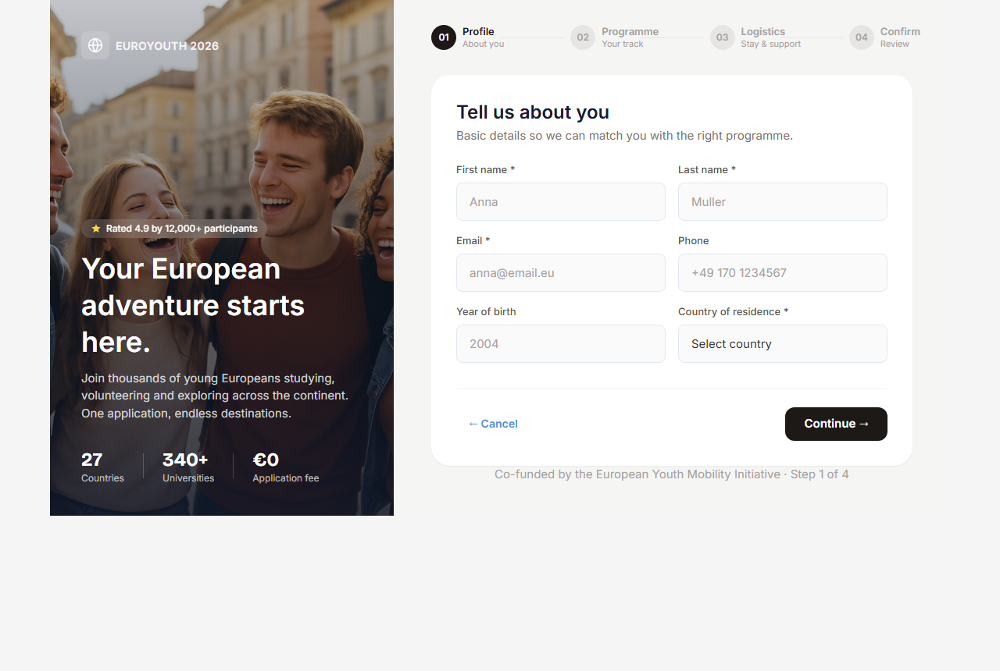
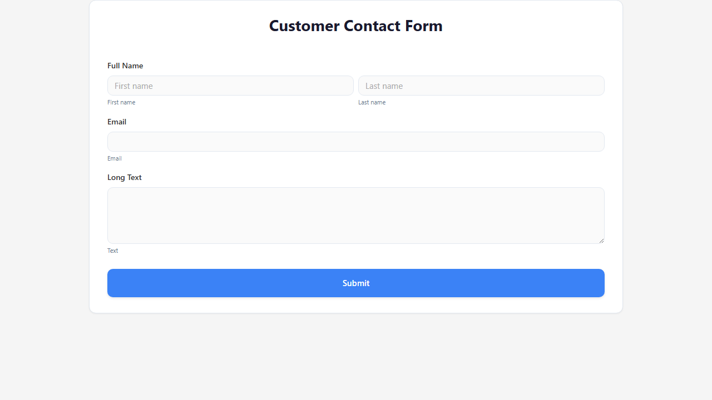
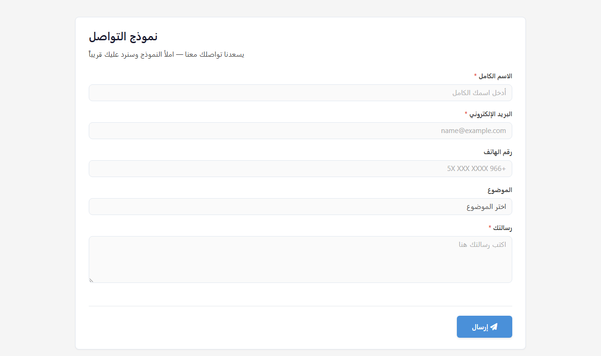
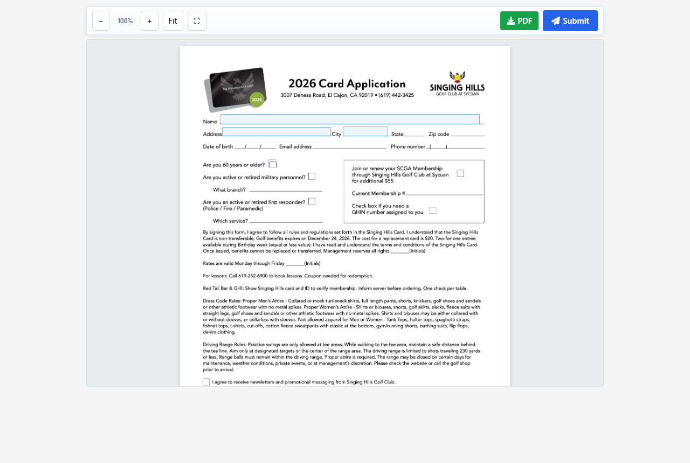
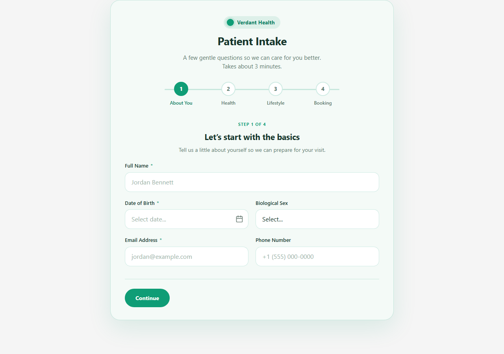

# MegaForm

**MegaForm** is a complete form platform for **Oqtane** (and DNN / ASP.NET Core hosts): a visual
builder, ready-made premium templates, an AI form designer, submissions with analytics, approval
workflows, and built-in multi-language support — all inside your own site, on your own database.

## Forms that don't look like "form builder" forms

Every template below ships in the box and renders exactly like this on an Oqtane page —
multi-step navigation, hero imagery, and theming included.

Prefer something simple? The wizard builds a clean standard form in under a minute
(see [Creating Forms](articles/creating-forms.md)):

## Right-to-left and multi-language, built in

Forms carry per-language translations with an on-page language switcher, RTL scripts render
correctly, and the admin UI itself ships in 19 languages —
see [Multi-language](articles/multi-language.md).

## Widgets in action

Beyond standard inputs: multi-step wizards with progress, ratings, signatures, file uploads,
composite fields — and a full **PDF form** widget that lets visitors fill a real PDF (with
zoom, full screen, and a downloadable filled copy):

## Manage everything from the Form Dashboard

Submissions with volume analytics and per-form data grids, an approval **My Inbox**, a visual
**BPMN workflow designer**, storage integrations (SQL database, Google Sheets), and per-module
theme settings:

## Start here

**Using MegaForm (Oqtane user guide):**

| Guide | What it covers |
|-------|----------------|
| [Creating Forms](articles/creating-forms.md) | Wizard, multi-step, and AI flows — with demo videos |
| [Form Builder](articles/form-builder.md) | The visual builder in depth |
| [Module Settings & Theme](articles/settings-pane.md) | Choose the form a page shows; presets, colors, layout |
| [Submissions & My Inbox](articles/submissions-inbox.md) | Analytics, data grids, statuses, the approval inbox |
| [Workflow](articles/workflow.md) | The BPMN designer and workflow engine |
| [Storage & Integrations](articles/storage-options.md) | Your SQL database, Google Sheets |
| [Multi-language](articles/multi-language.md) | Translated forms and admin UI languages |
| [AI Form Designer](articles/ai-form-designer.md) | Describe a form; review and apply |

**Programming (SDK & API):**

| Guide | What it covers |
|-------|----------------|
| [Overview](articles/overview.md) | Architecture, key concepts, the object model |
| [Installation](articles/installation.md) | Add the SDK and register it in your host |
| [Standalone Host](articles/standalone-host.md) | Run MegaForm as an ASP.NET Core app via NuGet |
| [Quick Start](articles/quickstart.md) | A working list view in ~20 lines |
| [SDK Reference](articles/sdk-reference.md) | Complete English reference for every SDK API |
| [Reading data](articles/reading-data.md) | Forms & submissions queries, paging, scope |
| [File download](articles/file-download.md) | List & stream uploaded files safely |

Or browse the generated **[API Reference](api/index.md)**.
