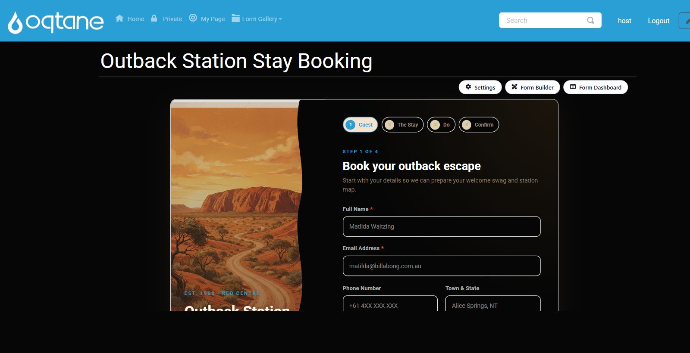
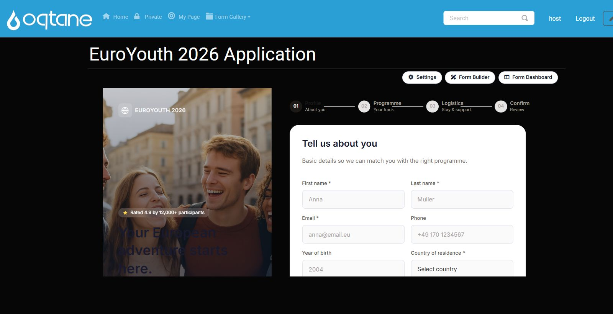
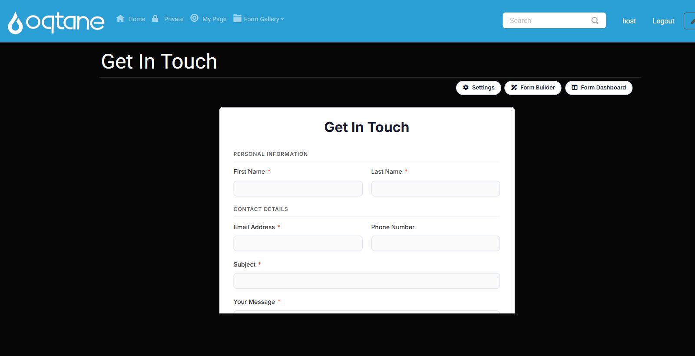
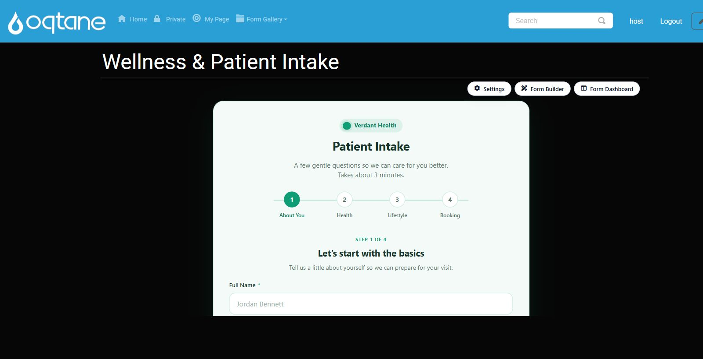
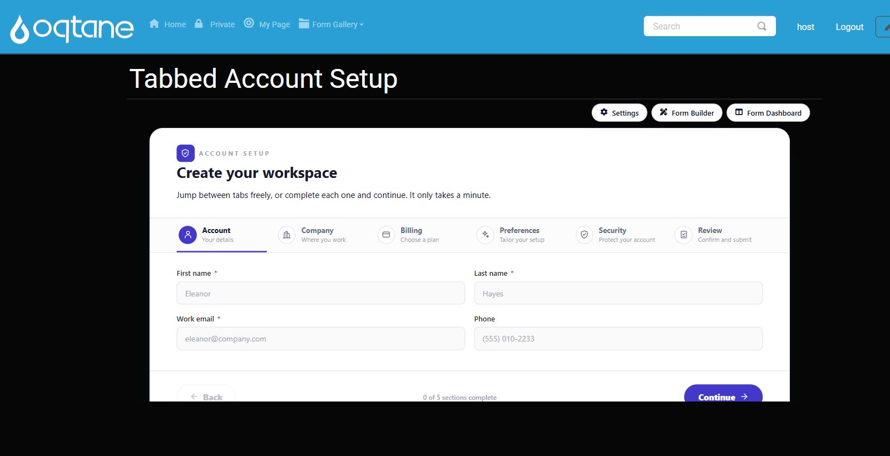
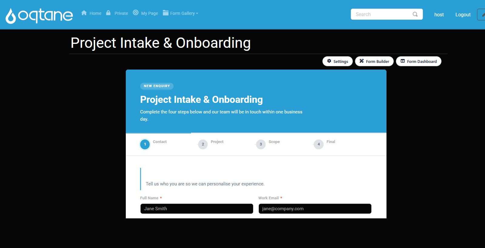
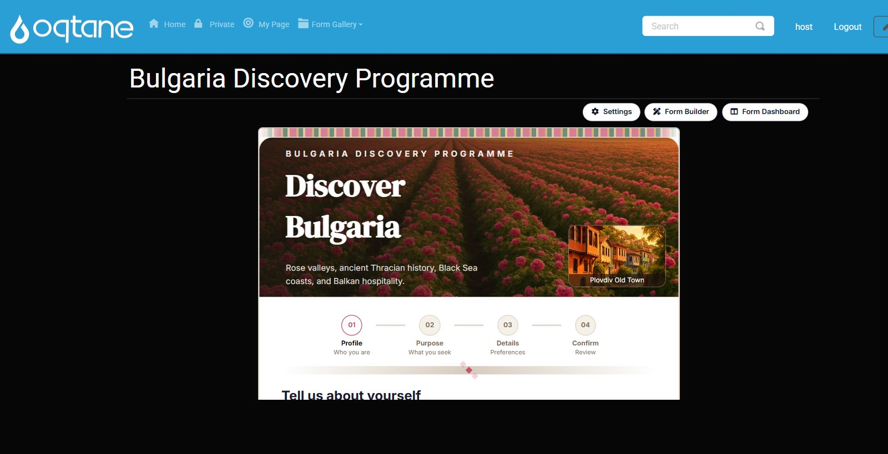
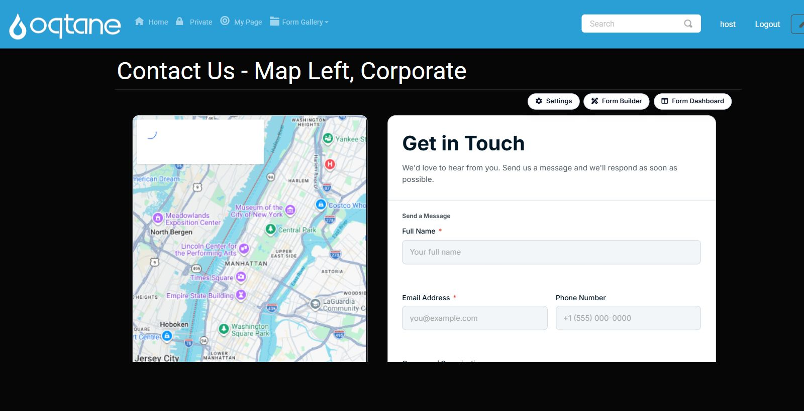

# MegaForm

**MegaForm** is a complete form platform for **Oqtane** (and DNN / ASP.NET Core hosts): a visual
builder, ready-made premium templates, an AI form designer, submissions with analytics, approval
workflows, and built-in multi-language support - all inside your own site, on your own database.

## Real Oqtane gallery screenshots

The screenshots below are captured from the live Oqtane gallery at `/form-gallery/`, including the
Oqtane header, page shell, module title, module actions, and the rendered form. They are not cropped
down to the form body, so you can see how the templates sit on a real Oqtane page.

## Premium templates

These templates show different layout styles from the same gallery: split hero panels, tabbed
account setup, onboarding flows, health intake, travel programmes, and contact forms with maps.

## Product areas

MegaForm also includes the dashboard, submissions analytics, an approval inbox, a visual BPMN
workflow designer, storage integrations, widgets, multi-language forms, and AI assisted form
creation. Start with the guides below for those workflows.

## Start here

**Using MegaForm (Oqtane user guide):**

| Guide | What it covers |
|-------|----------------|
| [Creating Forms](articles/creating-forms.md) | Wizard, multi-step, and AI flows - with demo videos |
| [Form Builder](articles/form-builder.md) | The visual builder in depth |
| [Module Settings & Theme](articles/settings-pane.md) | Choose the form a page shows; presets, colors, layout |
| [Submissions & My Inbox](articles/submissions-inbox.md) | Analytics, data grids, statuses, the approval inbox |
| [Workflow](articles/workflow.md) | The BPMN designer and workflow engine |
| [Storage & Integrations](articles/storage-options.md) | Your SQL database, Google Sheets |
| [Multi-language](articles/multi-language.md) | Translated forms and admin UI languages |
| [AI Form Designer](articles/ai-form-designer.md) | Describe a form; review and apply |

**Programming (SDK & API):**

| Guide | What it covers |
|-------|----------------|
| [Overview](articles/overview.md) | Architecture, key concepts, the object model |
| [Installation](articles/installation.md) | Add the SDK and register it in your host |
| [Standalone Host](articles/standalone-host.md) | Run MegaForm as an ASP.NET Core app via NuGet |
| [Quick Start](articles/quickstart.md) | A working list view in ~20 lines |
| [SDK Reference](articles/sdk-reference.md) | Complete English reference for every SDK API |
| [Reading data](articles/reading-data.md) | Forms and submissions queries, paging, scope |
| [File download](articles/file-download.md) | List and stream uploaded files safely |

Or browse the generated **[API Reference](api/index.md)**.
