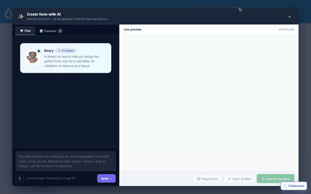

# AI Form Designer on Oqtane

On Oqtane, MegaForm is available from the Admin area and from the full MegaForm dashboard.

## Create a new form

1. Sign in as a host or administrator.
2. Open **Admin > MegaForm**.
3. Select **Full Dashboard**, then **Create form**.
4. Choose **Create with AI**.
5. Describe the form and review the live preview.
6. Continue the conversation to refine the result.
7. Save the form or open it in the full builder.

The following Oqtane recording shows the create, preview, and refine flow:

## Refine a form

Open the form in the builder and select **AI Designer**. Ask for changes in plain language, review
them on the form canvas, and save when the result is ready.

## Add the form to a page

Use **Add To Page** from the form list, select the target page and pane, and confirm. For the full
publishing workflow, see [Create a form on Oqtane](oqtane-create-form.md).
