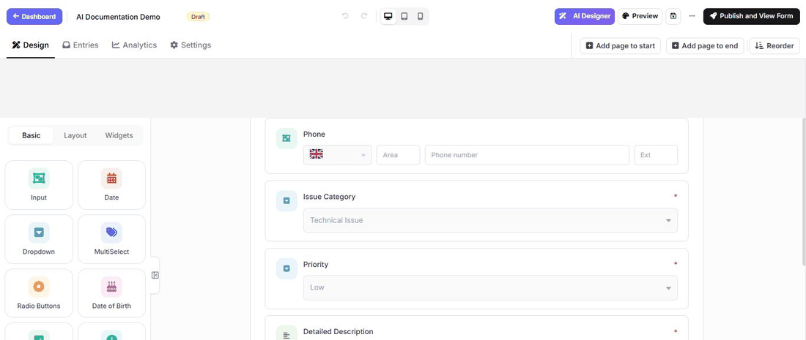

# Design a form with AI on Umbraco

AI Designer turns a plain-language request into live changes on the form currently open in the builder. Review the result on the canvas, then save the draft only when it matches the request.

Use [Create a form with AI](umbraco-create-with-ai.md) when the form does not exist yet. Use AI Designer for the form currently open in the builder.

The animation below was recorded in the real Umbraco builder. It uses an English prompt for consistency, but you can write the request in **any language supported by the configured AI model**. Use the language you want for generated field labels and form text, or name the desired output language explicitly.

## Before you begin

An administrator must configure an AI provider under **MegaForm → Settings → AI Settings**. Trial or package restrictions may also control whether AI features are available.

## Create a useful prompt

Open a form in the builder, select **AI Designer**, and describe:

- the form's purpose and intended audience;
- the information that must be collected;
- which fields are required;
- any sections or multiple pages;
- conditional questions;
- the desired tone and visual style;
- what should happen after submission.

Example used in the animation:

> Add a required Company Name field below Full Name, add a Preferred Contact Time field, and change the form description to "Tell us how we can help and our team will respond within one business day."

## Review and save the result

Check the changed field labels, keys, required flags, option lists, and conditional rules on the live canvas. Remove anything unnecessary and confirm that the form does not request personal or sensitive data without a business need.

Use the normal builder for any precise follow-up changes, then select **Save draft**. AI output is a starting point, not a substitute for validation and visitor testing.

## Database-assisted design

The **Database** tab can help plan a form around an approved data source. Ask a site administrator to configure the named connection first. Do not paste connection strings, passwords, personal data, or production records into an AI prompt.

## Final checks

Preview the form, test all required and conditional fields, submit sample data, and verify the resulting entry and workflow before publishing.

For more prompt structure and the new-form flow, see [Create a form with AI](umbraco-create-with-ai.md).
