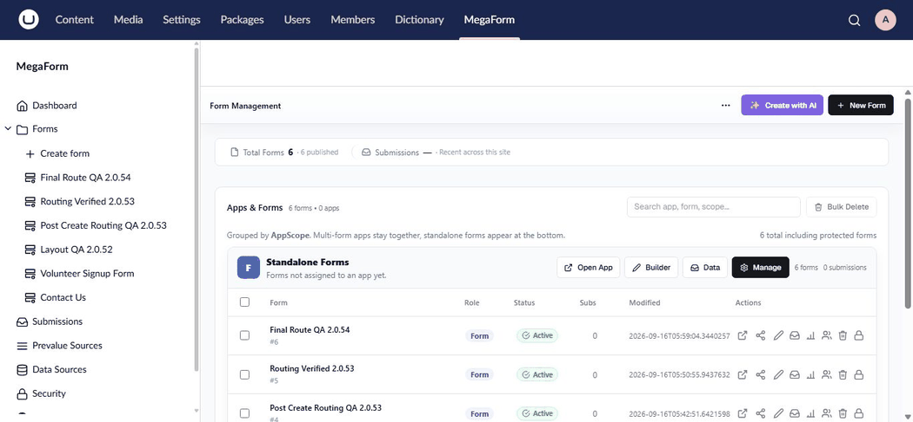

# AI Form Designer on Umbraco

MegaForm runs inside the Umbraco backoffice, so you can create and refine forms without leaving
the **MegaForm** section.

## Create a new form

1. Sign in to the Umbraco backoffice.
2. Open **MegaForm** in the main navigation.
3. Open the Dashboard and select **Create with AI**.
4. Describe the form you need and send the request.
5. Review the live form preview and ask for further changes.
6. Select **Save & Use Now**, or choose **Open Builder** for detailed editing.

## Continue editing in the builder

Open any form and select **AI Designer** in the builder toolbar. Ask MegaForm to add or remove
fields, reorganize pages, improve validation, change labels, or configure submission behavior. The
form canvas remains visible while you work, so you can inspect each change before saving.

## Use existing Umbraco data

If Umbraco Forms is installed, import the source form first and then ask AI to adapt it for a new
purpose. You can preserve the useful fields and behavior while changing the wording, layout, or
visitor experience.

See [Use Umbraco Forms data in MegaForm](umbraco-forms-data-source.md).

## Publish on an Umbraco page

After saving the form, add the MegaForm picker to the target content type, select the form on a
content item, and publish the page. See [MegaForm on Umbraco](umbraco-overview.md) for all supported
embedding options.
