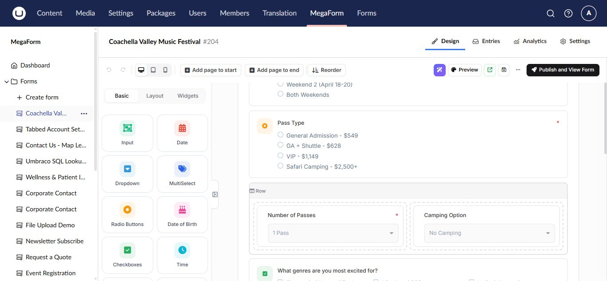
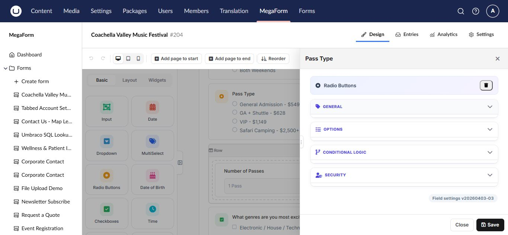

# Controls, layouts, and widgets on Umbraco

The builder palette groups form components into **Basic**, **Layout**, and **Widgets**. Choose the simplest control that accurately represents the answer you need.

## Basic controls

Basic controls cover text, email, number, phone, date, time, radio buttons, checkboxes, dropdowns, text areas, and common composite inputs.

- Use radio buttons for one choice from a short visible list.
- Use checkboxes for several independent choices.
- Use a dropdown when a single-choice list is long.
- Use the email, number, date, and phone controls instead of plain text when validation matters.

## Layout components

Sections, rows, columns, page breaks, headings, and HTML blocks organize a form without creating submitted values. Use a multi-page layout for long forms and group related questions under short section headings.

## Widgets

Widgets provide richer behavior such as file upload, signature, rating, maps, data grids, repeaters, payments, CAPTCHA, and database-backed choices. Availability depends on the installed package and license.

Widgets often require additional setup. For example, upload fields need upload or cloud-storage settings, payment fields need a payment provider, and database-backed fields need an approved data source.

## Configure a component

Select the component on the canvas to open its properties.

Review **General**, **Options**, **Conditional Logic**, and **Security**. Give every submitted field a stable key and verify option values before collecting production entries.

## Accessibility and mobile checks

- Keep labels visible and meaningful.
- Do not rely on color alone to explain a state.
- Provide help text for unfamiliar inputs.
- Verify keyboard navigation and validation focus.
- Preview desktop, tablet, and mobile widths.
- Avoid placing too many fields in one row on small screens.
