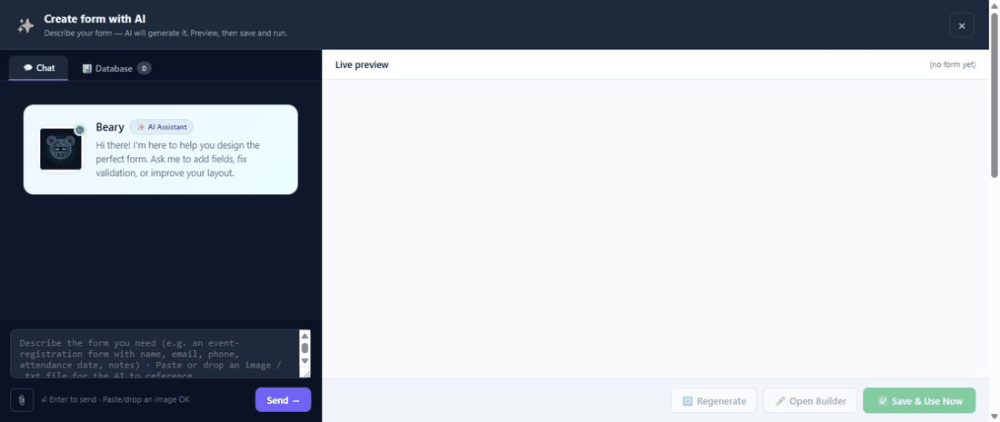

# Create a form with AI on Umbraco

**Create with AI** starts a new form from a plain-language description. Use it when you know the business outcome but do not want to select and arrange every field manually.

## Before you begin

An administrator must enable and configure an AI provider under **MegaForm → Settings → AI Settings**. AI creation is a licensed feature; a trial banner marked **AI locked** means the assistant cannot create a form until the site is licensed.

## Create the first draft

The animation below was recorded in the real Umbraco backoffice. The prompt is in English so the example is consistent and easy to copy, but you can describe the form in **any language supported by the configured AI model**. MegaForm sends the prompt as entered; the generated labels and content normally follow the language requested in the prompt.

1. Open **MegaForm → Dashboard**.
2. Select **Create with AI**.
3. Describe the form, its audience, and the information to collect.
4. Send the prompt and wait for the structured preview.
5. Review the proposed fields, pages, rules, and design.
6. Save the generated form, then open it in the builder for final changes.

For example:

> Create a modern Customer Support Request form named AI Documentation Demo. Include full name, work email, phone, issue category, priority, detailed description, preferred contact method, file upload, and consent. Make name, email, category, priority, description, and consent required. Use a clean blue professional design.

To generate a form in another language, write the prompt in that language or explicitly name the output language. For example, a Vietnamese prompt can request Vietnamese field labels and messages, while an English prompt can request an English form.

## Write a strong prompt

Include the details that affect structure:

- the form's purpose and intended visitor;
- required fields and useful optional fields;
- the sections or pages you expect;
- choice lists and default values;
- conditional questions;
- approvals, notifications, or integrations after submission;
- the visual tone, such as corporate, minimal, or friendly.

The assistant may start from an installed form template when one matches the request. This produces a more complete first draft than adding unrelated fields one at a time.

The creation surface uses the same conversational AI studio as AI Designer in the form builder. It shows the request, the assistant's summary, and a structured live preview before the form is saved.

## Create with AI versus AI Designer

| Tool | Use it for |
|---|---|
| **Create with AI** | Creating a new form from the Dashboard |
| **AI Designer** | Modifying the form currently open in the builder |

AI Designer can add, remove, rename, and reconfigure fields after the form exists.

## Review before publishing

AI output remains a draft. Check field keys, required flags, validation, option values, conditional logic, workflow recipients, and any database binding. Remove unnecessary personal data, preview the form, and complete a real test submission before publication.

## Related guides

- [Design a form with AI](umbraco-ai-designer.md)
- [Use form templates](umbraco-form-templates.md)
- [Configure workflows](umbraco-workflows.md)
